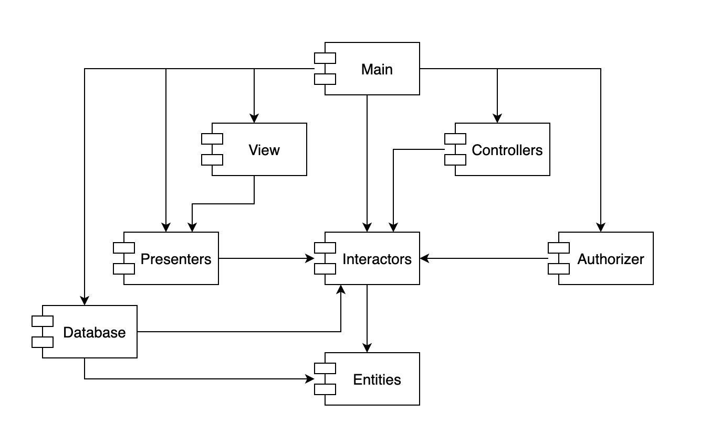
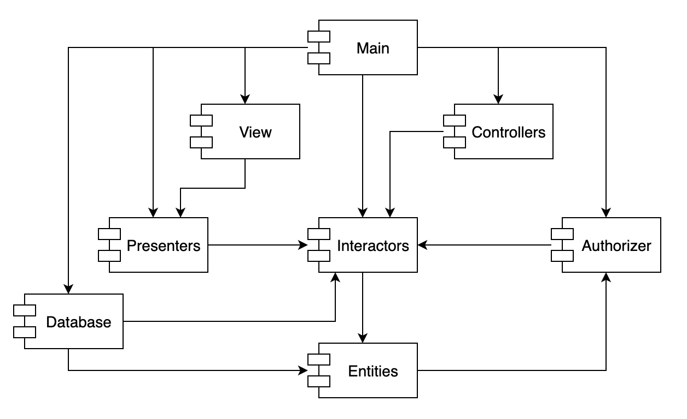
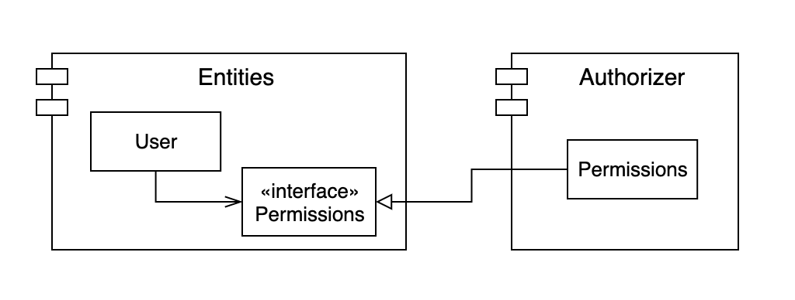
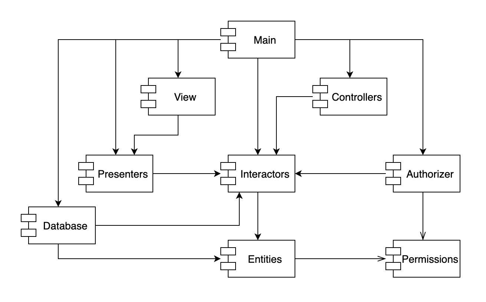

# 컴포넌트 결합

 이번 포스트에서는 컴포넌트 사이의 관계에 대한 세 가지 원칙에 대해서 정리해보겠습니다.

## ADP : 의존성 비순환 원칙 (Acyclic Dependencies Principle)

 컴포넌트 의존성 그래프에 순환이 있어서는 안된다.

 많은 개발자가 동일한 소스 파일을 수정하는 환경에서는 '숙취 증후군(The morning after syndrome)'이 발생합니다. 여기서 말하는 '숙취 증후군'은 내가 잘 동작하도록 만든 소스 코드가 다음날 아침에는 다른 사람의 수정으로 인해 동작하지 않는 현상을 말합니다. **이 문제를 해결하기 위해서는 개발 환경을 릴리스 가능한 컴포넌트 단위로 분리해야 합니다.** 이를 통해 컴포넌트 개발자 또는 단일 개발팀이 책임을 질 수 있는 작업 단위가 됩니다. 담당 개발자는 이 컴포넌트에 릴리스 번호를 부여하고, 다른 팀에서 사용할 수 있도록 하면 다른 개발자들은 릴리스된 버전을 적용할지 결정하여 개발을 진행할 수 있게 됩니다. 따라서 어떤 팀도 다른 팀에 의해 개발 업무가 좌우되지 않습니다.

 이 같은 작업 절차가 성공적으로 동작하기 위해서는 컴포넌트 사이의 의존성 구조를 반드시 관리해야 합니다. 그 관리 방법으로는 컴포넌트 사이의 의존성 구조에는 순환이 생기지 않도록 하는 것입니다. 의존성 구조에 순환이 생기면 '숙취 증후군'을 피해 갈 수 없습니다.

 위 그림은 컴포넌트 간의 의존성 구조를 방향 그래프(Directed graph)를 표현한 것입니다. 컴포넌트는 정점(Vertex)에 해당하고, 의존성 관계는 방향이 있는 간선(Directed edge)에 해당합니다. 여기서 주목할 점은 어느 컴포넌트에서 시작하더라도, 의존성 관계를 따라가면서 최초의 컴포넌트로 되돌아 갈 수 없다는 사실입니다. 이 구조에는 순환이 없습니다. 즉, 이 구조는 **비순환 방향 그래프(Directed Acyclic Graph, DAG)**입니다.

 여기서 컴포넌트가 새로운 릴리스를 만들게 되면 어떤 컴포넌트가 영향을 받는지 생각해보겠습니다. 만약 Presenters 컴포넌트가 새롭게 릴리스가 되었다면 **의존성 화살표를 거꾸로 따라가서 찾으면 됩니다.** 즉, 이 릴리스로 인해 영향을 받는 컴포넌트는 View와 Main 컴포넌트가 영향을 받게됩니다.

 Presenters 컴포넌트를 개발하는 개발자가 이 컴포넌트를 테스트하고자 한다면, 단순히 현재 사용 중인 버전의 Interactors와 Entities를 이용해서 Presenters 자체 버전을 빌드하면 됩니다. 즉, Presenters를 개발하는 개발자가 테스트를 구성할 때 더 적은 노력이 든다는 뜻이며, 고려해야 할 변수도 상대적으로 적어지게 됩니다.

**시스템 전체를 릴리스해야 할 때가 오면 릴리스 절차는 상향식으로 진행하게 됩니다.** 먼저 Entities 컴포넌트를 컴파일하고, 테스트하고 릴리스 합니다. 그러고 나서 Database와 Interactors에 대해서도 동일한 과정을 거칩니다. 그다음에는 Presenters, View, Controllers, Authorizer 순으로 진행합니다. Main은 마지막에 처리하게 됩니다.

#### 순환이 컴포넌트 의존성 그래프에 미치는 영향

 새로운 요구사항이 발생해서 Entities에 포함된 클래스 하나가 Authorizer에 포함된 클래스 하나를 사용하도록 변경할 수밖에 없다고 가정했을 때, 아래와 같은 그림처럼 순환 의존성(Dependency cycle)이 발생합니다.

 Database 컴포넌트를 개발하는 개발자가 컴포넌트를 릴리스하려면 Entities 컴포넌트와 반드시 호환되어야 한다는 사실을 알 수 있습니다. 하지만 Entities 컴포넌트에는 순환이 있으므로, Database 컴포넌트는 Authorizer 컴포넌트와도  호환이 되어야 합니다. 그런데 Authorizer 컴포넌트는 Interactors 컴포넌트와도 의존하고 있습니다. 이로 인해 Database 컴포넌트는 릴리스하기가 훨씬 어려워집니다. 해당 컴포넌트들이 모두 항상 정확하게 동일한 릴리스를 사용해야 하기 때문입니다.

 순환 그래프가 생기면 컴포넌트를 분리하기가 상당히 어려워집니다. 단위 테스트를 하고 릴리스를 하는 일도 굉장히 어려워지며 에러도 쉽게 발생합니다. 게다가 모듈의 개수가 많아짐에 따라 빌드 관련 이슈가 기하급수적으로 증가하게 될 것입니다. 뿐만 아니라 의존성 그래프에 순환이 생기면 어떤 순서로 빌드해야 올바를지 파악하기가 상당히 힘들어집니다. 애초에 순환이 생기면 올바른 순서라는 것 자체가 없을 수 있습니다.

#### 순환 끊기

 컴포넌트 사이의 순환을 끊고 의존성을 다시 DAG(Directed Acyclic Graph, DAG)로 원상복구하는 방법은 아래의 두 가지 메커니즘을 이용하는 방법이 있습니다.

1\. 의존성 역전 원칙(DIP)을 적용합니다. 아래의 그림처럼 User가 필요로 하는 메서드를 제공하는 인터페이스를 생성합니다. 그리고 이 인터페이스는 Entities에 위치시키고, Authorizer에서는 이 인터페이스를 상속받습니다. 이렇게 하면 Entities와 Authorizer 사이의 의존성을 역전시킬 수 있고, 이를 통해 순환을 끊어낼 수 있습니다.

2\. Entities와 Authorizer가 모두 의존하는 새로운 컴포넌트를 만듭니다. 그리고 두 컴포넌트가 모두 의존하는 클래스들을 새로운 컴포넌트로 이동시킵니다.

 두 번째 해결책에서 시사하는 바는 요구사항이 변경되면 컴포넌트의 구조도 변경될 수 있다는 사실입니다. 실제로 어플리케이션이 성장함에 따라 컴포넌트 의존성 구조는 서서히 흐트러지며, 또 성장합니다. 따라서 의존성 구조에 순환이 발생하는지 항상 관찰해야 합니다. 순환이 발생하면 어떤 식으로든 끊어야 합니다. 이 말은 때론 새로운 컴포넌트를 생성하거나 의존성 구조가 더 커질 수도 있음을 의미합니다.

---

## 참고자료

[Clean Architecture](http://www.kyobobook.co.kr/product/detailViewKor.laf?ejkGb=KOR&mallGb=KOR&barcode=9788966262472&orderClick=LAG&Kc=) <<로버트C. 마틴 지음>>
