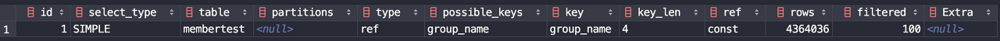
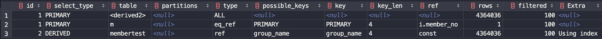

# 커버링 인덱스

 커버링 인덱스는 쿼리의 조건을 충족시키는데 필요한 모든 데이터들을 인덱스에서만 추출할 수 있는 인덱스를 의미합니다. 커버링 인덱스는 B-Tree 인덱스를 스캔하는 것만으로도 원하는 데이터를 가져 올 수 있으며, 컬럼을 읽기 위해 디스크에 접근하여 데이터 블록을 읽지 않아도 됩니다. 인덱스는 행 전체의 크기보다 훨씬 작으며, 인덱스의 값에 따라 정렬이 되기 때문에 Sequential Read 접근이 가능해집니다. 따라서 커버링 인덱스를 활용하면 쿼리의 성능을 비약적으로 향상시킬 수 있습니다.

 먼저 커버링 인덱스의 성능에 대해 테스트를 해보겠습니다.

#### 테이블 생성

 테이블은 아래와 같은 스키마로 생성하였습니다.

```
create table membertest
(
	member_no int auto_increment,
	member_id varchar(50) not null,
	group_no int not null,
	name varchar(30) not null,
	created_date datetime default now() not null,
	constraint membertest_pk
		primary key (member_no)
);
```

 인덱스는 **(group\_no, name)** 컬럼으로 생성하였고, 데이터는 약 1000만 건을 입력해두었습니다.

 그리고 아래와 같이 쿼리를 각각 수행해보았습니다.

<일반 쿼리>

수행 속도 : 40s 835ms

```
select *
from membertest
where group_no = 1
limit 5000000, 1000;
```

<커버링 인덱스 쿼리>

수행 속도 : 776ms

```
select * from (
        select member_no
        from membertest
        order by member_no
        limit 5000000, 100
    ) as i
    inner join membertest as m
on i.member_no = m.member_no;
```

 위의 두 쿼리는 같은 결과값을 반환하지만 수행 속도면에서 엄청난 차이를 보이고 있습니다. 커버링 인덱스가 어떤 역할을 하기에 속도 차이가 극적으로 나타나는 걸까요? 우선 두 쿼리의 실행 계획을 살펴보겠습니다.

<일반 쿼리의 실행 계획>



<커버링 인덱스 실행 계획>



 커버링 인덱스의 실행 계획을 보면 3번째 row의 extra에서 Using index를 확인할 수 있습니다. 이는 쿼리 수행에 커버링 인덱스가 사용되었다는 뜻입니다.

---

## 참고자료

[https://gywn.net/2012/04/mysql-covering-index/](https://gywn.net/2012/04/mysql-covering-index/)

[https://jojoldu.tistory.com/476](https://jojoldu.tistory.com/476)

[https://mozi.tistory.com/320](https://mozi.tistory.com/320)

[https://lng1982.tistory.com/144](https://lng1982.tistory.com/144)

[https://denodo1.tistory.com/306](https://denodo1.tistory.com/306)