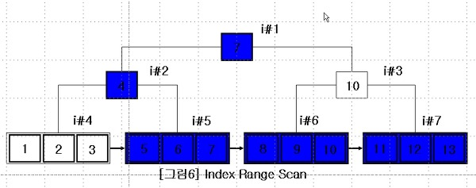
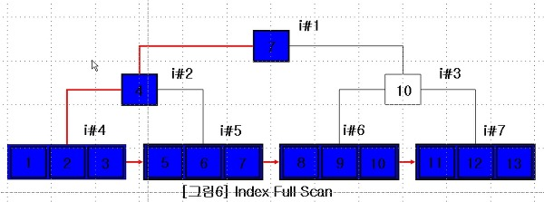

 **인덱스를 통해 테이블의 레코드를 읽는 것은 인덱스를 거치지 않고 바로 테이블의 레코드를 읽는 것보다 높은 비용이 드는 작업입니다.** 테이블의 레코드가 총 100만 건이고, 그 중에서 50만 건을 읽어야 할 때, 테이블을 모두 읽어서 필요 없는 50만 건을 버리는 것이 효율적인지, 인덱스를 통해 필요한 50만 건만 읽어 오는 것이 효율적인지 판단해야 합니다. **일반적인 DBMS의 옵티마이저에서는 인덱스를 통해 레코드를 1건 읽는 것이 테이블에서 직접 레코드를 읽는 것보다 4 ~ 5배 정도 더 많은 비용이 드는 작업인 것으로 예측**합니다. 즉, 인덱스를 통해 읽어야하는 레코드의 건 수가 전체 테이블의 레코드의 20 ~ 25%를 넘어서면 인덱스를 이용하지 않고 직접 테이블을 모두 읽어서 필요한 레코드만 가려내는 필터링 방식으로 처리하는 것이 효율적입니다.

## B-Tree를 이용한 인덱스 스캔 방법

#### 인덱스 레인지 스캔

 레인지 스캔은 인덱스의 접근 방법 가운데 가장 대표적인 방법입니다. 다음에 나올 두 가지 스캔 방식보다 빠른 방법이기도 합니다.

** 레인지 스캔은 검색해야 할 인덱스의 범위가 결정되었을 때 사용하는 방식입니다. **Root 노드부터 시작하여 Branch 노드를 거쳐 Leaf 노드까지 찾아 들어가야만 실제로 원하는 범위의 시작 지점을 찾을 수 있습니다. 시작해야할 위치를 찾으면 그 다음부터는 Leaf 노드의 레코드만 순서대로 읽으면 됩니다. 이처럼 차례대로 쭉 읽는 것을 레인지 스캔이라고 합니다. 만약 스캔하다가 Leaf 노드의 끝까지 읽으면 Leaf 노드간의 링크를 이용하여 다음 Leaf 노드를 찾아서 다시 스캔합니다.

#### 인덱스 풀 스캔

 레인지 스캔과 마찬가지로 인덱스를 사용하지만 레인지 스캔과 달리 인덱스의 처음부터 끝까지 모두 읽는 방식을 풀 스캔이라고 합니다. 대표적으로 쿼리의 조건절에 사용된 컬럼이 인덱스의 첫 번째 컬럼이 아닌 경우에 풀 스캔 방식을 이용합니다. 예를 들어 인덱스의 컬럼은 (A, B, C)로 만들어져 있지만 조건절에는 B나 C 컬럼으로 검색하는 경우 입니다.

 일반적으로 인덱스의 크기는 테이블의 크기보다 작으므로 직접 테이블을 끝까지 읽는 것보다 인덱스만 읽는 것이 효율적입니다. **주로****쿼리가 인덱스에 명시된 컬럼만으로 조건을 처리할 경우에 이 방식이 사용됩니다. 인덱스 뿐만 아니라 데이터 레코드까지 모두 읽어야 한다면 이 방식이 이용되지 않습니다.**

 인덱스 풀 스캔은 Leaf 노드의 제일 앞 또는 뒤로 이동한 후에 Leaf 노드를 연결하고 있는 연결 리스트를 이용하여 처음부터 끝까지 스캔하는 방식입니다. 이 방식은 인덱스 레인지 스캔보다는 빠르지 않지만 테이블 풀 스캔보다는 효율적입니다. 인덱스에 포함된 컬럼만으로 쿼리를 처리할 수 있는 경우 테이블 레코드를 읽을 필요가 없기 때문입니다.

---

## 참고자료

[https://12bme.tistory.com/138](https://12bme.tistory.com/138)