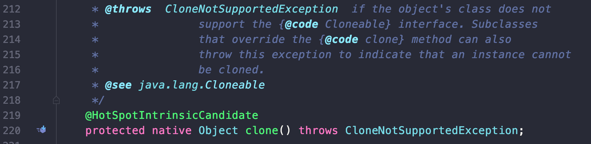

# Item 13. clone 재정의는 주의해서 진행하라

 Cloneable 인터페이스는 복제해도 되는 클래스임을 명시하는 용도의 믹스인 인터페이스입니다. 하지만 clone() 메서드는 Cloneable 인터페이스가 아닌 Object 클래스에 선언이 되어있고, 접근 지정자는 protected로 선언이 되어 있습니다.

 메서드가 하나도 선언되어 있지 않은 Cloneable 인터페이스는 Object의 protected 메서드인 clone() 메서드의 동작 방식을 결정합니다. Cloneable을 구현한 클래스의 인스턴스에서 clone()을 호출하면 그 객체의 필드들을 하나하나 복사한 객체를 반환하며, Cloneable을 구현하지 않은 클래스에서 이를 호출하면 CloneNotSupportedException이 발생합니다.



#### clone() 메서드에 대한 Object 명세

 이 객체의 복사본을 생성해 반환한다. 복사의 정확한 뜻은 그 객체를 구현한 클래스에 따라 다를 수 있지만 일반적인 의도는 다음과 같습니다. 어떤 객체 x에 대해 다음 식은 참입니다.

```
x.clone() != x
```

```
x.clone().getClass() == x.getClass()
```

```
x.clone().equals(x)
```

 관례상, 이 메서드가 반환하는 객체는 super.clone()을 호출해 얻어야 합니다. 이 클래스와 (Object를 제외한) 모든 상위 클래스가 이 관례를 따른다면 다음 식은 참입니다.

```
x.clone().getClass() == x.getClass()
```

 관례상, 반환된 객체와 원본 객체는 독립적이어야 합니다. 이를 만족하려면 super.clone()으로 얻은 객체의 필드 중 하나 이상을 반환 전에 수정해야 할 수도 있습니다.

#### clone()을 구현하는 방법

 clone() 메서드에 대한 구현은 강제성이 없기 때문에 super.clone()이 아닌, 생성자를 호출해 얻은 인스턴스를 반환해도 컴파일러를 통과시킬 수 있습니다. 하지만 이 클래스의 하위 클래스에서 super.clone()을 호출한다면 잘못된 클래스의 객체가 만들어져, 결국 하위 클래스의 clone() 메서드가 제대로 동작하지 않게 됩니다. clone()을 재정의한 클래스가 final이라면 상속이 불가능하므로 이 관례를 무시해도 안전합니다.

-   클래스 B가 클래스 A를 상속할 때, 하위 클래스인 B인 clone()은 B 타입 객체를 반환해야 합니다. 그런데 A의 clone()이 자신의 생성자, 즉 new A(...)로 생성한 객체를 반환한다면 B의 clone()도 A타입의 객체를 반환할 수밖에 없습니다.

 클래스에 정의된 모든 필드가 기본 타입이거나 불변 객체를 참조한다면 clone()을 통해서 얻은 객체는 완벽한 복제본일 것입니다. 하지만 쓸데없는 복사를 지양한다는 관점에서 보면 불변 클래스는 굳이 clone() 메서드를 제공하지 않는 것이 좋습니다.

```
public class Foo implements Cloneable {
    private int foo;

    public Foo(int foo) {
        this.foo = foo;
    }

    public int getFoo() {
        return foo;
    }

    @Override
    protected Foo clone() {
        try {
            return (Foo) super.clone();
        } catch (CloneNotSupportedException e) {
            throw new AssertionError();
        }
    }
}
```

 위 코드는 Cloneable 인터페이스를 구현한 예제 클래스입니다. clone() 메서드를 보면 super.clone()을 호출하고 있고, super.clone()은 Object 타입을 반환합니다. 하지만 자바에서는 **공변 반환 타이핑(covariant return typing)**을 지원하므로 Foo 타입으로 형변환하여 반환이 가능하고, 이렇게 하는 방식을 권장하기도 합니다.

#### 가변 객체를 참조하는 경우의 clone() 메서드 재정의

 우선 가변 객체를 참조할 경우의 예제를 살펴보겠습니다.

```
import java.util.Arrays;
import java.util.EmptyStackException;

public class Stack implements Cloneable {
    private Object[] elements;
    private int size = 0;
    private static final int DEFAULT_INITIAL_CAPACITY = 16;

    public Stack() {
        this.elements = new Object[DEFAULT_INITIAL_CAPACITY];
    }

    public void push(Object e) {
        ensureCapacity();
        elements[size++] = e;
    }

    public Object pop() {
        if (size == 0)
            throw new EmptyStackException();
        Object result = elements[--size];
        elements[size] = null;  //다 쓴 참조 해제
        return result;
    }

    private void ensureCapacity() {
        if (elements.length == size)
            elements = Arrays.copyOf(elements, 2 * size + 1);
    }

    @Override
    protected Stack clone() {
        try {
            Stack result = (Stack) super.clone();
            result.elements = elements.clone();
            return result;
        } catch (CloneNotSupportedException e) {
            throw new AssertionError();
        }
    }
}

```

 만약 위의 코드에서 clone() 메서드가 단순히 super.clone()의 결과를 그대로 반환한다면 반환된 인스턴스의 size 필드는 올바른 값을 갖지만, elements 필드는 원본 Stack 인스턴스와 같은 배열을 참조할 것입니다. 즉, 원본이나 복제본 인스턴스 중 하나를 수정하면 다른 하나도 같이 수정되어 불변식을 해치게 됩니다.

 객체의 불변성을 위해 elements 필드를 final로 선언하고자 하는 시도는 실패합니다. final에는 새로운 값을 할당할 수 없기 때문입니다. 그래서 복제할 수 있는 클래스를 만들기 위해 일부 필드에서 final 한정자를 제거해야 할 수도 있습니다.

 배열의 clone()은 런타임 타입과 컴파일타임 타입 모두가 원본 배열과 똑같은 배열을 반환하므로 형변환이 필요 없습니다.

```
public class HashTable implements Cloneable {
    private Entry[] buckets;

    private static class Entry {
        final Object key;
        Object value;
        Entry next;

        public Entry(Object key, Object value, Entry next) {
            this.key = key;
            this.value = value;
            this.next = next;
        }
    }

    @Override
    protected HashTable clone() {

        try {
            HashTable result = (HashTable) super.clone();
            result.buckets = buckets.clone();
            return result;
        } catch (CloneNotSupportedException e) {
            throw new AssertionError();
        }
    }

    // 나머지 코드 생략...
}

```

 해시테이블에 대한 예제를 살펴보겠습니다. 위 코드는 복제본에서 자신만의 버킷 배열을 갖지만, 얕은 복사로 인해 원본과 복제본의 인스턴스에서 같은 연결 리스트가 공유되는 문제가 있습니다. 이를 해결하기 위해 재귀적인 방법의 예제 코드는 아래와 같습니다.

```
public class HashTable implements Cloneable {
    private Entry[] buckets = ...;

    private static class Entry {
        final Object key;
        Object value;
        Entry next;

        public Entry(Object key, Object value, Entry next) {
            this.key = key;
            this.value = value;
            this.next = next;
        }
        
        Entry deepCopy() {
            return new Entry(key, value, next == null ? null : next.deepCopy());
        }
    }

    @Override
    protected HashTable clone() {

        try {
            HashTable result = (HashTable) super.clone();
            result.buckets = new Entry[buckets.length];
            for (int i = 0; i < buckets.length; i++) {
                if (buckets[i] != null)
                    result.buckets[i] = buckets[i].deepCopy();
            }
            return result;
        } catch (CloneNotSupportedException e) {
            throw new AssertionError();
        }
    }

    // 나머지 코드 생략...
}

```

 재귀적인 방법은 간단하며, 버킷이 크기가 크지 않다면 잘 작동합니다. 하지만 재귀적인 호출로 인해 연결 리스트의 원소 수만큼 스택 프레임을 소비하기 때문에 연결 리스트가 길다면 StackOverflow를 일으킬 위험이 있습니다. 이 문제를 회피하기 위해서 deepCopy()를 재귀적으로 호출하는 대신 반복자를 써서 순회하는 방향으로 수정해야 합니다.

```
        Entry deepCopy() {
            Entry result = new Entry(key, value, next);
            for (Entry p = result; p.next != null; p = p.next)
                p.next = new Entry(p.next.key, p.next.value, p.next.next);
            return result;
        }
```

#### clone()의 주의점

 생성자에서는 재정의될 수 있는 메서드를 호출하지 않아야 하는데 clone() 메서드도 마찬가지 입니다. 만약 clone()이 하위 클래스에서 재정의한 메서드를 호출하면, 하위 클래스는 복제 과정에서 자신의 상태를 교정할 기회를 잃게 되어 원본과 복제본의 상태가 달라질 가능성이 커지기 때문입니다.

 상속해서 쓰기 위한 클래스 설계 방식 두 가지 중 어느 쪽에서든, 상속용 클래스는 Cloneable을 구현해서는 안됩니다.

 Cloneable을 구현한 스레드 안전 클래스를 작성할 때는 clone 메서드 역시 적절히 동기화해줘야 합니다. Object의 clone() 메서드는 동기화를 신경쓰지 않았습니다. 그러므로 super.clone() 호출 외에 다른 할 일이 없더라도 clone()을 재정의하고 동기화해줘야 합니다.

#### 복사 생성자와 복사 팩토리

 Cloneable을 이미 구현한 클래스를 확장한다면 어쩔 수 없이 clone()을 잘 작동하도록 구현해야 하지만, 그렇지 않은 상황에서는 **복사 생성자와 복사 팩토리라는 더 나은 객체 복사 방식을 제공할 수 있습니다. **복사 생성자란 단순히 자신과 같은 클래스의 인스턴스를 인수로 받는 생성자를 말합니다.

복사 생성자

```
public Yum(Yum yum) { ... };
```

복사 팩토리

```
public static Yun newInstance(Yum yum) { ... };
```

 복사 생성자와 복사 팩토리는 Cloneable 방식보다 나은 면이 많습니다.

-   생성자를 쓰지 않는 방식의 객체 생성 메커니즘을 사용하지 않습니다.
-   엉성하게 문서화된 규약에 기대지 않정상적인 final 필드 용법과도 충돌하지 않습니다.
-   불필요한 검사 예외를 던지지 않고, 형변환도 필요치 않습니다.
-   **해당 클래스가 구현한 인터페이스 타입의 인스턴스를 인수로 받을 수 있습니다.**

마지막 항목에 대한 예시로, 모든 범용 컬렉션 구현체는 Collection이나 Map 타입을 받는 생성자를 제공합니다. 인터페이스 기반 복사 생성자와 복사 팩토리의 더 정확한 이름은 변환 생성자(conversion constructor)와 변환 팩토리(conversion factory)입니다. 이들을 이용하면 **클라이언트는 원본의 구현 타입에 얽매이지 않고 복제본의 타입을 직접 선택할 수 있습니다.** 예를 들어, HashSet 객체 s를 TreeSet 타입으로 복제할 수 있습니다. clone()으로는 불가능한 이 기능을 변환 생성자로는 간단히 new TreeSet<>(s)로 처리할 수 있습니다.

---

## 참고자료

[http://www.kyobobook.co.kr/product/detailViewKor.laf?ejkGb=KOR&mallGb=KOR&barcode=9788966262281&orderClick=LEa&Kc=](http://www.kyobobook.co.kr/product/detailViewKor.laf?ejkGb=KOR&mallGb=KOR&barcode=9788966262281&orderClick=LEa&Kc=)
