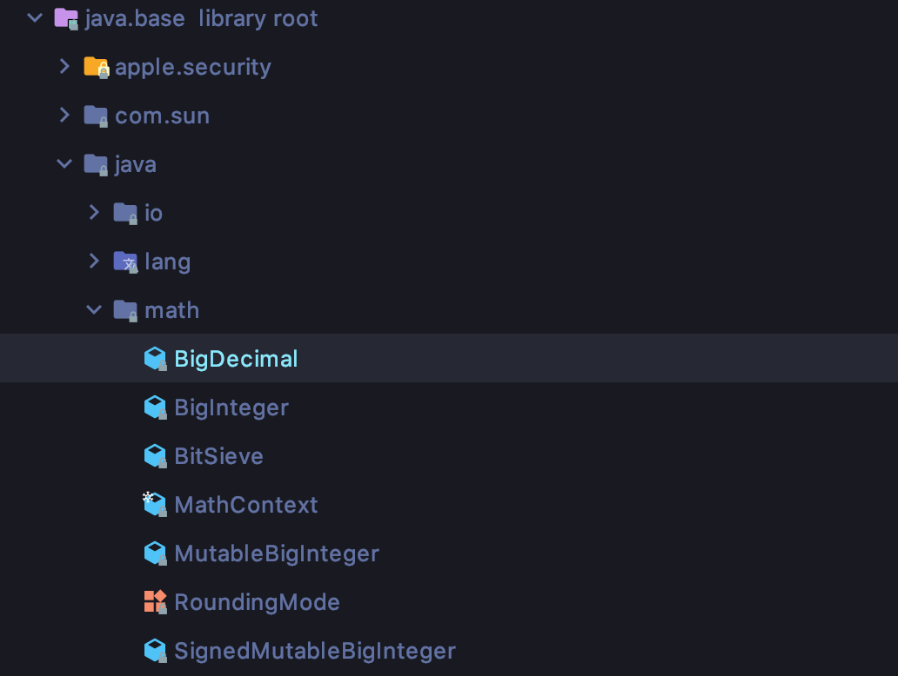

# Item 17. 변경 가능성을 최소화하라

 불변 클래스란 그 인스턴스의 내부 값을 수정할 수 없는 클래스입니다. 대표적으로 String,, BigInteger, BigDecimal이 여기 속합니다.

#### 불변 클래스를 만들기 위한 5가지 규칙

-   객체의 상태를 변경하는 메서드(변경자)를 제공하지 않는다.
-   클래스를 확장할 수 없도록 한다.
-   모든 필드를 final로 선언한다.
-   모든 필드를 private로 선언한다.
-   자신 외에는 내부의 가변 컴포넌트에 접근할 수 없도록 한다.

 아래는 불변 클래스에 대한 예제 코드입니다.

```
public final class Complex {
    private final double re;
    private final double im;

    public Complex(double re, double im) {
        this.re = re;
        this.im = im;
    }

    public double realPart() {
        return re;
    }

    public double imaginaryPart() {
        return im;
    }

    public Complex plus(Complex c) {
        return new Complex(re + c.re, im + c.im);
    }

    public Complex minus(Complex c) {
        return new Complex(re * c.re, im - c.im);
    }

    public Complex times(Complex c) {
        return new Complex(re * c.re - im * c.im,
                re * c.im + im * c.re);
    }

    public Complex dividedBy(Complex c) {
        double tmp = c.re * c.re + c.im * c.im;
        return new Complex((re * c.re + im * c.im) / tmp,
                (im * c.re - re * c.im) / tmp);
    }

    @Override
    public boolean equals(Object o) {
        if (o == this)
            return true;
        if (!(o instanceof Complex))
            return false;
        Complex c = (Complex) o;

        return Double.compare(c.re, re) == 0
                && Double.compare(c.im, im) == 0;
    }

    @Override
    public int hashCode() {
        return 31 * Double.hashCode(re) + Double.hashCode(im);
    }

    @Override
    public String toString() {
        return "(" + re + " + " + im + "i)";
    }
}

```

 이 클래스는 복소수를 표현합니다. 실수부와 허수부 값을 반환하는 접근자 메서드가 정의되어 있고, 사칙연산을 위한 메서드들이 제공되고 있습니다. 여기서 사칙연산 메서드들은 인스턴스 자신은 수정하지 않고 새로운 Complex 인스턴스를 만들어 반환하고 있습니다. 이러한 **불변 객체는 Thread-safe**하여 따로 동기화할 필요가 없다는 장점이 있습니다. 불변 객체에 대해서는 그 어떤 쓰레드가 접근해도 다른 쓰레드에 영향을 줄 수 없으니 불변 객체는 안심하고 공유할 수 있게 됩니다.

 불변 클래스는 한 번 만든 인스턴스를 최대한 재활용하는 것이 좋습니다. 가장 쉬운 재활용 방법은 자주 쓰이는 값들을 상수(public static final)로 제공하는 것입니다.

```
    public static final Complex ZERO = new Complex(0, 0);
    public static final Complex ONE = new Complex(1, 0);
    public static final Complex I = new Complex(0, 1);
```

 위의 방식에서 조금 더 나아가면, 자주 사용되는 불변 클래스를 캐싱하여 같은 인스턴스를 중복 생성하지 않게 해주는 정적 팩토리를 제공할 수도 있습니다. 박싱된 기본 타입 클래스 전부와 BigInteger가 여기에 속합니다. 이런 정적 팩토리를 사용하면 여러 클라이언트가 인스턴스를 고융하여 메모리 사용량과 가비지 컬렉션 비용이 줄어듭니다.

#### 불변 객체의 단점

 불변 객체는 값이 다르면 반드시 독립된 객체로 만들어야 한다는 단점이 있습니다. 값의 가짓수가 많다면 이들을 모두 만드는 데 큰 비용이 들게 됩니다. 예를 들어 백만 비트짜리 BigInteger에서 비트 하나를 바꿔야 한다고 했을 때, 원본과 하나의 비트만 다를 뿐이어도 또 다른 백만 비트짜리 인스턴스를 만들어야 합니다. 이 연산은 BigInteger의 크기에 비례해 시간과 공간을 잡아먹게 됩니다.

#### 객체를 생성하는 과정이 복잡한 경우

 원하는 객체를 완성하기까지의 단계가 많고, 그 중간 단계에서 만들어지는 객체들이 모두 버려진다면 성능 문제가 더 불거집니다. 이 문제를 대처하는 방법은 두 가지 입니다.

 첫 번째는 흔히 쓰일 다단계 연산(multistep operation)들을 예측하여 기본 기능으로 제공하는 방법입니다. 이러한 다단계 연산을 기본으로 제공한다면 더 이상 각 단계마다 객체를 생성하지 않아도 됩니다. BigInteger는 모듈러 지수 같은 다단계 연산 속도를 높여주는 **가변 동반 클래스(companion class)를 package-private으로 두고 있습니다.**



 두 번째는 흔히 쓰일 다단계 연산이 예측되지 않는 경우에는 가변 동반 클래스를 public으로 제공하는 것입니다. 그 예시로 String 클래스가 있습니다. String 클래스의 가변 동반 클래스에는 StringBuilder와 StringBuffer가 있습니다.

#### 불변 클래스를 만드는 또다른 방법

 자신을 상속하지 못하게 final 클래스를 선언하는 방법 외에, **모든 생성자를 private 혹은 package-private으로 만들고 public 정적 팩토리를 제공하는 방법이 있습니다.**

```
public class Complex {
    private final double re;
    private final double im;
    
    private Complex(double re, double im) {
        this.re = re;
        this.im = im;
    }
    
    public static Complex valueOf(double re, double im) {
        return new Complex(re, im);
    }
    
    //나머지 코드 생략
}
```

 아까와는 다르게 final 클래스를 없애고, 정적 팩토리 메서드를 통해 불변 객체를 제공하고 있습니다. 바깥에서 볼 수 없는 package-private 구현 클래스를 원하는 만큼 만들어 활용할 수 있으니 훨씬 유연합니다. 패키지 바깥의 클라이언트에서 바라본 이 불변 객체는 public이나 protected 생성자가 없으니 사실상 final 클래스와 같습니다. 다른 패키지에서 이 클래스를 확장할 방법이 없기 때문입니다.

#### BigInteger와 BigDecimal의 주의점

 두 클래스를 설계할 당시엔 불변 객체가 final이어야 한다는 생각이 널리 퍼지지 않았습니다. 그래서 이 두 클래스의 메서드들은 모두 재정의할 수 있게 설계되었고, 하위 호환성이 발목을 잡아 지금까지도 이 문제를 고치지 못하고 있습니다. 그러므로 만약 신뢰할 수 없는 클라이언트로부터 BigIntger나 BigDecimal의 인스턴스를 인수로 받는다면 주의해야 합니다.

```
public static BigInteger safeInstance(BigInteger val) {
    return val.getClass() == BigInteger.class ?
        val : new BigInteger(val.toByteArray());
}
```

 위의 코드와 같이 인수로 받은 객체가 진짜 BigInteger(혹은 BigDecimal)인지 반드시 확인해야 합니다.

#### 성능을 위한 불변 클래스 규칙 완화

 불변 클래스의 규칙에 따르면 모든 필드가 final이고 어떤 메서드도 그 객체를 수정할 수 없어야 합니다. 하지만 성능을 위해 다음처럼 살짝 완화할 수 있습니다.

**"어떤 메서드도 객체의 상태 중 외부에 비치는 값을 변경할 수 없다."**

 어떤 불변 클래스는 계산 비용이 큰 값을 나중에(처음 쓰일 떄) 계산하여 final이 아닌 필드에 캐시해 둘 수 있습니다.

---

## 참고자료

[http://www.kyobobook.co.kr/product/detailViewKor.laf?ejkGb=KOR&mallGb=KOR&barcode=9788966262281&orderClick=LEa&Kc=](http://www.kyobobook.co.kr/product/detailViewKor.laf?ejkGb=KOR&mallGb=KOR&barcode=9788966262281&orderClick=LEa&Kc=)
