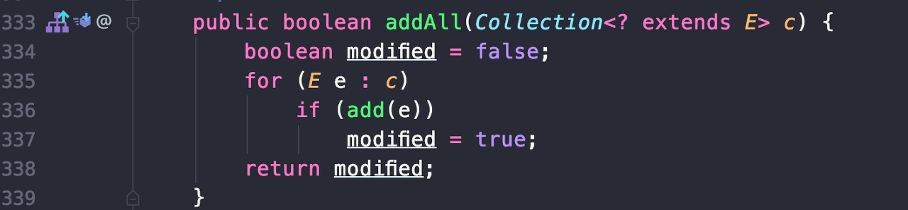

# Item 18. 상속보다는 컴포지션을 사용하라

 상속은 코드를 재사용하는 강력한 수단이지만, 잘못 사용하면 객체의 유연성을 해치는 설계를 하게 되는 결과를 초래할 수 있습니다. **상속이 캡슐화를 깨뜨리기 때문**입니다. 상속은 하위 클래스가 상위 클래스에 대한 내부 구현 정보를 알게 합니다. 그리고 상위 클래스가 어떻게 구현되느냐에 따라 하위 클래스의 동작에 이상이 생길 수 있습니다.

#### 상속을 잘못 사용한 예

```
import java.util.Collection;
import java.util.HashSet;

public class InstrumentedHashSet<E> extends HashSet<E> {

    //추가된 원소의 수
    private int addCount = 0;

    public InstrumentedHashSet() {}

    public InstrumentedHashSet(int initCap, float loadFactor) {
        super(initCap, loadFactor);
    }

    @Override
    public boolean add(E e) {
        addCount++;
        return super.add(e);
    }

    @Override
    public boolean addAll(Collection<? extends E> c) {
        addCount += c.size();
        return super.addAll(c);
    }

    public int getAddCount() {
        return addCount;
    }
}

```

 InstrumentedhashSet 클래스는 HashSet을 상속하여 기존의 HashSet 클래스의 기능을 더하고, 추가된 원소우 수를 카운트하는 클래스로 확장한 코드입니다. 이 클래스는 겉으로 보기에는 잘 동작할 것 같지만 addAll()을 호출할 시에 오동작을 하게 됩니다. 그 이유는 HashSet의 addAll() 메서드가 모든 컬랙션 원소를 추가하는데 add() 메서드를 사용하여 구현되어 있기 때문입니다.

**HashSet의 상위 추상 클래스인 AbstractCollection 코드 일부**



 위와 같이 구현되어 있는 이유로 InstrumentHashSet은 크기가 3인 컬렉션을 addAll() 메서드의 인자로 전달하게 되면 addCount에 3이 한 번 더해지고, add() 메서드가 중복으로 호출되어 6이 더해지게 되어 오동작을 하게 됩니다.

 하위 클래스에서 addAll() 메서드를 재정의하지 않으면 문제가 고쳐질 수는 있습니다. 하지만 이는 하위 클래스가 HashSet의 addAll() 메서드가 add() 메서드를 이용해 구현되었다는 구체적 사실을 인지하고 있어야 한다는 한계가 있습니다.

#### 컴포지션을 이용한 확장 방법

  기존의 클래스를 확장하는 대신, 새로운 클래스를 만들고 private 필드로 기존 클래스의 인스턴스를 참조하게 하는 방법을 통해 기능을 확장시킬 수도 있습니다. 이러한 방법을 **컴포지션(Composition)**이라고 합니다. 새 클래스의 인스턴스 메서드들은 (private 필드로 참조하는) 기존 클래스의 대응하는 메서드를 호출해 그 결과를 반환합니다. 이 방식을 전달(forwarding)이라 하며, 새 클래스의 메서드들을 **전달 메서드(forwarding method)**라 부릅니다.

 컴포지션을 활용하면 기존 클래스의 내부 구현 방식의 영향에서 벗어나며, 심지어 기존 클래스에 새로운 메서드가 추가되더라도 전혀 영향받지 않게 됩니다. 새로운 클래스는 기존의 클래스의 내부 구현에 대해 알지 못하게 되어 캡슐화 원칙도 잘 지켜지게 됩니다.

```
import java.util.Collection;
import java.util.Iterator;
import java.util.Set;

public class ForwardingSet<E> implements Set<E> {
    private final Set<E> s;

    public ForwardingSet(Set<E> s) {
        this.s = s;
    }

    @Override
    public void clear() { s.clear(); }

    @Override
    public boolean contains(Object o) { return s.contains(o); }

    @Override
    public boolean isEmpty() { return s.isEmpty(); }

    @Override
    public int size() { return s.size(); }

    @Override
    public Iterator<E> iterator() { return s.iterator(); }

    @Override
    public boolean add(E e) { return s.add(e); }

    @Override
    public boolean remove(Object o) { return s.remove(o); }

    @Override
    public boolean containsAll(Collection<?> c) { return s.containsAll(c); }

    @Override
    public boolean addAll(Collection<? extends E> c) { return s.addAll(c); }

    @Override
    public boolean removeAll(Collection<?> c) { return s.removeAll(c); }

    @Override
    public boolean retainAll(Collection<?> c) { return s.retainAll(c); }

    @Override
    public Object[] toArray() { return s.toArray(); }

    @Override
    public <T> T[] toArray(T[] a) { return s.toArray(a); }

    @Override
    public int hashCode() { return s.hashCode(); }

    @Override
    public boolean equals(Object obj) { return s.equals(obj); }

    @Override
    public String toString() { return s.toString(); }
}

```

```
import java.util.Collection;
import java.util.Set;

public class InstrumentedSet<E> extends ForwardingSet<E> {
    private int addCount = 0;

    public InstrumentedSet(Set<E> s) {
        super(s);
    }

    @Override
    public boolean add(E e) {
        addCount++;
        return super.add(e);
    }

    @Override
    public boolean addAll(Collection<? extends E> c) {
        addCount += c.size();
        return super.addAll(c);
    }

    public int getAddCount() {
        return addCount;
    }
}

```

 InstrumentedSet은 HashSet의 모든 기능을 정의한 Set 인터페이스를 활용해 설계되어 유연하게 기능을 확장하였습니다. 상속 방식은 구체 클래스 각각을 따로 확장해야 하며, 지원하고 싶은 상위 클래스의 생성자 각각에 대응하는 생성자를 별도로 정의해줘야 합니다. 하지만 컴포지션 방식은 한 번만 구현해두면 어떠한 Set 구현체라도 기능을 확장할 수 있습니다.

```
Set<Instant> times = new InstrumentedSet<>(new TreeSet<>(cmp));
Set<E> s = new InstrumentedSet<>(new HashSet<>(INIT_CAPACITY));

```

 위 방식은 다른 Set 인스턴스를 감싸고(wrap) 있다는 뜻에서 InstrumentedSet 같은 클래스를 래퍼 클래스라 하며, 다른 Set에 계측 기능을 덧씌운다는 뜻에서 **데코레이터 패턴**이라고 합니다. 컴포지션과 전달의 조합은 넓은 의미로 위임(delegation)이라고 부릅니다. 단, 엄밀히 따지면 래퍼 객체가 내부 객체에 자기 자신의 참조를 넘기는 경우만 위임에 해당합니다.

#### 래퍼 클래스의 단점

 래퍼 클래스는 단점이 거의 없지만, 콜백(callback) 프레임워크와는 어울리지 않는다는 점을 주의해야 합니다. 콜백 프레임워크에서는 자기 자신의 참조를 다른 객체에 넘겨서 다음 호출(콜백) 때 사용하도록 합니다. 내부 객체는 자신을 감싸고 있는 래퍼의 존재를 모르니 대신 자신(this)의 참조를 넘기고, 콜백 때는 래퍼가 아닌 내부 객체를 호출하게 됩니다. 이를 SELF 문제라고 합니다.

 SELF 문제에 대한 설명 링크

[https://stackoverflow.com/questions/28254116/wrapper-classes-are-not-suited-for-callback-frameworks](https://stackoverflow.com/questions/28254116/wrapper-classes-are-not-suited-for-callback-frameworks)

```
    interface SomethingWithCallback {

      void doSomething();

      void call();

    }


    class WrappedObject implements SomethingWithCallback {

      private final SomeService service;

      WrappedObject(SomeService service) {
        this.service = service;
      }

      @Override
      public void doSomething() {
        service.performAsync(this);
      }

      @Override
      public void call() {
        System.out.println("WrappedObject callback!");
      }
    }


    class Wrapper implements SomethingWithCallback {

      private final WrappedObject wrappedObject;

      Wrapper(WrappedObject wrappedObject) {
        this.wrappedObject = wrappedObject;
      }

      @Override
      public void doSomething() {
        wrappedObject.doSomething();
      }

      void doSomethingElse() {
        System.out.println("We can do everything the wrapped object can, and more!");
      }

      @Override
      public void call() {
        System.out.println("Wrapper callback!");
      }
    }

    final class SomeService {

      void performAsync(SomethingWithCallback callback) {
        new Thread(() -> {
          perform();
          callback.call();
        }).start();
      }

      void perform() {
        System.out.println("Service is being performed.");
      }
    }
    public static void main(String[] args) {
        SomeService   service       = new SomeService();
        WrappedObject wrappedObject = new WrappedObject(service);
        Wrapper       wrapper       = new Wrapper(wrappedObject);
        wrapper.doSomething();
    }   
```

#### 상속의 사용 방법

 상속은 반드시 하위 클래스가 상위 클래스의 '진짜' 하위 타입인 상황에서만 쓰여야 합니다. 다르게 말하면, 클래스 B가 클래스 A와 is-a 관계일 때만 클래스 A를 상속해야 합니다. 이는 SOLID 원칙 중, **리스코프 치환 원칙(LSP)**을 준수해야 함을 뜻합니다. 즉, 상위 타입은 하위 타입으로 치환하여도 상위 타입을 사용하는 프로그램은 정상적으로 동작해야 합니다.

---

## 참고자료

[http://www.kyobobook.co.kr/product/detailViewKor.laf?ejkGb=KOR&mallGb=KOR&barcode=9788966262281&orderClick=LEa&Kc=](http://www.kyobobook.co.kr/product/detailViewKor.laf?ejkGb=KOR&mallGb=KOR&barcode=9788966262281&orderClick=LEa&Kc=)
