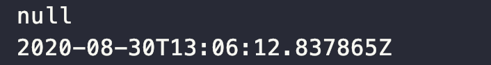

# Item 19. 상속을 고려해 설계하고 문서화하라. 그러지 않았다면 상속을 금지하라

#### 재정의 가능한 메서드의 문서화

 상속용 클래스는 재정의할 수 있는 메서드들을 내부적으로 어떻게 이용하지는지(자기사용) 문서로 남겨야 합니다. 클래스의 API로 공개된 메서드에서 클래스 자신의 또다른 메서드를 호출할 수도 있습니다. 그리고 그 호출되는 메서드가 재정의 가능 메서드라면 그 사실을 호출하는 메서드의 API 설명에 적시해야 합니다. 어떤 순서로 호출하는지, 각각의 호출 결과가 이어지는 처리에 어떤 영향을 주는지도 담아야 합니다.

#### API 문서의 Implementation Requirements

 메서드의 주석에 @implSpec 태그를 붙여주면 자바독 도구가 생성해줍니다. **좋은 API 문서란 '어떻게'가 아닌 '무엇'을 하는지를 설명해야 합니다.**

 @implSpec 태그를 활성화하려면 명령줄 매개변수로 -tag "implSpec:a:Implementation Requiredments:"를 지정하면 됩니다.

#### 훅(hook)

 효율적인 하위 클래스를 큰 어려움 없이 만들 수 있게 하려면 클래스의 내부 동작 과정 중간에 끼어들 수 있는 훅(hook)을 잘 선별하여 protected 메서드 형태로 공개해야 할 수도 있습니다.

 상속용 클래스를 설계할 때 어떤 메서드를 protected로 노출해야할지 결정하는 방법은 특별히 없습니다. 심사숙고해서 잘 예측해본 다음, **실제 하위 클래스를 만들어 시험해보는 것이 최선**입니다. protected 메서드 하나하나가 내부 구현에 해당하므로 그 수는 가능한 한 적어야 합니다. 한편으로는 너무 적게 노출해서 상속으로 얻는 이점마저 없애지 않도록 주의해야 합니다.

** 상속용 클래스를 시험하는 방법은 직접 하위 클래스를 만들어보는 것이 유일합니다. 상속용으로 설계한 클래스는 배포 전에 반드시 하위 클래스를 만들어 검증해야 합니다.**

#### 상속용 클래스 설계 시, 주의사항

** 상속용 클래스의 생성자는 직접적으로든 간접적으로든 재정의 가능 메서드를 호출해서는 안됩니다.** 상위 클래스의 생성자가 하위 클래스의 생성자보다 먼저 실행되므로 하위 클래스에서 재정의한 메서드가 하위 클래스의 생성자보다 먼저 실행됩니다. 이때 그 재정의한 메서드가 하위 클래스의 생성자에서 초기화하는 값에 의존한다면 의도한대로 동작하지 않게 됩니다.

```
public class Super {

    // 잘못된 예 - 생성자가 재정의 가능 메서드를 호출한다.
    public Super() {
        overrideMe();
    }

    public void overrideMe() {

    }
}

```

```
import java.time.Instant;

public class Sub extends Super {
    // 초기화되지 않은 final 필드, 생성자에서 초기화한다.
    private final Instant instant;

    Sub() {
        instant = Instant.now();
    }

    // 재정의 가능 메서드, 상위 클래스의 생성자가 호출한다.
    @Override
    public void overrideMe() {
        System.out.println(instant);
    }
}

```

```
public class Main {
    public static void main(String[] args) {
        Sub sub = new Sub();
        sub.overrideMe();
    }
}

```



 상속용 클래스의 생성자에서 재정의 가능 메서드를 호출할 경우, 위와 같은 문제가 발생하게 됩니다. Sub의 인스턴스가 생성되면서 Super의 생성자가 호출되고, 그 과정에서 overrideMe() 메서드가 호출됩니다. 아직 instant는 초기화되지 않은 상태이므로 Sub의 overrideMe() 메서드는 null을 출력하게 됩니다.

#### 상속용 클래스에서의 Cloneable과 Serializable

 **Cloneable과 Serializable 인터페이스를 구현한 클래스는 상속할 수 없게 하는 것이 좋습니다.**

clone과 readObject 메서드는 생성자와 비슷한 효과를 냅니다(새로운 객체를 만든다). 따라서 상속용 클래스에서 Cloneable이나 Serializable을 구현할지 정해야 한다면, 이들을 구현할 때 따르는 제약도 생성자와 비슷합니다. 즉, **clone()과 readObject 모두 직접적으로든 간접적으로든 재정의 가능 메서드를 호출해서는 안됩니다.**

-   readObject의 경우 하위 클래스의 상태가 미처 다 역직렬화되기 전에 재정의한 메서드부터 호출하게 됩니다.
-   clone의 경우 하위 클래스의 clone 메서드가 복제본의 상태를 (올바른 상태로) 수정하기 전에 재정의한 메서드를 호출하게 됩니다.

 위 사항의 어느쪽이든 프로그램의 오작동으로 이어지게 됩니다.

#### Serializable을 구현한 상속용 클래스의 주의점

 Serializable을 구현한 상속용 클래스가 readResolve나 writeReplace 메서드를 갖는다면 이 메서드들은 private이 아닌 protected로 선언해야 합니다. **private로 선언한다면 하위 클래스에서 무시되기 때문**입니다. 이 역시 상속을 허용하기 위해 내부 구현을 클래스 API로 공개하는 예 중 하나입니다.

#### 일반적인 구체 클래스의 설계 방법

 일반적인 구체 클래스는 final도 아니고 상속용으로 설계되거나 문서화되지도 않았습니다. 하지만 이러한 사실은 클래스에 변화가 생길 때마다 하위 클래스를 오동작하게 만들 수 있기 때문에 위험합니다. **이 문제를 해결하는 가장 좋은 방법은 상속용으로 설계하지 않은 클래스는 상속을 금지하는 것입니다.**

**상속을 금지하는 방법 두 가지**

-   클래스를 final로 선언하는 방법
-   모든 생성자를 private나 package-private로 선언하고 public 정적 팩토리를 만들어주는 방법

---

## 참고자료

[http://www.kyobobook.co.kr/product/detailViewKor.laf?ejkGb=KOR&mallGb=KOR&barcode=9788966262281&orderClick=LEa&Kc=](http://www.kyobobook.co.kr/product/detailViewKor.laf?ejkGb=KOR&mallGb=KOR&barcode=9788966262281&orderClick=LEa&Kc=)
