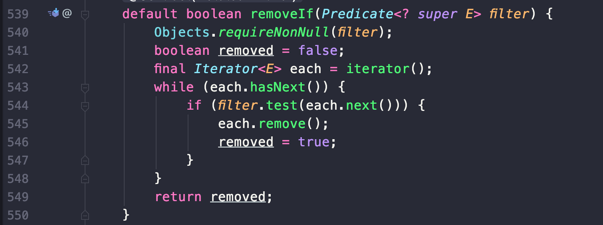

# Item 21. 인터페이스는 구현하는 쪽을 생각해 설계하라

  자바 8 전에는 기존 구현체를 깨뜨리지 않고는 인터페이스에 메서드를 추가할 방법이 없었지만, 자바 8 이후에는 기존 인터페이스에 메서드를 추가할 수 있도록 디폴트 메서드를 지원하기 시작했습니다.

 디폴트 메서드를 선언하면, 그 인터페이스를 구현한 후 디폴트 메서드를 재정의하지 않은 모든 클래스에서 디폴트 구현이 쓰이게 됩니다. 이처럼 자바에도 기존 인터페이스에 메서드를 추가하는 길이 열렸지만 모든 기존 구현체들과 매끄럽게 연동되리라는 보장은 없습니다.

#### 디폴트 메서드로 인한 기존 구현 클래스의 호환성

  위 코드는 Collection 인터페이스에 추가된 디폴트 메서드인 removeIf() 입니다. 이 메서드는 주어진 불리언 함수(predicate)가 true를 반환하는 모든 원소를 제거합니다. 범용성을 위해 추가되었지만, 이러한 디폴트 메서드가 현존하는 모든 Collection 구현체와 잘 어우러지는 것은 아닙니다.

 아파치 커먼즈 라이브러리의 org.apache.commons.collections4.collection.SynchronizedCollection 클래스는 java.util의 Collections.synchronizedCollection 정적 팩토리 메서드가 반환하는 클래스와 비슷합니다. 아파치 버전은 클라이언트가 제공한 객체로 락을 거는 능력을 추가로 제공합니다. 즉, 모든 메서드에서 주어진 락 객체로 동기화한 후 내부 컬렉션 객체에 기능을 위임하는 래퍼 클래스입니다.

 아파치의 SynchronizedCollection 클래스는 처음에 removeIf 메서드를 재정의하지 않고 있었습니다.

(현재는 지원되고 있음. [https://commons.apache.org/proper/commons-collections/apidocs/org/apache/commons/collections4/collection/SynchronizedCollection.html](https://commons.apache.org/proper/commons-collections/apidocs/org/apache/commons/collections4/collection/SynchronizedCollection.html))

 즉, 클래스를 자바 8과 함께 사용한다면(그래서 removeIf의 디폴트 구현을 물려받게 된다면), removeIf의 구현이 동기화에 관해 아무것도 모르기 때문에 락 객체를 사용할 수 없게 됩니다. 따라서 SynchronizedCollection 인스턴스를 여러 쓰레드가 공유하는 환경에서 한 쓰레드가 removeIf를 호출하면 ConcurrentModificationException이 발생하거나 다른 예기치 못한 결과로 이어질 수 있습니다.

#### 디폴트 메서드 주의사항

-   기존 인터페이스에 디폴트 메서드로 새 메서드를 추가하는 일은 꼭 필요한 경우가 아니면 피해야 합니다.
-   디폴트 메서드는 인터페이스로부터 메서드를 제거하거나 기존 메서드의 시그니처를 수정하는 용도가 아님을 명심해야 합니다.
-   새로운 인터페이스라면 반드시 릴리스 전에 서로 다른 방식으로 최소한 세 가지는 구현해보면서 테스트해 봐야 합니다.
-   인터페이스를 릴리스한 후라도 결함을 수정하는 게 가능한 경우도 있겠지만, 절대 그 가능성에 기대서는 안 됩니다.

---

## 참고자료

[http://www.kyobobook.co.kr/product/detailViewKor.laf?ejkGb=KOR&mallGb=KOR&barcode=9788966262281&orderClick=LEa&Kc=](http://www.kyobobook.co.kr/product/detailViewKor.laf?ejkGb=KOR&mallGb=KOR&barcode=9788966262281&orderClick=LEa&Kc=)
