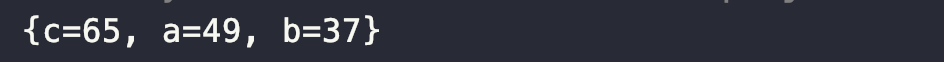

# Item 46. 스트림에서는 부작용 없는 함수를 사용하라

## Stream

 스트림은 함수형 프로그래밍에 기초한 패러다임입니다. 스트림 패러다임의 핵심은 계산을 일련의 변환(transformation)으로 재구성하는 부분입니다.

 각 변환 단계는 가능한 한 이전 단게의 결과를 받아 처리하는 순수 함수여야 합니다. 순수 함수란 오직 입력만이 결과에 영향을 주는 함수를 말합니다.

 다른 가변 상태를 참조하지 않고, 함수 스스로도 다른 상태를 변경하지 않습니다. 이렇게 하려면 (중간 단계든 종단 단계든) 스트림 연산에 건네는 함수 객체는 모두 부작용(side effect)이 없어야 합니다.

 다음의 예제는 단어별 수를 세어 빈도표를 만드는 코드입니다.

**스트림을 이용하지 않은 코드**

```
import java.util.HashMap;
import java.util.List;
import java.util.Map;

public class NonStreamUtilization {
    public static void main(String[] args) {
        List<String> stringList = List.of(
                "Apple", "apple", "banana", "What", "Who", "who",
                "Banana", "Orange", "orange", "Hello", "may", "orange",
                "hello", "who", "what", "what", "Apple", "who", "apple"
        );

        Map<String, Long> freq = new HashMap<>();
        stringList.forEach(word -> 
                freq.merge(word.toLowerCase(), 1L, Long::sum)
        );
        System.out.println(freq);
    }
}

```

 위 코드는 스트림을 가장한 반복적 코드입니다. 이 코드의 모든 작업이 종단 연산인 forEach에서 일어나는데, 이때 외부 상태(빈도표)를 수정하는 람다를 실행하면서 문제가 생깁니다.

**스트림을 활용한 코드**

```
import java.util.List;
import java.util.Map;

import static java.util.Comparator.comparing;
import static java.util.stream.Collectors.*;

public class StreamUtilization {
    public static void main(String[] args) {
        List<String> stringList = List.of(
                "Apple", "apple", "banana", "What", "Who", "who",
                "Banana", "Orange", "orange", "Hello", "may", "orange",
                "hello", "who", "what", "what", "Apple", "who", "apple"
        );

        Map<String, Long> freq;
        freq = stringList.stream()
                .collect(groupingBy(String::toLowerCase, counting()));
        System.out.println(freq);
    }
}

```

 스트림을 이용하면 위와 같이 짧고 명확하게 코드를 작성할 수 있습니다.

#### forEach 연산의 주의점

 forEach 종단 연산은 for-each 반복문과 비슷하게 생겼습니다. 하지만 forEach 연산은 종단 연산 중 기능이 가장 적고 가장 '덜' 스트림답습니다. 대놓고 반복적이라서 병렬화할 수도 없습니다. **forEach 연산은 스트림 계산 결과를 보고할 때만 사용하고, 계산하는 데는 쓰지 않는 것이 좋습니다.** 물론 가끔은 스트림 계산 결과를 기존 컬렉션에 추가하는 등의 다른 용도로도 쓸 수 있습니다.

## 수집기 (Collector)

 수집기는 스트림을 사용하면서 유용하게 사용되는 API인데, java.util.stream.Collectors 클래스에서 변환, 통계 등 다양한 기능을 메서드로 제공합니다. 간단하게 축소(reduction) 전략을 캡슐화한 블랙박스 객체라고 생각하면 됩니다. 수집기가 생성하는 객체는 일반적으로 컬렉션이며, 그래서 "collector"라는 이름을 씁니다.

### 수집기의 종류

toList(), toSet(), toMap(), toCollection() 등...

 위 수집기들은 차례로 리스트, 집합, 맵, 프로그래머가 지정한 컬렉션 타입을 반환합니다.

**toList() 예시 코드**

 아래는 빈표에서 가장 흔한 단어 10개를 뽑아내는 파이프라인 코드입니다.

```
List<String> topTen = freq.keySet().stream()
                .sorted(comparing(freq::get).reversed())
                .limit(10)
                .collect(toList());
```

 comparing(freq::get).reversed()는 키 추출 함수를 받는 비교자 생성 메서드입니다. 그리고 한정적 메서드 참조이자, 여기서 키 추출 함수로 쓰인 freq::get은 입력받은 단어(키)를 반도표에서 찾아(추출) 그 빈도를 반환합니다. 그런 다음 가장 흔한 단어가 위로 오도록 비교자(comparing)를 역순(reversed)으로 정렬(sorted)합니다.

**toMap() 예시 코드**

```
private static final Map<String, Operation> stringToEnum =
    Stream.of(values()).collect(
        toMap(Object::toString, e -> e));
```

 위 예시는 가장 간단한 형태의 맵 수집기를 이용한 코드입니다. toMap(keyMapper, valueMapper)로, 스트림 원소를 키에 매핑하는 함수와 값에 매핑하는 함수를 인수로 받습니다. 이 수집기는 열거 타입 상수의 문자열 표현을 열거 타입 상수에 매핑합니다.

 이 간단한 형태의 toMap()은 각 원소가 고유한 키에 매핑되어 있을 때 적합합니다. 스트림 원소 다수가 같은 키를 사용한다면 파이프라인이 IllegalStateException을 던지며 종료될 것입니다.

**조금 더 복잡한 형태의 toMap()**

 조금 더 복잡한 형태의 toMap()이나 groupingBy는 키가 충돌할 때 발생하던 문제들을 다루는 다양한 전략을 제공합니다. 예를 들어 toMap에 키 매퍼와 값 매퍼는 물론 병합(merge) 함수까지 제공할 수 있습니다. 병합 함수의 형태는 BinaryOperator<U>이며, 여기서 U는 해당 맵의 값 타입입니다. 같은 키를 공유하는 값들은 이 병합 함수를 사용해 기존 값에 합쳐집니다.

**toMap() 예시**

```
public class Artist {
    private String name;

    public Artist(String name) {
        this.name = name;
    }

    @Override
    public String toString() {
        return name;
    }
}

```

```
public class Album {
    private Artist artist;
    private int sales;

    public Album(Artist artist, int sales) {
        this.artist = artist;
        this.sales = sales;
    }

    public Artist artist() {
        return artist;
    }

    public int sales() {
        return sales;
    }

    @Override
    public String toString() {
        return Integer.toString(sales);
    }
}

```

```
import java.util.List;
import java.util.Map;

import static java.util.Comparator.comparing;
import static java.util.function.BinaryOperator.maxBy;
import static java.util.stream.Collectors.toMap;

public class StreamToMapMain {
    public static void main(String[] args) {
        Artist a = new Artist("a");
        Artist b = new Artist("b");
        Artist c = new Artist("c");

        List<Album> albums = List.of(
                new Album(a, 21),
                new Album(a, 11),
                new Album(a, 30),
                new Album(a, 9),
                new Album(a, 49),
                new Album(b, 37),
                new Album(b, 12),
                new Album(c, 45),
                new Album(c, 65),
                new Album(c, 28)
        );

        Map<Artist, Album> topHits = albums.stream().collect(
                toMap(Album::artist,
                        album -> album,
                        maxBy(comparing(Album::sales))
                )
        );
        System.out.println(topHits);
    }
}

```



 위 예시는 다양한 음악가의 앨범들을 담은 스트림을 가지고, 음악가와 그 음악가의 베스트 앨범을 연관 시키는 코드입니다. 여기서 비교자로는 **BinaryOperator**에서 정적 임포트한 maxBy라는 정적 팩토리 메서드를 사용했습니다. maxBy는 Comparator<T>를 입력받아 BinaryOperator<T>를 반환합니다.

 인수가 3개인 toMap은 충돌이 나면 마지막 값을 취하는(last-write-wins) 수집기를 만들 때도 유용합니다.

```
toMap(keyMapper, valueMapper, (oldVal, newVal) -> newVal)
```

 toMap()은 마지막 인수로 맵 팩토리를 받습니다. 이 인수로는 EnumMap이나 TreeMap처럼 원하는 특정 맵 구현체를 직접 지정할 수 있습니다.

 이상의 세 가지 toMap에는 변형이 있는데, 그중 toConcurrentMap은 병렬 실행된 후 결과로 ConcurrentHashMap 인스턴스를 생성합니다.

#### Collectors의 groupingBy()

 groupingBy는 입력으로 분류 함수(classifier)를 받고 출력으로는 원소들을 카테고리별로 모아 놓은 맵을 담은 수집기를 반환합니다. 반류 함수는 입력받은 원소가 속하는 카테고리를 반환합니다. 그리고 이 카테고리가 해당 원소의 맵 키로 쓰입니다.

 다중정의된 groupingBy 중 형태가 가장 간단한 것은 분류 함수 하나를 인수로 받아 맵을 반환합니다. 반환된 맵에 담긴 각각의 값은 해당 카테고리에 속하는 원소들을 모두 담은 리스트입니다.

```
    strList.stream().collect(groupingBy(word -> alphabetize(word)))

//...

    private static String alphabetize(String s) {
        char[] a = s.toCharArray();
        Arrays.sort(a);
        return new String(a);
    }
```

 groupingBy가 반환하는 수집기가 리스트 외의 값을 갖는 맵을 생성하게 하려면, 분류 함수와 함께 다운스트림(downstream) 수집기도 명시해야 합니다. 다운 스트림 수집기의 역할은 해당 카테고리의 모든 원소를 담은 스트림으로부터 값을 생성는 것입니다.

**toSet()**

 이 매개변수를 사용하는 가장 간단한 방법은 toSet()을 넘기는 것입니다.

```
Map<String, Set<String>> collect = stringList.stream()
                .collect(groupingBy(String::toLowerCase, toSet()));
```

**toCollection(collectionFactory)**

 리스트나 집합 대신 컬렉션을 값으로 갖는 맵을 생성합니다. 이는 원하는 컬렉션 타입을 선택할 수 있다는 유연성까지 가지고 있습니다.

```
Map<String, Set<String>> collect = stringList.stream()
                .collect(groupingBy(String::toLowerCase, toCollection(LinkedHashSet::new)));
```

**counting()**

다운스트림 수집기로 counting()을 건네는 방법도 있습니다. 이렇게 하면 각 카테고리(키)를 (원소를 담은 컬렉션이 아닌) 해당 카테고리에 속하는 원소의 개수(값)와 매핑한 맵을 얻습니다.

```
Map<String, Long> collect = stringList.stream()
                .collect(groupingBy(String::toLowerCase, counting()));
```

** groupingBy의 세 번째 버전**은 다운스트림 수집기에 더해 맵 팩토리도 지정할 수 있게 해줍니다. 이 메서드는 점층적 인수 목록 패턴(telescoping argument list pattern)에 어긋납니다. 즉, mapFactory 매개변수가 downStream 매개변수보다 앞에 놓입니다.

```
public static <T, K, D, A, M extends Map<K, D>>
    Collector<T, ?, M> groupingBy(Function<? super T, ? extends K> classifier,
                                  Supplier<M> mapFactory,
                                  Collector<? super T, A, D> downstream)
```

```
TreeMap<String, Long> collect = stringList.stream()
                .collect(groupingBy(String::toLowerCase, TreeMap::new, counting()));
```

 이 버전의 groupingBy를 사용하면 맵과 그 안에 담긴 컬렉션의 타입을 모두 지정할 수 있습니다.

#### Collectors의 partitioningBy

 partitioningBy는 분류 함수 자리에 Predicate를 받고 키가 Boolean인 맵을 반환합니다. Predicate에 더해 다운스트림 수집기까지 입력 받는 버전도 다중정의 되어 있습니다.

#### counting()과 그 외의 메서드들

 counting() 메서드가 반환하는 수집기는 다운스트림 수집기 전용입니다. **Stream의 count 메서드를 직접 사용하여 같은 기능을 수행할 수 있으니 collect(counting()) 형태로 사용할 일은 전혀 없습니다.**

 Collections에는 이런 속성의 메서드가 16개나 더 있습니다. 그중 9개는 이름이 summing, averaging, summarizing으로 시작하며, 각각 int, long, double 스트림용으로 하나씩 존재합니다. 그리고 다중정의된 reducing 메서드들, filtering, mapping, flatMapping, collectingAndThen 메서드가 있습니다.

#### joining()

 joining() 메서드는 (문자열 등의) CharSequence 인스턴스의 스트림에만 적용할 수 있습니다.

 인수가 없는 joining은 단순히 원소들을 연결(concatenate)하는 수집기를 반환합니다.

 인수가 하나짜리 joining은 CharSequence 타입의 구분문자(delimiter)를 매개변수로 받습니다. 연결 부위에 이 구분문자를 삽입하는데, 구분문자로 쉼표(,)를 입력하면 CSV 형태의 문자열을 만들어줍니다(단, 스트림에 쉼표를 이미 포함한 원소가 있다면 구분문자와 구별되지 않으니 유의해야 합니다).

 인수가 3개짜리 joining은 구분문자에 더해 접두문자(prefix)와 접미문자(suffix)도 받습니다.

```
import java.util.List;

import static java.util.stream.Collectors.joining;

public class CollectorsJoining {
    public static void main(String[] args) {
        List<String> stringList = List.of("Hello", "World");

        String collected = stringList.stream()
                .collect(joining(", ", "[", "]"));
        System.out.println(collected);
    }
}

```


---

## 참고자료

[www.kyobobook.co.kr/product/detailViewKor.laf?ejkGb=KOR&mallGb=KOR&barcode=9788966262281&orderClick=LEa&Kc=](http://www.kyobobook.co.kr/product/detailViewKor.laf?ejkGb=KOR&mallGb=KOR&barcode=9788966262281&orderClick=LEa&Kc=)
