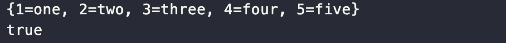

# Item 6. 불필요한 객체 생성을 피하라

 똑같은 기능의 객체 매번 생성하기보다는 객체 하나를 재사용하는 편이 나을 때가 많습니다. 특히 **불편 객체는 언제든 재사용**할 수 있습니다.

 다음은 코드는 하지 말아야 할 극단적인 예입니다.

```
String s = new String("hello");
```

 이 문장은 실행할 때마다 생성자를 통해 String 인스턴스를 매번 생성합니다. 만약 이 문장이 빈번히 호출되는 메서드를 만든다면 같은 기능을 하는 불변 객체를 쓸데없이 매번 생성하게 될 것입니다. 이는 아래와 같은 코드로 개선되어야 합니다.

```
String s = "Hello";
```

 이 코드는 새로운 인스턴스를 매번 만드는 대신 하나의 인스턴스만 사용합니다. 같은 가상 머신 안에서 이와 똑같은 문자열 리터럴이 사용된다면 사용하는 모든 코드가 같은 객체를 재사용함이 보장됩니다.

 생성자 대신 정적 팩토리 메서드를 제공하는 불변 클래스에서 정적 팩토리 메서드를 사용하여 불필요한 객체 생성을 피할 수 있습니다. 불변 객체만이 아니라 가변 객체라 해도 사용 중에 변경되지 않을 것임을 안다면 재사용할 수 있습니다.

 데이터베이스 커넥션과 같이 생성 비용이 비싼 객체들도 있습니다. 이런 객체들이 반복해서 필요하다면 캐싱하여 재사용하는 것이 좋습니다. 데이터베이스 커넥션 같은 경우에는 이를 위해서 커넥션 풀을 만들어놓고 재사용을 합니다.

#### 불필요한 객체 생성 반복 예시 1

```
static boolean isRomanNumeral(String s) {
    return s.matches("^(?=.)M*(C[MD]|D?C{0,3})"
            + "(X[CL]|L?X{0,3})(I[XV]|V?I{0,3})$");
}
```

 위 방식의 문제점은 String.matches 메서드를 사용한다는 데 있습니다. String.matches 는 메서드 내부에서 만드는 정규표현식용 Pattern 인스턴스는, 한 번 쓰고 버려져서 곧바로 가비지 컬렉션 대상이 됩니다. Pattern 인스턴스는 입력받은 정규표현식에 해당하는 유한 상태 머신(finite state machine)을 만들기 때문에 인스턴스 생성 비용이 높습니다.

```
public class RomanNumerals {
    private static final Pattern ROMAN = Pattern.compile(
            "^(?=.)M*(C[MD]|D?C{0,3})" 
            + "(X[CL]|L?X{0,3})(I[XV]|V?I{0,3})$");

    static boolean isRomanNumeral(String s) {
        return ROMAN.matcher(s).matches();
    }
}
```

 이러한 성능을 개선하기 위해서는 위와 같이 불변인 Pattern 인스턴스를 클래스 초기화 과정에서 직접 생성하여 캐싱해두고, isRomanNumeral() 메서드가 호출될 때마다 이 인스턴스를 재사용하는 것입니다. 이렇게 개선하면 isRomanNumeral() 메서드가 빈번히 호출되는 상황에서 성능을 상당히 끌어올릴 수 있습니다.

#### 불필요한 객체 생성 반복 예시 2

 Map 인터페이스의 keySet() 메서드는 Map 객체 안의 키 전부를 담은 Set 뷰를 반환합니다. keySet() 는 호출할 때마다 새로운 객체를 생성하는 것이 아니라 매번 같은 Set 인스턴스를 반환합니다. 반환된 Set 인스턴스가 일반적으로 가변이더라도 반환된 인스턴스들은 기능적으로 모두 같습니다. 즉, 반환된 객체 중 하나를 수정하면 다른 모든 객체가 따라서 바뀝니다. 모두가 똑같은 Map 인스턴스를 대변하기 때문입니다.

```
import java.util.HashMap;
import java.util.Iterator;
import java.util.Map;
import java.util.Set;

public class MapExam {
    public static void main(String[] args) {
        Map<Integer, String> maps = new HashMap<>();

        maps.put(1, "one");
        maps.put(2, "two");
        maps.put(3, "three");
        maps.put(4, "four");
        maps.put(5, "five");
        System.out.println(maps);

        Set<Integer> set1 = maps.keySet();
        Set<Integer> set2 = maps.keySet();
        System.out.println(set1 == set2);
    }
}

```



#### 불필요한 객체 생성 반복 예시 3

```
private static long sum() {
    Long sum = 0L;
    for (long i = 0; i <= Integer.MAX_VALUE; i++) {
        sum += i;
    }
    return sum;
}
```

 오토박싱은 기본 타입과 그에 대응하는 박싱된 기본 타입의 구분을 흐려주지만, 완전히 없애주지는 않습니다. 위와 같은 코드는 의미상으로는 별다를 것이 없지만 성능에 있어서는 그렇지 않습니다.기본 타입 long 인 i 변수가 Long 타입인 sum에 더해질 때마다 불필요한 Long 인스턴스가 계속해서 만들어지게 됩니다. 이를 방지하기 위해서 **박싱된 기본 타입보다는 기본 타입을 사용하고, 의도치 않은 오토박싱이 숨어들지 않도록 주의해야 합니다.**

---

## 참고자료

[http://www.kyobobook.co.kr/product/detailViewKor.laf?ejkGb=KOR&mallGb=KOR&barcode=9788966262281&orderClick=LEa&Kc=](http://www.kyobobook.co.kr/product/detailViewKor.laf?ejkGb=KOR&mallGb=KOR&barcode=9788966262281&orderClick=LEa&Kc=)
