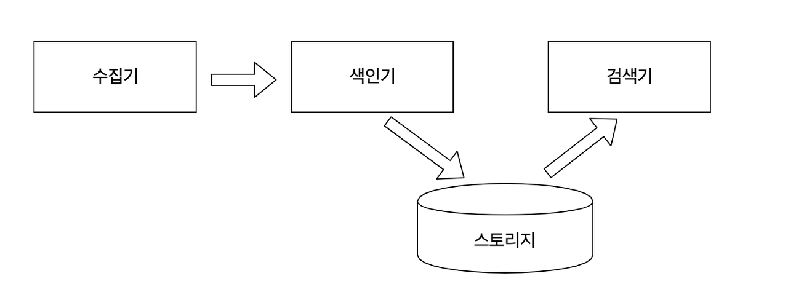

# [ElasticSearch] 들어가기

## 검색 시스템이란?

이름 그대로 생각하면 사용자가 원하는 검색어에 대한 검색 결과를 제공하는 시스템입니다. 이러한 검색 시스템은 부르는 용어도 다양합니다. 검색엔진, 검색 시스템, 검색 서비스 등의 용어가 대표적입니다. 이 세 가지 용어의 정의에 대해 살펴보겠습니다.

# 검색 시스템의 구성 요소

## 수집기

수집기는 웹사이트, 블로그, 카페 등 웹에서 필요한 정보를 수집하는 프로그램입니다. 크롤러(Crawler), 스파이더(Spider), 웜(Worms), 웹 로봇(Web Robot) 등으로도 불립니다. 파일, 데이터베이스, 웹페이지 등 웹상의 대부분의 정보가 수집 대상입니다.

## 스토리지

데이터베이스에서 데이터를 저장하는 물리적인 장소입니다. 검색 엔진은 색인한 데이터를 스토리지에 보관합니다.

### 색인기

검색 엔진이 수집한 정보에서 사용자의 질의와 일치하는 정보를 찾으려면 수집된 데이터를 검색 가능한 구조로 가공하고 저장해야 합니다. 그 역할을 하는 것이 색인기입니다. 색인기는 다양한 형태소 분석기를 조합해 정보에서 의미가 있는 용어를 추출하고 검색에 유리한 역색인 구조로 데이터를 저장합니다.

### 검색기

검색기는 사용자 질의를 입력받아 색인기에서 저장한 역색인 구조에서 일치하는 문서를 찾아 결과로 반환합니다. 질의와 문서가 일치하는지는 유사도 기반의 검색 순위 알고리즘으로 판단합니다. **검색기 또한 색인기와 마찬가지로 형태소 분석기를 이용해 사용자 질의에서 유의미한 용어를 추출해 검색합니다.**

---

## 관계형 데이터베이스와의 차이점

 데이터베이스는 저장 방식에 따라 크게 관계형 또는 계층형 데이터베이스로 나뉩니다.

 관계형 데이터베이스는 모든 데이터의 중복을 제거하고 정형 데이터로 구조화해 행과 열로 구성된 테이블에 저장됩니다. SQL 문을 이용해 원하는 정보의 검색이 가능하지만 텍스트 매칭을 통한 단순한 검색만 가능합니다. 텍스트를 여러 단어로 변형하거나 여러 개의 동의어나 유의어를 활용한 검색은 불가능합니다.

 검색엔진은 관계형 데이터베이스에서는 불가능한 비정형 데이터를 색인하고 검색할 수 있습니다. 형태소 분석을 통해 사람이 구사하는 자연어의 처리가 가능해지고 역색인 구조를 바탕으로 빠른 검색 속도를 보장합니다.

<table style="border-collapse: collapse; width: 100%;" border="1" data-ke-style="style8"><tbody><tr><td style="width: 50%;">엘라스틱 서치</td><td style="width: 50%;">관계형 데이터베이스</td></tr><tr><td style="width: 50%;">인덱스 (Index)</td><td style="width: 50%;">데이터베이스 (Database)</td></tr><tr><td style="width: 50%;">샤드 (Shard)</td><td style="width: 50%;">파티션 (Partition)</td></tr><tr><td style="width: 50%;">타입 (Type)</td><td style="width: 50%;">테이블 (Table)</td></tr><tr><td style="width: 50%;">문서 (Document)</td><td style="width: 50%;">행 (Row)</td></tr><tr><td style="width: 50%;">필드 (Field)</td><td style="width: 50%;">열 (Column)</td></tr><tr><td style="width: 50%;">매핑 (Mapping)</td><td style="width: 50%;">스키마 (Schema)</td></tr><tr><td style="width: 50%;">Query DSL</td><td style="width: 50%;">SQL</td></tr></tbody></table>

 위의 표는 엘라스틱서치와 관계형 데이터베이스의 주요 개념을 비교하여 나타낸 테이블입니다. **엘라스틱서치 6.0 이하 버전에서는 하나의 인덱스 내부에 기능에 따라 데이터를 분류하고 여러 개의 타입을 만들어 사용했지만 현재는 하나의 인덱스에 하나의 타입만을 구성하도록 바뀌었습니다.**

 엘라스틱서치가 관계형 데이터베이스에 비해 강점을 띤 부분 중 하나는 구조화되지 않은 비정형 데이터도 검색이 가능하다는 점입니다. 데이터베이스는 스키마를 미리 정의해야만 데이터 저장과 조회가 가능한 반면 엘라스틱서치는 구조화되지 않은 데이터까지 스스로 분석해 자동으로 필드를 생성하고 저장합니다.

---

### 엘라스틱서치의 강점

#### 전문 검색

 PostgreSQL, MongoDB 같은 대부분의 데이터베이스는 기본 쿼리 및 색인 구조의 한계로 인해 기본적인 텍스트 검색만 제공합니다. 하지만 엘라스틱서치는 좀 더 고차원적인 전문 검색(Full Text)이 가능합니다. 전문 검색이란 내용 전체를 색인해서 특정 단어가 포함된 문서를 검색하는 것을 말합니다.

#### 통계 분석

 비정형 로그 데이터를 수집하고 한곳에 모아 통계 분석을 할 수 있습니다. 엘라스턱서치와 키바나를 연결하면 실시간으로 쌓이는 로그를 시각화하고 분석할 수 있습니다.

#### 스키마리스 (Schemaless)

 데이터베이스는 스키마라는 구조에 따라 데이터를 적합한 형태로 변경해서 저장하고 관리합니다. 반면 엘라스틱서치는 정형화되지 않은 형태의 문서도 자동으로 색인하고 검색할 수 있습니다.

#### RESTful API

 엘라스틱서치는 HTTP 기반의 RESTful API를 지원하고 요청뿐 아니라 응답에도 JSON 형식을 사용해 개발 언어, 운영체제, 시스템에 관계없이 이기종 플랫폼에서도 이용 가능합니다.

#### 멀티테넌시 (Multi-tenancy)

 서로 상이한 인덱스일지라도 검색할 필드명만 같으면 여러 개의 인덱스를 한번에 조회할 수 있습니다.

#### Document-Oriented

 여러 계층의 데이터를 JSON 형식의 구조화된 문서로 인덱스에 저장할 수 있습니다. 계층 구조로 문서도 한 번의 쿼리로 쉽게 조회할 수 있습니다.

#### 역색인 (Inverted Index)

MongoDB, 카산드라 같은 일반적인 NoSQL은 역색인을 지원하지 않지만 엘라스틱서치는 역색인을 지원하여 해당 단어가 포함된 모든 문서의 위치를 빠르게 찾아낼 수 있습니다.

#### 확장성과 가용성

 엘라스틱서치를 분산 구성해서 확장하면 대량의 문서를 좀 더 효율적으로 처리할 수 있습니다. 분산 환경에서는 샤드(Shard)라는 작은 단위로 나뉘어 제공되며, 인덱스를 만들 때마다 샤드의 수를 조절할 수 있습니다. 이를 통해 데이터의 종류와 성격에 따라 데이터를 분산해서 빠르게 처리할 수 있습니다.

---

### 엘라스틱서치의 약점

#### 1\. 실시간이 아닙니다.

 색인된 데이터는 내부적으로 커밋(Commit)과 플러시(Flush) 같은 복잡한 과정을 거치기 때문에 실시간이 아닙니다. 엄밀히 따지자면 준 실시간(Near Realtime)이라고 할 수 있습니다.

#### 2\. 트랜잭션과 롤백 기능을 제공하지 않습니다.

 엘라스틱서치는 기본적으로 분산 시스템으로 구성됩니다. 전체적인 클러스터 향상을 위해 시스템적으로 비용 소모가 큰 롤백(Rollback)과 트랜잭션(Transaction)을 지원하지 않기 때문에 최악의 경우 데이터 손실의 위험이 있습니다.

#### 3\. 데이터의 업데이트를 제공하지 않습니다.

 엘라스틱서치는 업데이트 명령이 요청될 경우 기존의 문서를 삭제하고 변경된 내용으로 새로운 문서를 생성하는 방식을 사용합니다. 이러한 이유로 단순 업데이트에 비해서는 상대적으로 많은 비용이 발생합니다. 하지만 이는 큰 단점이 아닌데, 이러한 점을 통해 불변적(Immutable)이라는 이점을 취할 수 있기 때문입니다.

---

## 참고자료

[엘라스틱서치 실무 가이드](http://www.kyobobook.co.kr/product/detailViewKor.laf?ejkGb=KOR&mallGb=KOR&barcode=9791158391485&orderClick=LAG&Kc=) <<권택환, 김동우, 김흥래, 박진현, 최용호, 황희정 지음>>