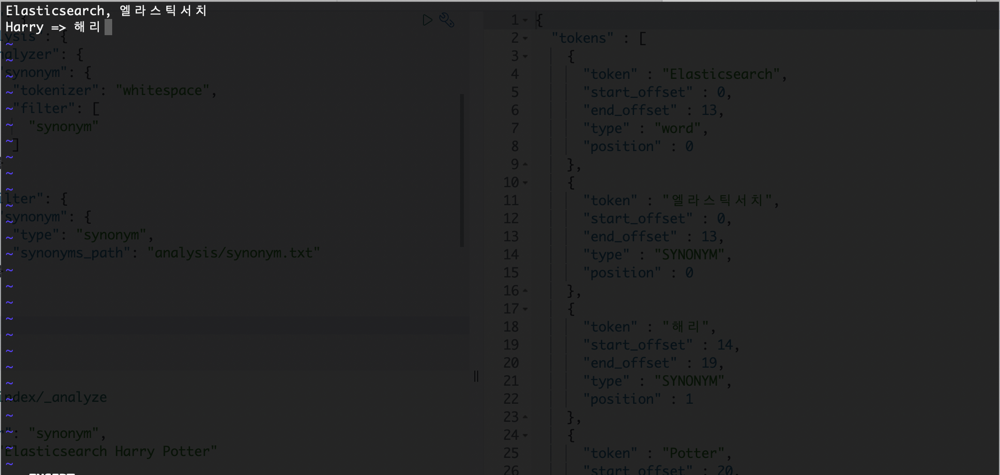
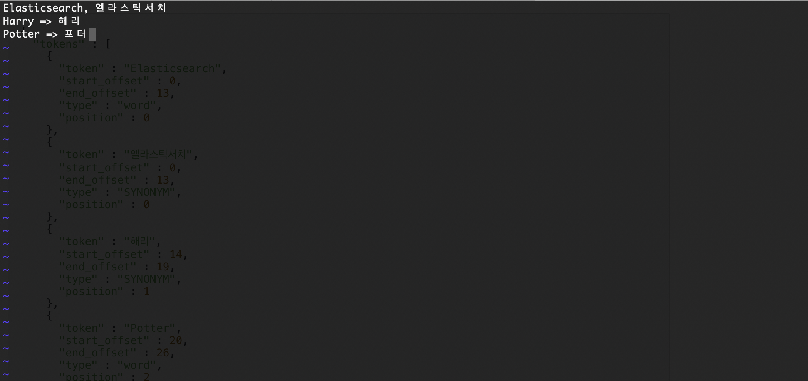

# 동의어 사전

## 동의어 사전

 Tokenizer에 의해 토큰이 모두 분리되면 다양한 토큰 필터를 적용해 토큰을 가공할 수 있습니다. 토큰 필터를 이용하면 토큰을 변경하는 것은 물론이고 토큰을 추가하거나 삭제하는 것도 가능해집니다. 그중에서 **동의어 처리에 대한 필터는 엘라스틱서치에서 제공하는 Synonym 필터를 사용하면 동의어 처리가 가능합니다.**

 동의어는 검색 기능을 풍부하게 할 수 있게 도와주는 도구 중 하나입니다. **원문에 특정 단어가 존재하지 않더라도 색인 데이터를 토큰화해서 저장할 때 동의어나 유의어에 해당하는 단어를 함께 저장해서 검색이 가능하도록 만드는 기술입니다.** 예를 들어, "Elasticsearch"라는 단어가 포함된 원문이 필터를 통해 인덱스에 저장된다면 "엘라스틱서치"라고 검색했을 때 검색되지 않을 것입니다. 하지만 동의어 기능을 이용하여 색인할 때 "엘라스틱서치"도 함께 저장한다면 "Elasticsearch"로도 검색이 가능하고 "엘라스틱서치"로도 검색이 가능해집니다.

#### 동의어를 추가하는 방법

1\. 동의어를 매핑 설정 정보에 미리 파라미터로 등록하는 방식

2\. 특정 파일을 별도로 생성해서 관리하는 방식

 첫 번째 방식은 실무에서는 잘 사용되지 않는데, 매핑 정보에서 동의어를 관리할 경우 운영 중에는 동의어를 변경하기가 사실상 어렵기 때문입니다.

 엘라스틱서치에서 가장 까다로운 부분 중 하나가 바로 동의어를 관리하는 것입니다. 검색엔진에서 다루는 분야가 많아지면 많아질수록 동의어의 수도 늘어납니다. 분야별로 파일도 늘어날 것이고 그 안의 동의어 변환 규칙도 많아질 것입니다. 실무에서는 이러한 동의어를 모아둔 파일들을 칭할 때 일반적으로 **"동의어 사전"**이라는 용어를 사용합니다.

#### 동의어 사전 만들기

 동의어 파일은 엘라스틱서치가 설치된 서버 아래의 config 디렉토리에 생성합니다. config 디렉토리 아래에 analysis라는 디렉토리를 만들고 synonym.txt라는 파일을 생성합니다.

```
<엘라스틱서치 설치 경로>/config/analysis/synonym.txt
```

 synonym.txt라는 동의어 사전을 생성했습니다. 이곳에는 다음의 두 가지 방법으로 데이터를 추가할 수 있습니다.

1\. 동의어 추가

2\. 동의어 치환

#### 동의어 추가

 동의어를 추가할 때 단어를 쉼표(,)로 분리하여 등록하는 방법입니다. 예를 들어, "Elasticsearch"와 "엘라스틱서치"를 동의어로 지정하고 싶다면 동의어 사전 파일에 "Elasticsearch, 엘라스틱서치"라고 등록하면 됩니다.

#### 동의어 치환

 특정 단어를 어떤 단어로 변경하고 싶다면 동의어 치환 기능을 이용하면 됩니다. 동의어를 치환하면 원본 토큰이 제거되고 변경될 새로운 토큰이 추가됩니다. 동의어 치환은 동의어 추가와 구분하기 위해 화살표 "=>"로 표시합니다. 예를 들어 "Harry => 해리"라고 한다면 "Harry"를 "해리"로 변경해서 색인하겠다는 의미입니다.

 아까 <엘라스틱서치 설치 경로>/config/analysis 경로에 생성했던 synonym.txt 파일에 아래와 같이 동의어 사전을 작성하였습니다.



 첫 번째 행은 "Elasticsearch"와 "엘라스틱서치"를 동의어로 등록하는 방법입니다.

 두 번째 행은 "Harry"라는 토큰을 "해리"라는 토큰으로 치환하여 등록하는 방법입니다.

 synonym.txt에 대한 예제 확인을 위해 아래와 같이 test\_index 라는 인덱스를 생성하였습니다.

```
PUT /test_index
{
  "settings": {
    "index": {
      "analysis": {
        "analyzer": {
          "synonym_test": {
            "tokenizer": "whitespace",
            "filter": [
              "synonym"
            ]
          }
        },
        "filter": {
          "synonym": {
            "type": "synonym",
            "synonyms_path": "analysis/synonym.txt"
          }
        }
      }
    }
  }
}
```

 위의 인덱스는 synonym\_test 라는 분석기에 Tokenizer Filter를 whitespace로 설정하여 공백을 기준으로 텍스트를 토큰화하고, Token Filter를 synonym 토큰 필터로 설정하여 동의어를 처리할 수 있도록 정의되었습니다. 동의어 사전의 경로는 synonyms\_path 값에 지정합니다.

 analyze API를 이용하여 분석기가 텍스트를 어떻게 분리하는지 확인해 보겠습니다.

```
GET /test_index/_analyze
{
  "analyzer": "synonym_test", 
  "text": "Elasticsearch Harry Potter"
}
```

 위의 API를 테스트하면 "Elasticsearch"라는 단어는 "엘라스틱서치"와 동의어이므로 두 단어가 함께 토큰화 될 것입니다. 그리고 "Harry"라는 단어는 "해리"라는 단어로 치환 될 것입니다. 결과적으로 "Elasticsearch Harry Potter"라는 문장은 아래와 같이 토큰화 될 것입니다.

\["Elasticsearch", "엘라스틱서치", "해리", "Potter"\]

 실제로도 위와 같은 결과를 나타내는지 실행 결과를 나타내는지 확인해 보겠습니다.

```
{
  "tokens" : [
    {
      "token" : "Elasticsearch",
      "start_offset" : 0,
      "end_offset" : 13,
      "type" : "word",
      "position" : 0
    },
    {
      "token" : "엘라스틱서치",
      "start_offset" : 0,
      "end_offset" : 13,
      "type" : "SYNONYM",
      "position" : 0
    },
    {
      "token" : "해리",
      "start_offset" : 14,
      "end_offset" : 19,
      "type" : "SYNONYM",
      "position" : 1
    },
    {
      "token" : "Potter",
      "start_offset" : 20,
      "end_offset" : 26,
      "type" : "word",
      "position" : 2
    }
  ]
}

```

 이번에는 동의어 사전에서 "Potter"를 "포터"로 치환하도록 synonym.txt 를 수정해보겠습니다.



 그리고나서 다시 아까 실행하였던 분석 쿼리를 실행해보면 방금 추가한 규칙이 적용되지 않는 것을 확인하실 수 있을겁니다. 동의어 사전이 변경될 경우 이를 인식시키기 위해서는 인덱스를 Reload 해야합니다. 인덱스에 설정된 동의어 사전의 모든 데이터는 Config 형태로 메모리에서 관리되는데 인덱스를 Reload해야만 이 정보가 갱신되기 때문입니다.

 Reload를 위해 인덱스를 먼저 Close 해보겠습니다. 인덱스가 Close 상태가 되면 검색도 불가능해집니다.

```
POST /test_index/_close
```

 인덱스를 다시 Open 오픈합니다.

```
POST /test_index/_open
```

 위 과정을 통해 인덱스가 Reload 되었으며, 다시 한 번 분석 쿼리를 실행하면 변경된 동의어 사전 규칙이 잘 적용된 것을 확인하실 수 있습니다.

```
{
  "tokens" : [
    {
      "token" : "Elasticsearch",
      "start_offset" : 0,
      "end_offset" : 13,
      "type" : "word",
      "position" : 0
    },
    {
      "token" : "엘라스틱서치",
      "start_offset" : 0,
      "end_offset" : 13,
      "type" : "SYNONYM",
      "position" : 0
    },
    {
      "token" : "해리",
      "start_offset" : 14,
      "end_offset" : 19,
      "type" : "SYNONYM",
      "position" : 1
    },
    {
      "token" : "포터",
      "start_offset" : 20,
      "end_offset" : 26,
      "type" : "SYNONYM",
      "position" : 2
    }
  ]
}
```

---

## 참고자료

[엘라스틱서치 실무 가이드](http://www.kyobobook.co.kr/product/detailViewKor.laf?ejkGb=KOR&mallGb=KOR&barcode=9791158391485&orderClick=LEa&Kc=) <<권택환, 김동우, 김흥래, 박진현, 최용호, 황희정 지음>>

[https://www.elastic.co/guide/en/elasticsearch/reference/current/analysis-synonym-tokenfilter.html](https://www.elastic.co/guide/en/elasticsearch/reference/current/analysis-synonym-tokenfilter.html)

[https://www.elastic.co/kr/blog/boosting-the-power-of-elasticsearch-with-synonyms](https://www.elastic.co/kr/blog/boosting-the-power-of-elasticsearch-with-synonyms)