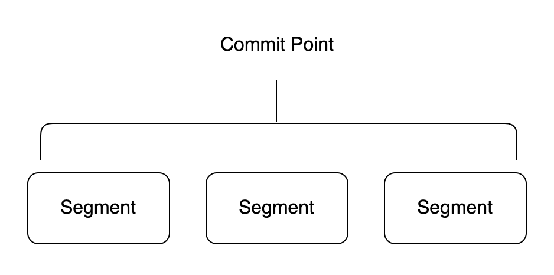
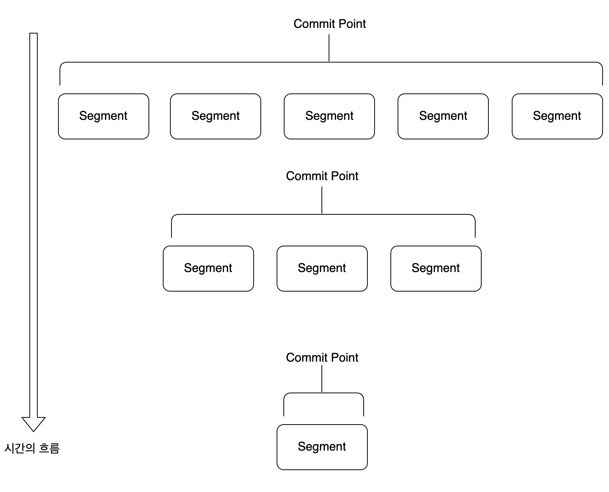

# 세그먼트에 대한 정리

## 색인 작업 시 세그먼트의 기본 동작 방식

 하나의 루씬 인덱스는 내부적으로 다수의 세그먼트로 구성되어 있습니다. 다수의 세그먼트로 나누어져 있기 때문에 검색 요청을 분산 처리하여 훨씬 효율적인 검색이 가능해집니다.

 루씬은 검색 요청을 받으면 다수의 작은 세그먼트 조각들이 각각 검색 결과 조각을 만들어 내고 이를 통합해서 하나의 결과로 응답하도록 설계되어 있습니다. 이러한 검색 방식을 **세그먼트 단위 검색(Per-Segment Search)**라고 합니다. 세그먼트는 내부에 색인된 데이터가 역색인 구조로 저장되어 있습니다.

 루씬은 세그먼트들을 관리하기 위한 용도로 커밋 포인트(Commit Point)라는 자료구조를 제공합니다. 커밋 포인트는 여러 세그먼트의 목록 정보를 가지고 있으며, 검색 요청 시 이를 활용합니다. 루씬의 IndexSearcher는 검색 요청 시 커밋 포인트를 이용하여 가장 오래된 세그먼트부터 차례대로 검색한 후에 하나의 결과로 합쳐서 제공합니다.

 최초 색인 작업 요청이 루씬에 들어오면 IndexWriter에 의해 색인 작업이 이뤄지고 결과물로 하나의 세그먼트가 생성됩니다. 그 후 **색인 작업이 추가로 요청될 때마다 새로운 세그먼트가 추가로 생성되고 커밋 포인트에 기록됩니다.** 즉, 색인 작업이 일어날 때마다 이런 식으로 세그먼트의 개수는 점점 늘어납니다.

 시간이 흐를수록 세그먼트의 개수는 빠르게 늘어납니다. 너무 많은 세그먼트가 생성되면 읽기 성능이 저하될 수 있기 때문에 **루씬은 백그라운드에서 주기적으로 세그먼트 파일을 병합하는 작업을 수행하고 이를 통해 모든 세그먼트들을 물리적으로 하나의 파일로 병합합니다.**

 루씬은 기본적으로 한 번 디스크에 저장된 세그먼트는 수정이 불가능하도록 설계되었습니다. 주기적인 Merge 작업에 의해 세그먼트가 통합되고 삭제되기 전까지는 전혀 수정을 허용하지 않습니다. 이처럼 수정을 전혀 허용하지 않기 때문에 색인 작업이 수행될 때마다 세그먼트가 추가로 생성될 수밖에 없는 구조가 된 것입니다.

 루씬에 데이터 추가 작업이 요청되면 IndexWriter는 다음과 같이 동작합니다.

#### 최초 색인이 요청된 경우

1.  IndexWriter가 세그먼트를 생성합니다.
2.  IndexSearcher가 생성된 세그먼트를 읽어 검색을 제공합니다.

#### 추가 색인이 요청된 경우

1.  IndexWriter가 세그먼트를 추가 생성합니다.
2.  세그먼트가 추가 생성되는 동안 기존 세그먼트만 읽어 검색 결과를 제공합니다.
3.  세그먼트 생성이 완료되면 생성된 모든 세그먼트를 읽어 검색 결과를 제공합니다.

#### 주기적으로 세그먼트 Merge 작업이 일어날 경우

1.  IndexWriter가 Merge 대상이 되는 세그먼트들을 복제합니다.
2.  IndexWriter가 복제한 세그먼트들을 하나의 세그먼트로 합칩니다.
3.  복제본 세그먼트들이 하나로 합쳐지는 동안 IndexSearcher는 원본 세그먼트를 읽어 검색 결과를 제공합니다.
4.  복제본 통합 작업이 완료되면 원본 세그먼트와 교체하고 교체된 원본 세그먼트들은 삭제합니다.
5.  IndexSearcher는 새로운 세그먼트를 읽어 검색 결과를 제공합니다.

## 세그먼트 불변성

 루씬에서 수정을 허용하지 않는 세그먼트의 이러한 동작 방식을 불변성(Immutability)이라고 합니다. 불변성은 내부에 역색인 구조로 생성된 세그먼트를 가지는 루씬 입장에서는 매우 중요한 특성입니다. 대용량의 텍스트를 다뤄야 하는 역색인 구조에서는 불변성이 제공하는 여러 가지 장점이 존재합니다.

#### 1\. 동시성 문제를 회피할 수 있습니다.

 불변성이 보장된다면 Lock이 필요가 없어집니다. 다수의 스레드가 동작하는 복잡한 다중 스레드 환경에서 동시성 문제는 심각한 문제를 초래할 수 있는 민감한 주제입니다. 수정이 불가능하다면 이러한 동시성 문제를 피할 수 있습니다.

#### 2\. 시스템 캐시를 적극적으로 활용할 수 있습니다.

 데이터가 OS 커널에서 제공하는 시스템 캐시에 한 번 생성되면 일정 시간 동안은 그대로 유지됩니다. 불변성을 보장하지 않을 경우 데이터가 변경될 때마다 시스템 캐시를 삭제하고 다시 생성해야 하는데 이는 성능 측면에서 비용이 큰 작업이므로 최대한 지양해야 합니다. 불변성이 보장되면 시스템 캐시를 적극 활용할 수 있게 됩니다.

#### 3\. 높은 캐시 적중률을 유지할 수 있습니다.

 시스템 캐시의 수명이 길어집니다. 이는 검색 시 데이터를 항상 메모리에 읽어 올 수 있다는 의미로써 이를 통해 성능 향상을 꾀할 수 있습니다.

 위와 같은 장점뿐만 아니라 단점도 존재합니다. 불변성이라는 특성은 말 그대로 수정이 불가능하다는 이야기입니다. 이는 일부 데이터가 변경되더라도 전체 역색인 구조가 다시 만들어져야 한다는 의미입니다. (데이터가 변경이 되면 기존의 데이터를 지우고 변경된 데이터로 다시 색인합니다.) 또 다른 문제로는 실시간 반영이 상대적으로 어려워진다는 문제가 있습니다. 변경사항을 반영하려면 역색인을 새롭게 만드는 작업이 반드시 동반되어야 하는데 변경이 매우 빠르게 일어날 경우 실시간 반영 자체가 불가능해집니다.

 이러한 단점을 극복하기 위해 루씬에서는 다수의 세그먼트를 생성해서 제공하는 방식을 택했습니다. 즉, **변경이 일어날 때마다 세그먼트를 다시 만드는 것이 아니라 기존의 세그먼트는 그대로 두고 추가 세그먼트를 생성하는 것입니다.** 그리고 검색 요청 시에는 생성된 모든 세그먼트를 읽어서 검색 결과를 제공합니다.

 상대적으로 읽기 연산의 비중이 큰 검색 엔진에서는 세그먼트의 불변성이라는 특성이 단점보다는 장점이 크게 와닿습니다. 불변성 덕분에 읽기 연산의 성능을 크게 끌어 올릴 수 있기 때문입니다. 추가(Insert) 연산의 경우에는 새로운 세그먼트를 생성해서 다수의 세그먼트를 가져가는 전략으로 불변성을 깨지 않으면서도 나쁘지 않은 성능을 보장합니다.

## 세그먼트의 불변성과 업데이트

 색인 작업의 상당수는 데이터가 추가되는 것이지만 기존에 색인된 데이터가 수정되거나 삭제되는 일도 종종 일어납니다. 이번에는 불변성을 해치지 않으면서도 수정이나 삭제 작업이 어떻게 이뤄지는지 살펴보겠습니다.

 **수정 연산의 경우 세그먼트의 불변성을 유지하기 위해 해당 데이터를 삭제한 후 다시 추가하는 방식으로 동작합니다.** 기존 데이터는 삭제 처리되어 검색 대상에서 제외되고 변경된 데이터는 새로운 세그먼트로 추가되어 검색 대상에 포함됩니다. 클라이언트의 입장에서는 수정이 된 것처럼 보이지만 내부적으로는 삭제 후 추가하는 방식을 통해서 불변성을 지키면서도 검색 엔진에 수정 기능을 부여한 것입니다.

 삭제 연산의 경우도 단순하게 데이터를 삭제 처리하지 않습니다. 모든 문서에는 삭제 여부를 표시하는 비트 배열이 내부적으로 존재하는데, 삭제 요청이 들어오면 삭제될 대상 데이터의 비트 배열을 찾아 삭제 여부만 표시하고 끝냅니다. 비트 배열에 삭제 여부만 표시했기 때문에 실제 데이터는 여전히 세그먼트 내부에 물리적으로 남아있습니다. 검색 시에는 비트 배열에 설정된 삭제 여부 값을 항상 먼저 판단하기 때문에 불변성을 훼손하지 않고도 빠르게 검색 대상에서 제외시킬 수 있습니다.

 루씬에서 데이터 수정, 삭제 작업이 요청되면 IndexWriter는 다음과 같이 동작합니다.

#### 세그먼트에서 일부 데이터가 삭제될 경우

1.  루씬은 삭제될 데이터가 포함된 세그먼트의 삭제 여부 비트 배열을 확인합니다.
2.  삭제 여부 비트 배열의 flag를 삭제로 표시합니다.
3.  세그먼트에 직접적인 변경사항은 없으므로 세그먼트의 불변성을 해치지 않으며 캐시도 그대로 유지됩니다.
4.  IndexSearcher는 검색 작업 시 삭제 여부 비트 배열을 항상 먼저 확인하고 삭제 여부가 체크된 데이터를 검색 결과에서 제외합니다.

#### 세그먼트에서 일부 데이터가 수정될 경우

1.  위의 과정(세그먼트에서 일부 데이터가 삭제될 경우)으로 삭제 처리를 먼저 수행합니다.
2.  수정된 데이터를 새로운 세그먼트로 생성합니다.
3.  IndexSearcher는 모든 세그먼트를 읽어 검색 결과를 제공합니다.

#### 삭제될 데이터가 물리적으로 삭제되는 시점

 위의 과정에서 데이터가 삭제 작업을 수행할 때는 삭제 여부 비트 배열의 flag에 삭제 표시만 하고 실제로는 데이터를 삭제하지 않는다는 사실을 알게되었습니다. 그렇다면 삭제되어야 하는 데이터들은 언제 물리적으로 제거가 될지 살펴보겠습니다.

 루씬은 삭제 데이터를 바로 삭제하지 않고 백그라운드에서 주기적으로 일어나는 Merge 작업을 수행할 때 물리적으로 제거합니다. 일반적으로 역색인 구조는 색인 대상이 되는 문서를 최소 단위인 텀 단위의 단어로 분리하고 역색인 구조에 따라 정렬한 뒤에 저장합니다.

**문서 하나를 삭제하려면 전체 역색인 구조를 뒤져서 관련된 모든 텀을 제거해야 하기 때문에 세그먼트를 다시 생성하는 것과 별반 다를 바가 없어지게 됩니다. 그래서 즉시 삭제하는 것이 아니라 주기적으로 세그먼트가 재생성되는 Merge 작업을 기다렸다가 물리적인 삭제 처리를 함께 진행하는 것입니다.**
---

## 참고자료

[엘라스틱서치 실무 가이드](http://www.kyobobook.co.kr/product/detailViewKor.laf?ejkGb=KOR&mallGb=KOR&barcode=9791158391485&orderClick=LAG&Kc=) <<권택환, 김동우, 김흥래, 박진현, 최용호, 황희정 지음>>