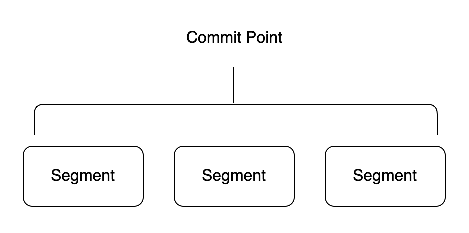
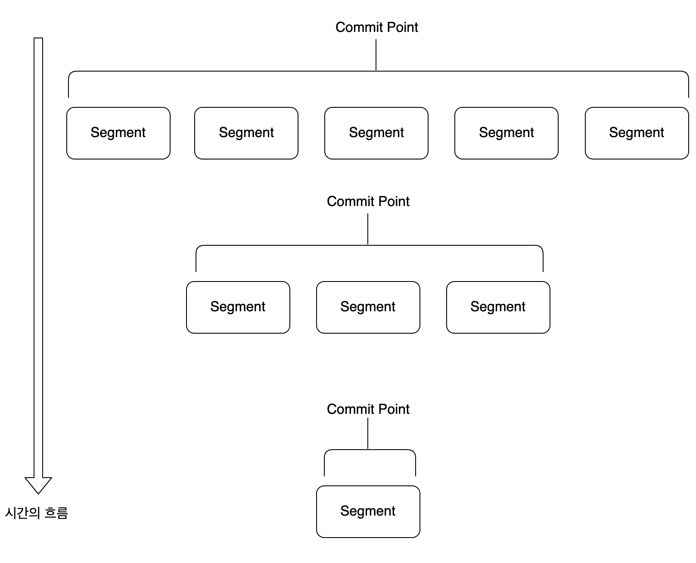

# 엘라스틱서치 동작 과정

## 색인 작업 시 세그먼트의 기본 동작 방식

 하나의 루씬 인덱스는 내부적으로 다수의 세그먼트로 구성되어 있습니다. 다수의 세그먼트로 나누어져 있기 때문에 검색 요청을 분산 처리하여 훨씬 효율적인 검색이 가능해집니다.

 루씬은 검색 요청을 받으면 다수의 작은 세그먼트 조각들이 각각 검색 결과 조각을 만들어 내고 이를 통합해서 하나의 결과로 응답하도록 설계되어 있습니다. 이러한 검색 방식을 **세그먼트 단위 검색(Per-Segment Search)**라고 합니다. 세그먼트는 내부에 색인된 데이터가 역색인 구조로 저장되어 있습니다.

 루씬은 세그먼트들을 관리하기 위한 용도로 커밋 포인트(Commit Point)라는 자료구조를 제공합니다. 커밋 포인트는 여러 세그먼트의 목록 정보를 가지고 있으며, 검색 요청 시 이를 활용합니다. 루씬의 IndexSearcher는 검색 요청 시 커밋 포인트를 이용하여 가장 오래된 세그먼트부터 차례대로 검색한 후에 하나의 결과로 합쳐서 제공합니다.

 최초 색인 작업 요청이 루씬에 들어오면 IndexWriter에 의해 색인 작업이 이뤄지고 결과물로 하나의 세그먼트가 생성됩니다. 그 후 **색인 작업이 추가로 요청될 때마다 새로운 세그먼트가 추가로 생성되고 커밋 포인트에 기록됩니다.** 즉, 색인 작업이 일어날 때마다 이런 식으로 세그먼트의 개수는 점점 늘어납니다.

 시간이 흐를수록 세그먼트의 개수는 빠르게 늘어납니다. 너무 많은 세그먼트가 생성되면 읽기 성능이 저하될 수 있기 때문에 **루씬은 백그라운드에서 주기적으로 세그먼트 파일을 병합하는 작업을 수행하고 이를 통해 모든 세그먼트들을 물리적으로 하나의 파일로 병합합니다.**

 루씬은 기본적으로 한 번 디스크에 저장된 세그먼트는 수정이 불가능하도록 설계되었습니다. 주기적인 Merge 작업에 의해 세그먼트가 통합되고 삭제되기 전까지는 전혀 수정을 허용하지 않습니다. 이처럼 수정을 전혀 허용하지 않기 때문에 색인 작업이 수행될 때마다 세그먼트가 추가로 생성될 수밖에 없는 구조가 된 것입니다.

 루씬에 데이터 추가 작업이 요청되면 IndexWriter는 다음과 같이 동작합니다.

#### 최초 색인이 요청된 경우

1.  IndexWriter가 세그먼트를 생성합니다.
2.  IndexSearcher가 생성된 세그먼트를 읽어 검색을 제공합니다.

#### 추가 색인이 요청된 경우

1.  IndexWriter가 세그먼트를 추가 생성합니다.
2.  세그먼트가 추가 생성되는 동안 기존 세그먼트만 읽어 검색 결과를 제공합니다.
3.  세그먼트 생성이 완료되면 생성된 모든 세그먼트를 읽어 검색 결과를 제공합니다.

#### 주기적으로 세그먼트 Merge 작업이 일어날 경우

1.  IndexWriter가 Merge 대상이 되는 세그먼트들을 복제합니다.
2.  IndexWriter가 복제한 세그먼트들을 하나의 세그먼트로 합칩니다.
3.  복제본 세그먼트들이 하나로 합쳐지는 동안 IndexSearcher는 원본 세그먼트를 읽어 검색 결과를 제공합니다.
4.  복제본 통합 작업이 완료되면 원본 세그먼트와 교체하고 교체된 원본 세그먼트들은 삭제합니다.
5.  IndexSearcher는 새로운 세그먼트를 읽어 검색 결과를 제공합니다.

---

## 참고자료

[엘라스틱서치 실무 가이드](http://www.kyobobook.co.kr/product/detailViewKor.laf?ejkGb=KOR&mallGb=KOR&barcode=9791158391485&orderClick=LAG&Kc=) <<권택환, 김동우, 김흥래, 박진현, 최용호, 황희정 지음>>