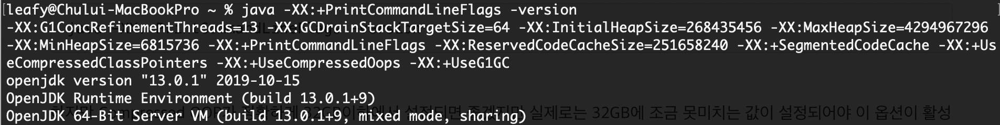

# 엘라스틱서치 힙 크기

 엘라스틱서치는 Java 언어로 개발되어 JVM 위에서 동작합니다. JVM 기반의 애플리케이션은 개발자가 직접 메모리 관리를 하지 않아도 된다는 큰 장점이 있습니다. 메모리 관리의 책임은 전적으로 JVM이 맡고, GC(Garbage Collection)라는 메커니즘을 이용하여 일정 주기로 사용하지 않는 메모리를 자동으로 회수합니다.

 엘라스틱서치 상에서는 JVM 옵션을 수정할 수 있도록 config 디렉토리에 **jvm.option** 파일이 존재합니다. jvm.option 파일에는 기본으로 제공하는 JVM 힙 크기가 1GB로 설정되어 있습니다. 이는 엘라스틱서치를 실행할 수 있는 최소한의 힙 크기가 1GB이기 때문입니다. 이 기본 설정은 테스트 용도이며, 실제 운영환경에서의 힙 크기는 1GB보다 반드시 커야합니다.

## 힙 크기를 32GB 이하로 유지해야 하는 이유

 엘라스틱서치는 메모리를 많이 사용하는 애플리케이션입니다. 우리는 시스템에서 제공되는 물리 메모리를 JVM 힙에 할당해서 엘라스틱서치가 사용하도록 설정할 수 있습니다. 일반적으로 힙 메모리가 많을수록 그에 비례에서 성능도 올라갑니다.

 자바 애플리케이션에서 너무 작은 힙 크기는 OOM 오류(Out-Of-Memory Exception)를 발생시킬 수 있으며, 반대로 너무 큰 힙 크기는 FullGC가 발생할 때 시스템 전체가 마비되는 STW(Stop The World)를 발생시킬 수 있습니다.

 일반적인 상황에서는 엘라스틱서치에 설정된 힙의 크기가 클수록 좋습니다. 하지만 그렇다고해서 무작정 큰 메모리를 할당하는 것은 성능에 심각한 문제를 야기시킬 수 있습니다. **엘라스틱서치에서는 할당할 힙 크기의 최대값으로 32GB 이하를 설정하도록 권장합니다.**

#### 운영체제에 50%의 메모리 공간을 보장하여 루씬에게 메모리를 제공하자

 엘라스틱서치 샤드는 내부에 루씬을 가지고 있으며 루씬은 세그먼트 생성 및 관리를 위해 커널 시스템 캐시를 최대한 활용합니다. **시스템 캐시는 운영체제가 가지고 있는 메모리 공간으로 커널 내부에 존재합니다.** 그러므로 물리적은 메모리 공간의 50% 정도는 운영체제가 자유롭게 사용하도록 할당하고 나머지 50% 정도를 엘라스틱서치 힙으로 할당하는 것이 좋습니다.

#### 자바 8 기반에서는 힙 크기를 32GB 이상 사용하지 말자

 엘라스틱서치는 힙 크기를 가급적이면 크게 설정하되 최대 32GB 이상을 사용하지 말 것을 권장합니다. 그렇다고해서 32GB 이상의 힙 크기를 설정하는 것이 불가능한 것은 아닙니다.

 엘라스틱서치에서 이러한 제한을 두는 이유는 핫스폿(Hot-Spot) JVM의 Object Pointer 정책 때문입니다. 엘라스틱서치 뿐만 아니라 모든 자바 애플리케이션에서도 Object Pointer 정책이 모두 동일하게 적용되기 때문에 최대 힙 크기를 32GB로 제한하는 것은 모든 자바 애플리케이션에도 동일하게 해당하는 내용입니다.

#### Object Point?

 Object Point는 객체의 메모리 번지를 표현하는 주소값입니다. 힙에 생성된 모든 객체는 이러한 주소값을 이용하여 접근하게 됩니다. JVM은 32비트 JVM과 64비트 JVM이 별도로 제공됩니다.  하지만 32비트 JVM과 64비트 JVM 모두 기본적으로 32비트 주소값을 가지고 동작합니다. 그 이유는 모든 JVM이 기본적으로 32비트 Object Pointer를 사용하고 있기 때문입니다.

#### Ordinary Object Pointer

 자바에서는 모든 객체가 힙 영역에 생성됩니다. 그리고 생성된 객체는 모두 포인터를 가지고 있고, 이 포인터를 이용해서 객체에 접근합니다. JVM은 힙 영역에 생성된 객체에 접근하기 위해 포인터의 주소를 Ordinary Object Pointer(OOP)라는 특수한 구조로 만들어서 관리합니다. 이러한 OOP들은 CPU의 처리 단위에 따라 동작하는 방식이 약간씩 달라집니다.

 32비트 시스템에서는 최대 4GB(2^32)의 메모리 주소밖에 가리킬 수 없었습니다. 하지만 하드웨어 기술이 발전하면서 옛날과는 다르게 메모리 자원이 풍부해졌고, 현재는 대부분의 서버가 64비트 시스템을 사용하게 되었습니다. 포인터를 64비트로 표현하니 이론상 18EB(2^64) 메모리까지 인식할 수 있게 되었습니다.

 하지만 64비트 시스템은 메모리상의 주소를 가리키는데 포인터 1개를 64비트로 표현하다보니 많은 메모리 공간 낭비가 발생합니다. 자바의 경우도 마찬가지였습니다. 32비트에서 64비트로 JVM이 전환되면서 Ordinary Object Pointer를 위해 낭비되는 메모리 문제가 발생하게 됩니다. 자바에서는 이러한 문제를 해결하기 위해 기존의 OOP를 개선하여 Compressed OOP라는 새로운 개념의 포인터 관리 기법을 도입했습니다.

#### Compressed Ordinary Object Pointer

 Compressed Ordinary Object Pointer는 64비트 시스템에서 JVM의 효율적인 메모리 사용을 위해 생긴 기법입니다. Compressed OOP는 포인터의 공간 낭비를 줄이고 좀 더 빠른 연산을 위해 포인터를 압축해서 표현하는 일종의 트릭이라고 할 수 있습니다. 기존에는 포인터가 객체의 정확한 메모리 주소를 가리키게 하는 것이었다면, **Compressed OOP에서는 상대적인 오브젝트 오프셋(Object Offset)을 가리키도록 변형해서 동작합니다.** 만약 이 방법을 사용하면 8비트의 포인터를 이용하여 256바이트의 물리적인 주소 공간을 표현하는 것이 아니라 256개의 객체를 가리킬 수 있게 되는 것입니다. 한 객체의 크기가 8비트라고 가정한다면 8비트 포인터를 이용하면 기존보다 8배나 큰 주소 공간을 사용하는 것이 가능해집니다.

-   32비트 OOP : 2^32까지의 주소를 가리킬 수 있습니다. 단순 메모리 주소를 표현하기 때문에 2^32까지의 메모리 공간을 가리킬 수 있습니다. (4GB)
-   64비트 OOP : 2^64까지의 주소를 가리킬 수 있습니다. 단순 메모리 주소를 표현하기 때문에 2^64까지의 메모리 공간을 가리킬 수 있습니다. (18EB)
-   32비트 Compressed OOP : 2^32까지의 객체(Object)를 가리킬 수 있습니다. 객체의 최소 단위는 8비트이기 때문에 (2^32) \* 8까지의 메모리 공간을 가리킬 수 있습니다. (32GB)

 64비트 시스템에서 Compressed OOP를 사용할 경우 포인터를 표현할 때 예외적으로 32비트 포인터를 사용하여 동작합니다. 32비트 포인터를 이용하면서도 64비트 포인터가 가지는 메모리 낭비 등의 단점을 우회해서 동작할 수 있는 것입니다.

 하지만 이러한 트릭은 힙 크기가 32GB를 넘어가면 사용할 수 없습니다. **JVM은 힙 크기가 32GB를 넘어가는 순간 Compressed OOP를 일반적인 OOP로 자동 변환합니다.** 이 경우 모든 Obejct Pointer는 64비트 기반으로 바뀌어서 동작하고 32비트를 사용하는 이점을 모두 잃어버리게 됩니다. **이러한 이유로 엘라스틱서치에서는 힙 크기를 설정할 때 최대 32GB 이하로만 설정하라고 안내하는 것입니다.**

 Compressed OOP는 JDK8 이상에서는 기본으로 이 옵션이 활성화되어 있기 때문에 32GB 이하의 힙 메모리를 설정하는 것만으로도 손쉽게 설정이 가능합니다. 아래의 방법으로 여러 옵션들을 조회할 수 있습니다.

**기본 옵션 조회**

java -XX:+PrintCommandLineFlags -version

**숨어있는 옵션까지 포함한 전체 옵션 조회**

java -server -XX:+UnlockExperimentalVMOptions -XX:+UnlockDiagnosticVMOptions -XX:+PrintFlagsFinal -version

하지만 Compressed OOP가 정확하게 32GB이하에서 설정되면 좋겠지만 실제로는 32GB에 조금 못미치는 값이 설정되어야 이 옵션이 활성화됩니다. 아래의 결과에서 힙 사이즈에 대한 Compressed OOP 설정 유무를 확인해 보겠습니다.

**Compressed OOP 설정 : true (32736MB = 31.96875GB)**

**Compressed OOP 설정 : false (32737MB = 31.969727GB)**

현재 저의 맥북에서는 Compressed OOP 설정을 위한 힙 사이즈의 Limit이 32736MB 입니다. 이처럼 32GB를 모두 사용하지 못하고 32GB에 조금 못미치는 힙 사이즈가 할당되어야 Compressed OOP 옵션이 활성화되는 것을 확인할 수 있습니다. 시스템마다 Limit 값이 다르고 32GB보다 작은 힙 사이즈에서 Compressed OOP 옵션이 활성화되는 이유는 J**VM의 힙 메모리가 0번지부터 시작되지 않기 때문입니다.** 객체를 가리키는 포인터가 0번지부터 시작되지 않았기 때문에 0번지부터 실제 시작 번지까지의 앞쪽에 위치한 일부 메모리 공간은 활용할 수 없게 되는 것입니다. 이론상으로는 최대 32GB이지만 실제로는 시작 번지가 0번지가 아니기 때문에 실제로는 32GB를 넘어버리게 되는 것입니다.

---

## 참고자료

[엘라스틱서치 실무 가이드](http://www.kyobobook.co.kr/product/detailViewKor.laf?ejkGb=KOR&mallGb=KOR&barcode=9791158391485&orderClick=LAG&Kc=)<<권택환, 김동우, 김흥래, 박진현, 최용호, 황희정 지음>>

[https://www.elastic.co/guide/en/elasticsearch/reference/current/heap-size.html](https://www.elastic.co/guide/en/elasticsearch/reference/current/heap-size.html)