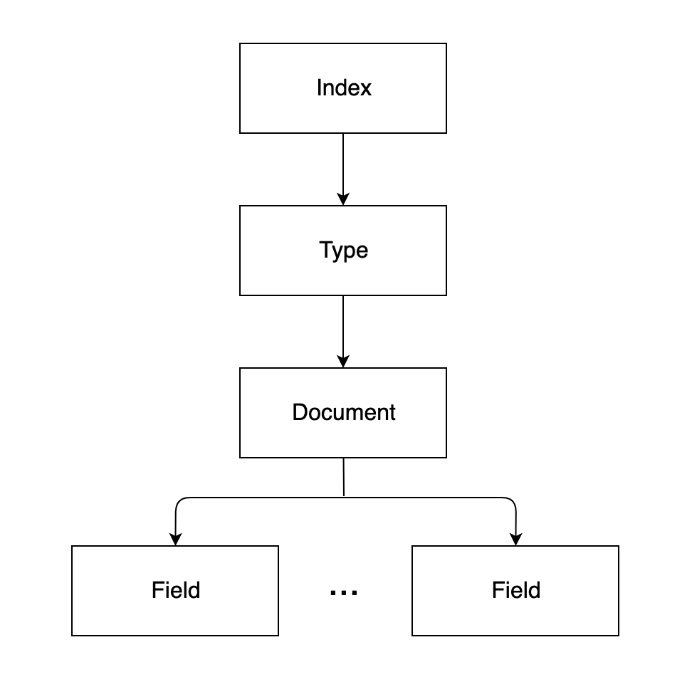

# 엘라스틱서치를 구성하는 개념

## 기본 용어

엘라스틱서치의 데이터는 다음 그림과 같이 **인덱스, 타입, 문서, 필드** 구조로 구성됩니다.

### 인덱스 (Index)

인덱스(Index)는 데이터 저장 공간입니다. 하나의 인덱스는 하나의 타입만 가지며 하나의 물리적인 노드에 여러 개의 논리적인 인덱스를 생성할 수 있습니다. 검색 시 인덱스 이름으로 문서 데이터를 검색하며, 여러 개의 인덱스를 동시에 검색하는 것도 가능합니다.

엘라스틱서치를 분산 환경으로 구성하면 하나의 인덱스가 여러 노드에 분산 저장되어 관리됩니다. 이 분산된 구성 단위를 샤드라고 합니다. 샤드 수는 인덱스를 생성할 때 옵션을 이용해 변경할 수 있습니다.

인덱스의 이름은 모두 소문자여야 하며, 추가, 수정, 삭제, 검색은 RESTful API로 수행할 수 있습니다. 만약 인덱스가 없는 상태에서 데이터가 추가된다면 데이터를 이용해 인덱스가 자동으로 생성됩니다.

### 샤드 (Shard)

색인된 문서는 하나의 인덱스에 담깁니다. 인덱스 내부에 색인된 데이터는 물리적인 공간에 여러 개의 파티션으로 나뉘어 구성되는데, 이 파티션을 샤드(Shard)라고 부릅니다.

### 타입 (Type)

타입(Type)은 인덱스의 논리적 구조를 의미하며, 인덱스 속성에 따라 분류하기도 합니다. 엘라스틱서치 6.0 이하 버전에서는 하나의 인덱스에 여러 타입을 설정 가능했지만 6.1 버전부터는 인덱스당 하나의 타입만 사용할 수 있습니다. **그리고 7.0 버전부터는 지원이 중단되어 사라졌습니다.**

### 문서 (Document)

문서(Document)는 엘라스틱 서치에서 데이터가 저장되는 최소 단위입니다. 기본적으로 JSON 포맷으로 데이터가 저장됩니다. 관계형 데이터베이스와 비교해보자면 테이블의 구성 요소인 행과 같다고 생각하면 됩니다. 하나의 문서는 다수의 필드로 구성되어 있는데, 각 필드는 데이터의 형태에 따라 용도에 맞는 데이터 타입을 정의해야 합니다. 또한 문서간의 중첩 구조를 지원하기 때문에 문서 안에 문서를 지정하는 것도 가능합니다.

### 필드 (Field)

필드(Field)는 문서를 구성하기 위한 속성이라고 할 수 있습니다. 일반적으로 데이터베이스의 컬럼(Column)과 비교할 수 있으나 컬럼이 정적(static)인 데이터 타입인 반면, 필드는 좀 더 동적(dynamic)인 데이터 타입입니다.

하나의 필드는 목적에 따라 다수의 데이터 타입을 가질 수도 있습니다. 예를 들어 한글 데이터가 들어가는 필드에 초성 검색을 지원해야 한다면 해당 필드는 2개의 데이터 타입을 갖도록 할 수 있습니다.

### 매핑 (Mapping)

매핑(Mapping)은 문서의 필드와 필드의 속성을 정의하고 그에 따른 색인 방법을 정의하는 프로세스입니다. 인덱스의 매핑 정보에는 여러 가지 데이터 타입을 지정할 수 있지만 필드명은 중복해서 사용할 수 없습니다.

---

### 노드의 종류

분산 처리를 위해서는 다양항 형태의 노드들을 조합해서 클러스터를 구성해야 합니다. 기본적으로 마스터 노드가 전체적인 클러스터를 관리하고 데이터 노드가 실제 데이터를 관리합니다.

#### 마스터 노드 (Master Node)

-   클러스터를 관리합니다.
    
-   노드 추가와 제거 같은 클러스터의 전반적인 관리를 담당합니다.
    
    마스터 노드는 인덱스 생성, 삭제하는 등 클러스터와 관련된 전반적인 작업을 담당하므로 네트워크 속도가 빠르고 지연이 없는 노드를 마스터 노드로 선정하는 것이 좋습니다. 노드 생성 시, 기본적으로 마스터 노드 설정인 node.master 가 true 이므로 마스터 후보 노드가 됩니다. 마스터 노드는 하나만 존재하며, 마스터 노드가 다운되면 다른 마스터 노드 후보들 중 하나를 선택해서 마스터 노드의 역할을 수행하도록 합니다.
    

#### 데이터 노드 (Data Node)

-   실질적인 데이터를 저장합니다.
    
-   검색과 통계 같은 데이터 관련 작업을 수행합니다.
    
    데이터 노드는 문서가 실제로 저장되는 노드입니다. 데이터가 실제로 분산 저장되는 물리적 공간인 샤드가 배치되는 노드이기도 합니다. 색인 작업은 CPU, 메모리, 스토리지 같은 컴퓨팅 리소스를 많이 소모하기 때문에 리소스 모니터링이 필요합니다.
    
    데이터 노드는 가능한 한 마스터 노드와 분리해서 구성하는 게 좋습니다. 단, 색인할 문서의 수가 적으면 함께 구성해도 상관은 없습니다.
    

#### 코디네이팅 노드 (Coordinating Node)

-   사용자의 요청만 받아서 처리합니다.
    
-   클러스터 관련 요청은 마스터 노드에 전달하고 데이터 관련 요청은 데이터 노드에 전달합니다.
    
    데이터 노드, 마스터 노드, 엔지스트 노드의 역할을 하지 않고, 들어온 요청을 단순히 라운드로빈 방식으로 분산시켜 주는 노드입니다.
    

#### 인제스트 노드 (Ingest Node)

-   문서의 전처리 작업을 담당합니다.
    
-   인덱스 생성 전 문서의 형식을 다양하게 변경할 수 있습니다.
    
    색인에 앞서 데이터를 전처리하기 위한 노드입니다. 데이터의 포맷을 변경하기 위해 스크립트로 전처리 파이프라인을 구성하고 실행할 수 있습니다.
    

#### 노드 참조 링크

[https://www.elastic.co/guide/en/elasticsearch/reference/current/modules-node.html](https://www.elastic.co/guide/en/elasticsearch/reference/current/modules-node.html)

---

## 참고자료

[엘라스틱서치 실무 가이드](http://www.kyobobook.co.kr/product/detailViewKor.laf?ejkGb=KOR&mallGb=KOR&barcode=9791158391485&orderClick=LEa&Kc=) <<권택환, 김동우, 김흥래, 박진현, 최용호, 황희정 지음>>