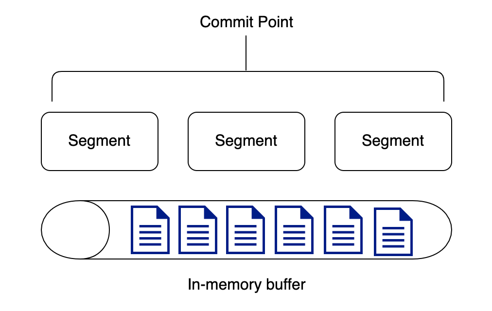
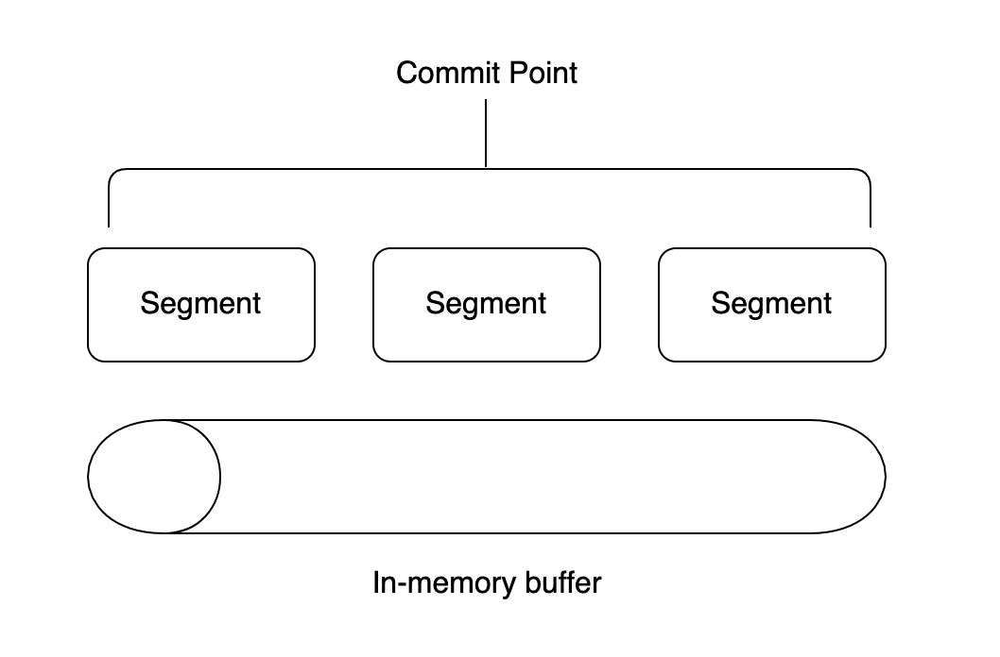

# 엘라스틱서치와 루씬의 세그먼트 최적화 방법

 루씬은 효율적인 색인 작업을 위해 내부적으로 일정 크기의 버퍼를 가지고 있습니다. 이러한 내부 버퍼를 인메모리 버퍼(In-memory buffer)라고 합니다. 만약 내부 버퍼가 없다면 데이터가 들어올 때마다 동기적으로 작업을 수행해야 하기 때문에 요청할 때마다 색인하여 매번 세그먼트를 만들어야 할 것입니다. 순간적으로 요청이 많아질 경우 세그먼트의 개수가 너무 많아져서 서비스 장애로 이어질 위험이 있습니다.

**루씬에 색인 작업이 요청되면 전달된 데이터는 인메모리 버퍼에 순서대로 쌓이고, 정책에 따라 내부 버퍼에 일정 크기 이상의 데이터가 쌓이거나 일정 시간이 흐를 경우 버퍼에 쌓은 데이터를 한꺼번에 모아 처리합니다.** 버퍼를 일종의 큐(Queue)로 활용하는 것입니다.

인메모리 버퍼의 데이터를 처리하기 전

인메모리 버퍼의 데이터를 처리한 후

 버퍼에 모여 한번에 처리된 데이터는 세그먼트 형태로 생성되고 즉시 디스크로 동기화됩니다. 새로운 세그먼트가 생성되고 디스크에 동기화하는 과정까지 거쳐야만 비로소 검색이 가능해집니다.

 디스크에 물리적으로 동기화하는 일련의 과정은 운영체제 입장에서는 매우 비용이 큰 연산입니다. 때문에 세그먼트가 생성될 때마다 물리적인 동기화를 진행할 경우 성능이 급격히 나빠질 수 있습니다. 루씬은 이러한 문제점을 해결하기 위해 무거운 fsync 방식을 이용하여 디스크 동기화를 하는 대신 **상대적으로 가벼운 write 방식을 이용해 쓰기 과정을 수행**합니다. 이후 일정한 주기에 따라 물리적인 디스크 동기화 작업을 수행합니다.

#### write() 함수

 일반적으로 파일을 저장할 때 사용하는 함수입니다. **운영체제 내부 커널에는 시스템 캐시가 존재하는데 write() 함수를 이용하면 시스템 캐시에만 기록되고 리턴됩니다.** 이후 실제 데이터는 특정한 주기에 따라 물리적인 디스크로 쓰기 작업을 진행합니다. 물리적인 디스크로 쓰기 작업을 바로 하지 않으므로 빠른 처리가 가능한 반면에 시스템이 비정상으로 종료될 경우에는 데이터 유실이 일어날 수도 있습니다.

#### fsync() 함수

 저수준의 파일 입출력 함수입니다. 내부 시스템 캐시의 데이터와 물리적인 디스크의 데이터를 동기화하기 위한 목적으로 사용됩니다. 실제 물리적인 디스크로 쓰기 작업을 진행하므로 많은 리소스가 사용됩니다.

## 루씬의 Flush, Commit, Merge

#### Flush

 인메모리 버퍼 기반의 처리과정을 루씬에서는 Flush라고 합니다. Flush 처리에 의해 세그먼트가 생성되면 커널 시스템 캐시에 세그먼트가 캐싱되어 읽기가 가능해집니다.

-   세그먼트가 생성된 후 검색이 가능해지도록 수행하는 작업입니다.
-   write() 함수로 동기화가 수행됐기 때문에 커널 시스템 캐시에만 데이터가 생성된 상태입니다.
-   이를 통해 유저 모드에서 파일을 열어서 사용하는 것이 가능해집니다.
-   물리적으로 디스크에 쓰여진 상태는 아닙니다.

#### Commit

 물리적으로 디스크에 기록을 수행하는 fsync() 함수를 호출하는 작업을 Commit이라고 합니다. Flush라는 단계가 존재함으로써 매번 Commit을 매번 수행할 필요는 없지만 일정 주기로 Commit을 통해 물리적인 디스크로 쓰기 작업을 수행해야 합니다.

-   커널 시스템 캐시의 내용을 물리적인 디스크로 쓰는 작업입니다.
-   실제 물리적인 디스크에 데이터가 기록되기 때문에 많은 리소스가 필요합니다.

#### Merge

 루씬에서는 불변성을 유지하기 위해 세그먼트 단위 검색(Per-Segment Search)을 제공하지만 시간이 흐를수록 세그먼트들의 개수가 늘어날 수밖에 없고 이를 지원하기 위해 제공되는 커밋 포인트의 부하도 증가하게 됩니다. 때문에 늘어난 다수의 세그먼트들을 합치는 작업이 필요합니다. 이를 Merge라고 합니다. Merge를 통한 이점은 아래와 같습니다.

1\. Merge를 통해 세그먼트의 수를 줄이게 되면 검색 성능이 좋아집니다. 검색 요청이 들어오면 루씬은 내부에 존재하는 모든 세그먼트를 검색해야 하는데, 각 세그먼트는 순차적으로 검색되기 때문에 세그먼트의 수가 줄어들면 검색 횟수도 줄어들게 되기 때문입니다.

2\. 세그먼트가 차지하는 디스크 용량이 줄어듭니다. 삭제되는 문서의 경우 Merge 작업 전에는 디스크에 물리적으로 남아있게 됩니다. 하지만 Merge 작업을 통해 세그먼트를 새롭게 생성하면 비로소 디스크에서 삭제되고 그만큼의 공간을 절약할 수 있게 됩니다.

-   다수의 세그먼트를 하나로 통합하는 과정입니다.
-   Merge 과정을 통해 삭제 처리된 데이터가 실제 물리적으로 삭제 처리됩니다.
-   검색할 세그먼트의 개수가 줄어들기 때문에 검색 성능이 좋아집니다.

## 엘라스틱서치의 Refresh, Flush, Optimize API

 엘라스틱서치 샤드는 루씬 인덱스의 확장이고 세그먼트 기반의 내부 동작을 그대로 검색에 활용합니다. 다수의 샤드로 데이터가 분산 저장되어 있고 모든 샤드가 협력해서 데이터 검색을 수행합니다.

 엘라스틱서치는 루씬의 Flush, Commit, Merge 작업에 대해 확장하여 API로 제공있고, 튜닝이 가능합니다. 하지만 각 작업은 엘라스틱서치와 루씬이 서로 다른 명칭으로 부르기 때문에 주의해야 합니다. 명칭의 차이는 아래의 표와 같습니다.

<table style="border-collapse: collapse; width: 100%; height: 76px;" border="1" data-ke-style="style8"><tbody><tr style="height: 19px;"><td style="width: 50%; height: 19px;">루씬</td><td style="width: 50%; height: 19px;">엘라스턱서치</td></tr><tr style="height: 19px;"><td style="width: 50%; height: 19px;">Flush</td><td style="width: 50%; height: 19px;">Refresh</td></tr><tr style="height: 19px;"><td style="width: 50%; height: 19px;">Commit</td><td style="width: 50%; height: 19px;">Flush</td></tr><tr style="height: 19px;"><td style="width: 50%; height: 19px;">Merge</td><td style="width: 50%; height: 19px;">Optimize API</td></tr></tbody></table>

#### Refresh

 엘라스틱서치는 대용량의 데이터를 색인하고 실시간 검색에 가깝게 동작하기 위해 주기적으로 인메모리 버퍼에 대해 Flush 작업을 수행합니다. 이러한 Flush 작업을 엘라스틱서치에서는 Refresh라고 부르며 클러스터에 존재하는 모든 샤드에서 기본적으로 1초마다 한 번씩 Refresh 작업이 수행됩니다.

#### Flush

 엘라스틱서치에서의 Flush는 루씬의 Commit 작업을 수행하고 새로운 Translog를 시작한다는 의미입니다. 이 작업을 루씬에서 제공하는 Flush 작업과 혼동해서는 안됩니다. Translog는 엘라스틱서치에서만 존재하는 개념으로 엘라스틱서치가 제공하는 고가용성과 밀접한 관련이 있습니다.

 Translog는 샤드의 장애 복구를 위해 제공되는 특수한 파일입니다. 엘라스틱서치 샤드는 자신에게 일어난 모든 변경사항을 Translog에 먼저 기록한 후 내부에 존재하는 루씬을 호출합니다. 샤드는 1초마다 Refresh 작업을 수행해서 실시간 검색을 제공하고, 시간이 흐름에 따라 Translog의 파일 크기는 증가합니다. 지속적인 Refresh 작업으로 인해 검색은 가능하지만 아직 디스크에 물리적인 동기화가 되지 않은 상태이기 때문에 주기적으로 루씬의 Commit을 수행해야 합니다.

 정책에 의해 루씬 Commit이 정상적으로 수행되면 변경사항이 디스크에 물리적으로 기록되고 Translog 파일에서 Commit이 정상적으로 일어난 시점까지의 내역이 비로소 삭제됩니다.

 엘라스틱서치에서는 기본적으로 5초에 한 번씩 Flush 작업이 수행됩니다. Refresh와 마찬가지로 API를 이용하여 Flush 주기를 조절할 수도 있지만 이를 임의로 수정하는 것은 권장하지 않습니다.

#### Optimize API

 엘라스틱서치에서는 인덱스 최적화를 위해 Optimize API를 제공합니다. 이를 forced merge API라고도 하는데, 말 그대로 루씬의 Merge 작업을 강제로 수행하는 것입니다. 이를 통해 파편화된 다수의 세그먼트를 하나의 거대한 세그먼트로 통합해서 조금 더 빠른 성능을 제공할 수 있게 됩니다. 일반적으로 변경이 더 이상 일어나지 않는 오래된 인덱스의 경우에는 하나의 세그먼트가 되도록 인덱스 내부의 세그먼트들을 강제로 병합하는 것이 성능상 유리합니다.

---

## 참고자료

[엘라스틱서치 실무 가이드](http://www.kyobobook.co.kr/product/detailViewKor.laf?ejkGb=KOR&mallGb=KOR&barcode=9791158391485&orderClick=LAG&Kc=)<<권택환, 김동우, 김흥래, 박진현, 최용호, 황희정 지음>>

[https://www.elastic.co/guide/en/elasticsearch/reference/current/indices.html](https://www.elastic.co/guide/en/elasticsearch/reference/current/indices.html)
