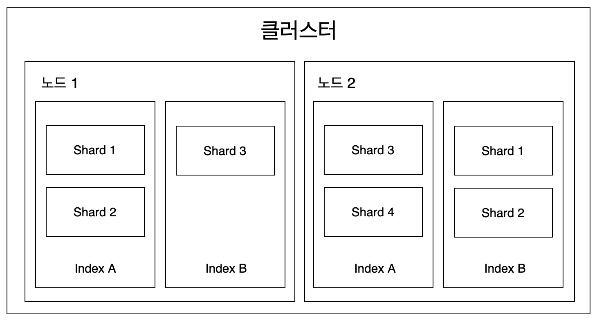
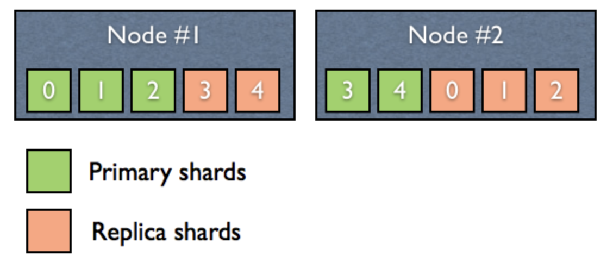

클러스터, 노드, 샤드의 관계는 아래의 그림과 같습니다.

위의 구조는 하나의 클러스터에 노드1, 노드2로 총 2개의 물리적 노드로 구성되어 있습니다. 엘라스틱서치 클러스터는 인덱스의 문서를 조회할 때 마스터 노드를 통해 2개의 노드를 모두 조회해서 각 데이터를 취합한 후 결과를 하나로 합쳐서 반환합니다.

현재는 하나의 클러스터만 만들어져 있지만 여러 개의 클러스터를 연결해서 구성할 수도 있으며, 이때는 클러스터의 이름으로 각각을 구분해야 합니다. 클러스터에 있는 노드는 실시간으로 추가, 제거가 가능하기 때문에 가용성이나 확장성 측면에서 매우 유연합니다.

샤드는 **primary shard**와 **replica shard** 두 가지 종류가 있습니다. **primary shard**는 각 인덱스 별로 최소 1개 이상 존재해야 합니다. 인덱스에 다수의 문서를 색인하게 되면 문서는 설정된 샤드 수만큼 골고루 분산 저장됩니다. **replica shard**는 primary shard의 복제본입니다. replica 값이 1이라는 것은 primary shard의 복제본이 1개 있다는 것을 의미합니다. 즉, replica shard의 개수는 primary shard를 제외한 복제본의 수입니다.

replica shard라는 복제본 덕분에 물리적인 노드 하나가 죽더라도 나머지 노드에 존재하는 replica shard로 전체 데이터를 복구할 수 있습니다. 만약 장애가 발생하면 마스터 노드는 데이터를 재분배하거나 replica shard를 primary shard로 승격시켜 서비스 중단 없는 복구가 가능해집니다. 이러한 동작을 위해 replica shard는 절대로 동일한 데이터를 갖고 있는 primary shard와 같은 노드상에 존재할 수 없습니다. 아래의 상황을 예로 보겠습니다.

 위 그림과 같은 상태에서 만약 Node#1 노드에 장애가 발생하더라도 나머지 노드에 모든 replica shard가 존재하므로 장애 상황에서도 중단없이 복구 가능합니다.

 n개의 노드에서 장애가 발생했을 때, 서비스가 정상적으로 동작하기 위해서는 최소 n + 1개의 노드가 동일 클러스터 내에 존재해야 하며, replica의 수는 최소 n개여야 합니다.

 또한, replica의 개수는 (전체 노드의 수 - 1)입니다. 그러므로 클러스터상의 노드에서 문제가 발생하여 가용한 노드의 수가 replica의 수보다 같거나 작은 경우 어떠한 노드에서 할당되지 못한 shard가 발생하게 되며, 이러한 경우 클러스터의 상태가 "YELLOW"가 됩니다. (정상적인 경우는 "GREEN"입니다.)

 만약, 문제가 발생하였던 노드가 복구되어 정상적으로 동작하게 되면 해당 노드는 클러스터에 연결되고, 할당되지 못하고 남아있던 replica shard들이 해당 노드에 할당됩니다.

---

## 참고자료

[http://guruble.com/elasticsearch-2-shard-replica/](http://guruble.com/elasticsearch-2-shard-replica/)

([http://guruble.com/elasticsearch-2-shard-replica/](http://guruble.com/elasticsearch-2-shard-replica/))

[엘라스틱서치 실무 가이드](http://www.kyobobook.co.kr/product/detailViewKor.laf?ejkGb=KOR&mallGb=KOR&barcode=9791158391485&orderClick=LEa&Kc=) <<권택환, 김동우, 김흥래, 박진현, 최용호, 황희정 지음>>