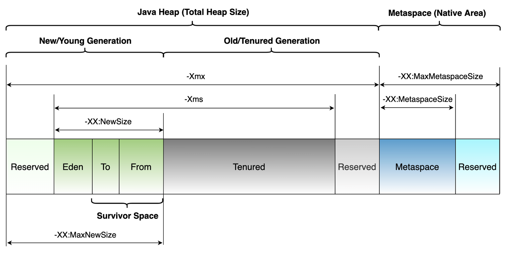
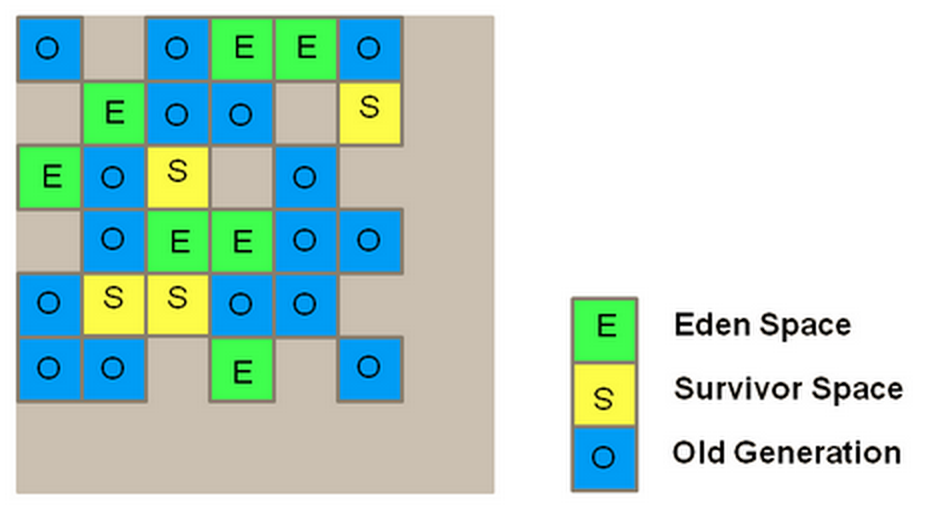

## Garbage Collector

 가비지 컬렉터는 애플리케이션의 할당된 동적 메모리를 자동으로 관리합니다. gc는 다음의 동작들을 통해 동적 메모리 관리를 자동으로 수행합니다.

-   메모리를 운영체제에 할당하고 반환
-   요청 시에 메모리를 애플리케이션에 전달
-   메모리가 애플리케이션에 의해 여전히 사용되고 있는지 결정
-   재사용을 위해 사용되지 않는 메모리를 애플리케이션으로부터 회수

 가비지 컬렉터는 다음의 두 가지 가설을 관점으로 설계되었습니다.

-   대부분의 객체는 금방 접근 불가능 상태(unreachable)가 된다.
-   오래된 객체에서 젊은 객체로의 참조는 아주 적게 존재한다.

 이러한 가정을 **약한 세대 가설(weak generational hypothesis)**이라 합니다. 이를 바탕으로 매번 메모리 전체를 검사하지 않고 일부만 검사할 수 있도록 generational한 구조로 나뉘어졌습니다.

#### Young generation

-   새롭게 생성된 객체 대부분이 이 영역으로 위치합니다.
-   대부분의 객체가 금방 접근 불가능 상태가 되기 때문에 매우 많은 객체가 Young 영역에 생성되었다가 사라집니다.
-   이 곳이 가득차면 minor gc가 발생합니다.
-   minor gc가 발생하면 살아있는 객체들만 체크하고 나머지는 다 없애버립니다.
-   살아남은 객체들 중 더 오래 쓸 것 같은 것들은 Tenured 영역으로 옮깁니다.

#### Tenured generation

-   Young 영역에서 살아남은 객체들은 이 곳으로 복사됩니다.
-   이 곳이 가득차면 major gc(혹은 full gc)가 발생합니다.
-   대부분 Young 영역보다 크게 할당하며, 크기가 큰 만큼 Young 영역보다 gc는 적게 발생합니다.
-   major gc는 minor gc 보다 오래걸립니다.

## JVM의 힙 메모리 구조

 Java 8 이전에는 Metaspace 영역이 아닌 Permanent 영역이 존재하였습니다. Permanent 영역은 Class의 Meta 정보나 Method의 Meta 정보, Static 변수와 상수 정보들이 저장되는 공간으로 활용되었습니다. **Java 8 버전부터는 기존의 Permanent 영역이 Native 영역으로 이동하여 Metaspace 영역으로 변경되었습니다.**

#### Eden Space \[Young Generation\]

 처음 생성된 모든 객체는 에덴 영역에 존재합니다. JVM에 의해 정해진 임계치에 도달하면 minor gc가 수행됩니다. minor gc가 수행되면 참조되지 않는 객체들은 에덴 영역에서 제거되고, 살아남은 객체들은 'From' 영역에서 'To' 영역의 Survivor 영역으로 이동합니다. gc가 끝나고나면 'From'과 'To' Survivor 영역의 역할이 서로 바뀝니다. ('From'은 'To'가 되고, 'To'는 'From'이 됩니다.)

#### Survivor 1 (From)

 이 영역은 에덴 영역으로부터 살아남은 객체가 담깁니다. 이전의 gc 과정에서는 'To'의 역할을 하던 영역입니다.

#### Survivor 2 (To)

 이 영역은 gc가 수행될 때, 에덴 영역과 'From'의 역할을 하던 Survivor 영역에서 살아남은 객체들이 담깁니다.

#### Tenured \[Old Generation\]

 Survivor 영역의 객체가 minor gc에서 살아남아 다른 Survivor 영역으로 이동할 때마다 객체의 Age가 증가합니다. 이 Age가 일정 이상이 되면 Tenured 영역으로 이동하게 됩니다(Promotion).

 Promotion의 기준이 되는 Age는 **\-XX:MaxTenuringThreshold** 옵션으로 설정할 수 있습니다. Java SE 8 에서의 default 값은 15이며, 설정 가능한 범위는 0 ~ 15 입니다.

## STW (Stop The World)

 STW란 gc를 실행시키기 위해 JVM이 모든 애플리케이션 쓰레드를 중단시키는 것입니다. STW가 발생하면 gc를 실행하는 쓰레드를 제외한 나머지 쓰레드는 모두 작업을 멈춥니다. gc 작업이 완료된 이후에야 중단했던 작업을 다시 시작합니다. 대게의 경우 gc 튜닝이란 STW 시간을 줄이는 것입니다.

## Mark and Sweep

### Mark

 가비지 컬렉터가 사용중인 객체와 사용되지 않는 객체를 식별합니다.

### Sweep

 Mark 단계에서 식별된 사용되지 않는 객체를 수거합니다.

 전체적인 gc 알고리즘은 다음과 같습니다.

1.  할당 리스트를 순회하면서 마크 비트(mark bit)를 지웁니다.
2.  gc 루트부터 살아 있는 객체를 찾습니다.
3.  이렇게 찾은 객체마다 마크 비트를 세팅합니다.
4.  할당 리스트를 순회하면서 마크 비트가 세팅되지 않은 객체를 찾습니다.
    1.  힙에서 메모리를 회수해 **프리 리스트(free list)**에 되돌립니다. (프리 리스트는 동적 메모리 할당을 위해서 계획적으로 사용된 자료 구조로, 메모리의 할당되지 않은 영역들을 연결 리스트로 연결해서 운용합니다.)
    2.  할당 리스트에서 객체를 삭제합니다.

### Compaction

 살아남은 객체들을 연속된 영역으로 배열합니다. 이 과정은 메모리 단편화(memory fragmentation)를 방지합니다.

## HotSpot의 가비지 수집

 자바 프로세스가 시작되면 JVM은 메모리를 할당(또는 예약)하고 유저 공간에서 연속된 단일 메모리 풀을 관리합니다.

 이 메모리 풀은 각자의 목적에 따라 서로 다른 영역으로 구성되며, 객체는 보통 에덴 영역에 생성됩니다. 수집기가 줄곧 객체를 이동시키기 때문에 객체가 차지한 주소는 대부분 시간이 흐르면서 아주 빈번하게 바뀝니다. 이처럼 객체를 이동시키는 것을 '방출'이라고 하는데, 핫스팟 수집기는 대부분 방출 수집기입니다.

#### bump-the-pointer

 새로 생성되는 대부분의 객체는 에덴 영역에 할당됩니다. bump-the-pointer는 에덴에 할당된 마지막 객체를 추적합니다. 새로 생성되는 객체가 있으면, 해당 객체가 에덴 영역에 할당하기 적당한지 확인합니다. 만약 해당 객체 크기가 에덴 영역에 할당되기 적당하면 에덴 영역에 할당하고 포인터가 마지막 위치를 가르키도록 업데이트 합니다. 따라서, 새로운 객체를 생성할 때마다 마지막에 추가된 객체만 점검하면 되므로 매우 빠르게 메모리 할당이 이루어집니다.

 하지만 멀티 쓰레드 환경에서는 Thread-safe 를 고려해주어야 합니다. 여러 쓰레드에서 사용하는 객체를 에덴에 저장하려면 락(Lock)이 발생할 수 밖에 없고, lock-connection 때문에 성능이 매우 떨어지게 될 것입니다.

HotSpot VM에서 이를 해결하기 위한 것이**TLAB(****Thread-Local Allocation Buffer)**라고 합니다.

#### TLAB (Thread-Local Allocation Buffer)

 JVM은 에덴을 여러 버퍼로 나누어 각 애플리케이션 쓰레드가 새 객체를 할당하는 구역으로 활용하도록 배포합니다. 이렇게 하면 각 쓰레드는 혹여 다른 쓰레드가 자신의 버퍼에 객체를 할당하지는 않을까 염려할 필요가 없습니다.

## Garbage Collector의 종류

#### Serial GC (-XX:+UseSerialGC)

 Serial GC는 싱글 쓰레드를 활용해서 gc 작업을 수행합니다. 이 방법은 쓰레드 사이의 커뮤니케이션 오버헤드가 없으므로 상대적으로 효율적입니다. 다만 멀티 프로세서 하드웨어의 장점을 살릴 수 없기 때문에 적은 메모리와 싱글 프로세스 머신 환경에 적합한 방식입니다.

#### Parallel GC (-XX:+UseParallelGC)

 Parallel GC는 Throughput GC라고도 부르며, 기본적인 알고리즘은 Serial GC와 같습니다. 하지만 Serial GC는 싱글 쓰레드로 gc를 처리하지만, Parallel GC는 gc를 처리하는 쓰레드가 여러 개입니다. minor gc를 병렬로 수행하므로 오버헤드를 현저히 줄일 수 있습니다.

 Parallel GC는 메모리가 충분하고 프로세서의 개수가 많을 수록 유리합니다.

#### Parallel Old GC (-XX:+UseParallelOldGC)

 Parallel Old GC는 Young 영역과 Old 영역 모두 gc가 멀티 쓰레드로 처리된다는 것을 제외하면 Parallel GC와 같습니다.

#### CMS (Concurrent Mark and Sweep GC, -XX:+UseConcMarkSweepGC)

 CMS 수집기는 STW 시간을 최소화 하려고 설계되었습니다. 마킹은 삼색 마킹(tri-color marking) 알고리즘에 따라 수행하므로 수집기가 힙을 탐색하는 도중에도 객체 그래프가 변경될 수 있습니다. 따라서 CMS는 가비지 수집의 두 번째 원칙(아직 살아 있는 객체를 수집하면 안된다)을 위반하지 않도록 반드시 레코드를 바로잡아야 합니다.

 CMS의 수행 단계는 병렬 수집기보다 더 복잡합니다.

1.  초기 마킹 (Initial Mark) - **STW**
2.  동시 마킹 (Concurrent Mark)
3.  재마킹 (Remark) - **STW**
4.  동시 스위프 (Concurrent Sweep)

 1 단계의 초기 마킹, 4 단계의 재마킹 단계는 모든 애플리케이션 쓰레드가 멈추고, 나머지 단계에서는 애플리케이션 쓰레드와 병행하여 GC를 수행합니다.

1\. 초기 마킹(Initial Mark) 단계의 목적은, 해당 영역 내부에 위치한 확실한 gc 출발점(내부 포인터, internal pointer 라고 하며 수집 사이클 목적상 gc 루트와 동등함)을 얻는 것입니다. 출발점에서 참조 Tree 상 가장 가까운 객체만 1차적으로 찾아가며 해당 객체가 gc 대상인지 판단합니다. 탐색의 깊이가 얕기 때문에 STW 시간이 매우 짧습니다.

2\. 동시 마킹(Concurrent Mark) 단계에서는 STW가 발생하지 않으며, 삼색 마킹 알고리즘을 힙에 적용하면서 나중에 조정해야 할지 모를 변경 사항을 추적합니다. 동시 마킹 단계에서는 애플리케이션 쓰레드와 병렬로 동작합니다. 즉, STW가 발생하지 않습니다.

3\. 재마킹(Remark) 단계는 동시 마킹 단계에서 새로 추가되거나 참조가 제거되었는지 객체를 확인합니다. 재마킹 단계는 STW가 발생하며, STW 시간을 줄이기 위해 멀티 쓰레드로 동작합니다.

4\. 동시 스위프(Concurrent Sweep) 단계는 gc 대상인 객체들을 메모리에서 제거합니다. 

 CMS는 STW 시간이 매우 짧으므로 애플리케이션의 응답 속도가 중요할 때 적합합니다. 하지만 STW 시간이 매우 짧다는 장점에 반해 다음과 같은 단점이 존재합니다.

-   다른 gc 방식보다 cpu와 메모리를 많이 사용합니다.
-   Compaction 단계를 진행하지 않으므로 테뉴어드 영역의 단편화가 발생할 수 있습니다.

 CMS는 실행 도중 Old 영역의 할당률이 너무 높거나 단편화가 심해져서 Young 영역으로부터 승격된 객체를 Old 영역에서 수용하지 못할 지경에 이르면 **CMF(Concurrent Mode Failue)**가 발생합니다. 이런 경우에 JVM은 어쩔 수 없이 풀 STW를 유발하는 (압착 수집기인)ParallelOld GC 수집 방식으로 돌아가게 됩니다.

 조각난 메모리가 많아 Compation을 수행하게 되면 다른 gc 방식보다 STW 시간이 길기 때문에 CMS를 사용할 때는 Compaction 작업을 얼마나 자주, 오랫동안 수행되는지 확인해야 합니다.

#### G1 (Garbage First, +XX:UseG1GC)

 G1은 앞서 살펴본 gc들과는 다른 방식으로 힙 메모리를 관리합니다. 병렬/CMS 수집기와는 달리 세대마다 경계가 뚜렷한, 연속된 메모리 공간이 없고 반구형 힙 레이아웃 방식과도 전혀 무관합니다.

 G1은 논리적 단위로 나누어진 리전(Region)으로 구성됩니다. 리전을 이용하면 generation을 불연속적으로 배치할 수 있고, 수집기가 매번 실행될 때마다 전체 가비지를 수집할 필요가 없습니다.

**G1 GC의 특징**

-   큰 메모리를 가진 멀티 프로세서 시스템에서 사용되기 위해 개발된 gc 입니다.
-   CMS보다 훨씬 튜닝하기 쉽습니다.
-   조기 승격에 덜 취약합니다. (조기 승격이란 할당률이 너무 높아서 Old 영역으로 너무 빨리 승격되는 문제입니다.)
-   대용량 힙에서 확장성(특히, 중단 시간)이 우수합니다.
-   자바 9부터는 디폴트 gc 입니다.

 G1의 힙은 리전(Region)으로 구성됩니다. 리전을 이용하면 세대를 불연속적으로 배치할 수 있고, 수집기가 매번 실행될 때마다 전체 가비지를 수집할 필요가 없습니다.

 G1 수집기는 RSet(Remembered Set)을 통해 어떤 객체가 어떤 리전에 저장되어 있는지 추적합니다. 덕분에 G1은 영역 내부를 바라보는 레퍼런스를 찾으려고 전체 힙을 다 뒤질 필요 없이 RSet만 꺼내보면 됩니다.

G1의 수집 단계는 다음과 같습니다.

1.  Initial Mark - **STW** : Old 영역에 존재하는 객체들이 참조하는 Survivor 영역을 찾습니다. STW가 발생합니다.
2.  Root Region Scanning : Initial Mark 단계에서 식별한 Survivor 영역에서 Old 영역을 가리키는 레퍼런스를 식별합니다.
3.  Concurrent Mark : 힙 전체에 걸쳐 접근 가능한 살아있는 객체를 찾습니다.
4.  Remark - **STW** : Concurrent Mark 단계를 검증하고, 최종적으로 살아남을 객체들을 식별합니다. 이 단계에서는 SATB(Snapshot-At-The-Beginning) 알고리즘이 사용됩니다. STW가 발생합니다.
5.  Cleanup - **STW** : 애플리케이션을 멈추고(STW) 살아있는 객체가 가장 적은 리전에 대한 미사용 객체를 제거합니다. 이후 STW를 끝내고, 앞서 GC 과정에서 완전히 비워진 리전을 Freelist에 추가하여 재사용될 수 있게 합니다.
6.  Copy : GC 대상 리전이었지만 Cleanup 과정에서 완전히 비워지지 않은 리전의 살아남은 객체들을 새로운 리전에 복사하여 Compaction 작업을 수행합니다.

---

## 참고자료

[www.kyobobook.co.kr/product/detailViewKor.laf?ejkGb=KOR&mallGb=KOR&barcode=9791162241776&orderClick=LAG&Kc=](http://www.kyobobook.co.kr/product/detailViewKor.laf?ejkGb=KOR&mallGb=KOR&barcode=9791162241776&orderClick=LAG&Kc=)

[https://docs.oracle.com/en/java/javase/12/gctuning/introduction-garbage-collection-tuning.html#GUID-326EB4CF-8C8C-4267-8355-21AB04F0D304](https://docs.oracle.com/en/java/javase/12/gctuning/introduction-garbage-collection-tuning.html#GUID-326EB4CF-8C8C-4267-8355-21AB04F0D304)

[d2.naver.com/helloworld/1329](https://d2.naver.com/helloworld/1329)

[johngrib.github.io/wiki/jvm-memory/#fnref:book2-Heap](https://johngrib.github.io/wiki/jvm-memory/#fnref:book2-Heap)

[johngrib.github.io/wiki/java-gc-eden-to-survivor/#survivor-%EC%97%90%EC%84%9C-old-%EC%98%81%EC%97%AD%EC%9C%BC%EB%A1%9C-promotion](https://johngrib.github.io/wiki/java-gc-eden-to-survivor/#survivor-%EC%97%90%EC%84%9C-old-%EC%98%81%EC%97%AD%EC%9C%BC%EB%A1%9C-promotion)

[dzone.com/articles/java-memory-architecture-model-garbage-collection](https://dzone.com/articles/java-memory-architecture-model-garbage-collection)

[www.infoworld.com/article/2078645/jvm-performance-optimization-part-3-garbage-collection.html](https://www.infoworld.com/article/2078645/jvm-performance-optimization-part-3-garbage-collection.html)

[johngrib.github.io/wiki/java-g1gc/](https://johngrib.github.io/wiki/java-g1gc/)
