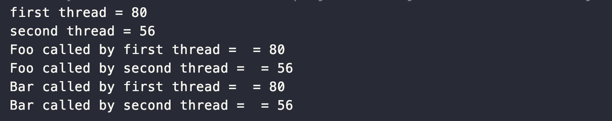

# ThreadLocal이란?

## ThreadLocal

 ThreadLocal은 한 쓰레드에서 읽고 쓰여질 수 있는 변수를 할당하여 접근할 수 있도록 합니다. 멀티 쓰레드 환경에서 각 쓰레드마다 get(), set() 메서드를 통해 독립적으로 변수에 접근할 수 있습니다. 말그대로 Thread 내부에서 사용하는 지역변수입니다.

## ThreadLocal를 다루는 방법

```
public class ThreadLocalExam {

    public static ThreadLocal<String> myThreadLocal = new ThreadLocal<>();

    public static void main(String[] args) {
        myThreadLocal.set("Hello World!");

        String myThreadLocalValue = myThreadLocal.get();
        System.out.println(myThreadLocalValue);

        myThreadLocal.remove();
    }
}

```

1\. ThreadLocal 객체를 생성한다.

2\. ThreadLocal 객체에 변수를 할당한다.

3\. ThreadLocal 객체에 변수를 읽어온다.

4\. ThreadLocal 객체의 remove() 메서드를 통해서 현재 ThreadLocal에 할당되어 있는 변수들을 삭제한다.

#### 각 쓰레드마다 다른 랜덤 값이 할당되는 ThreadLocal 예제

```
import java.util.Random;

public class Context {
    public static ThreadLocal<Integer> threadLocal =
            ThreadLocal.withInitial(() -> new Random().nextInt(100));
}

```

 위 코드는 ThreadLocal 을 담고 있는 컨테이너 클래스입니다. 내부에 있는 ThreadLocal 객체는 초기화 시, 랜덤한 정수 값을 할당하도록 구현되어 있습니다.

```
public class Foo {
    private String threadName;

    public Foo(String threadName) {
        this.threadName = threadName;
    }

    public void foo() {
        System.out.println("Foo called by " + threadName + " = " + Context.threadLocal.get());

        Bar bar = new Bar(threadName);
        bar.bar();
    }
}

```

```
public class Bar {

    private String threadName;

    public Bar(String threadName) {
        this.threadName = threadName;
    }

    public void bar() {
        System.out.println("Bar called by " + threadName + " = " + Context.threadLocal.get());
    }
}

```

1\. Foo 클래스는 객체 생성 시, 호출된 threadName을 저장합니다.

2\. foo() 메서드를 호출하면 어떤 쓰레드로부터 호출되었는지 이름과 함께 ThreadLocal에 있는 변수를 출력합니다.

3\. Bar 객체를 생성하고 Foo 객체와 마찬가지로 생성자에서 호출된 threadName을 저장합니다.

4\. bar() 메서드를 호출하면 어떤 쓰레드로부터 호출되었는지 이름과 함께 ThreadLocal에 있는 변수를 출력합니다.

```
public class ThreadLocalExam_2 {

    public static void main(String[] args) {
        Thread first = new Thread(() -> {
            System.out.println("first thread = " + Context.threadLocal.get());
            Foo foo = new Foo("first thread = ");
            foo.foo();
        });

        Thread second = new Thread(() -> {
            System.out.println("second thread = " + Context.threadLocal.get());
            Foo foo = new Foo("second thread = ");
            foo.foo();
        });

        first.start();
        second.start();
    }
}
```



 위 코드를 실행시킨 결과로 같은 Thread에서는 ThreadLocal 변수에 할당되어 있는 값들이 공유되고, 다른 쓰레드와는 값이 다른 것을 확인할 수 있습니다. 즉, ThreadLocal의 변수는 각 쓰레드마다 독립되어 존재함을 알 수 있습니다.

## ThreadLocal의 활용

 ThreadLocal은 한 쓰레드에서 실행되는 코드가 동일한 객체를 사용할 수 있도록 해주기 때문에 쓰레드와 관련된 코드에서 파라미터를 사용하지 않고 객체를 전파하기 위한 용도로 주로 사용됩니다.

-   사용자 인증정보 전파 : SpringSecurity에서는 ThreadLocal을 이용해서 사용자 인증 정보를 전파합니다.
-   트랜잭션 컨텍스트 전파 : 트랜잭션 매니저는 트랜잭션 컨텍스트를 전파하는 데 ThreadLocal을 사용합니다.
-   쓰레드에 안전해야 하는 데이터를 보관하는데 사용합니다.

 InheritableThreadLocal이라는 ThreadLocal을 상속받아 구현한 클래스를 이용하면 단일 쓰레드 뿐만 아니라 그 쓰레드에서 생성한 하위 쓰레드까지도 데이터를 공유해서 사용할 수 있습니다.

## ThreadLocal 사용 시 주의 사항

 만약 쓰레드 풀과 같은 환경에서 ThreadLocal을 사용한다면 ThreadLocal 변수에 보관되어 있는 데이터의 사용이 끝나면 반드시 remove() 메서드를 통해 삭제해주어야 합니다. 쓰레드 풀을 통해 쓰레드를 재사용하는 경우에 이전에 사용했던 값을 공유할 수 있기 때문입니다.

---

## 참고자료

[javacan.tistory.com/entry/ThreadLocalUsage](https://javacan.tistory.com/entry/ThreadLocalUsage)

[velog.io/@skygl/ThreadLocal](https://velog.io/@skygl/ThreadLocal)
