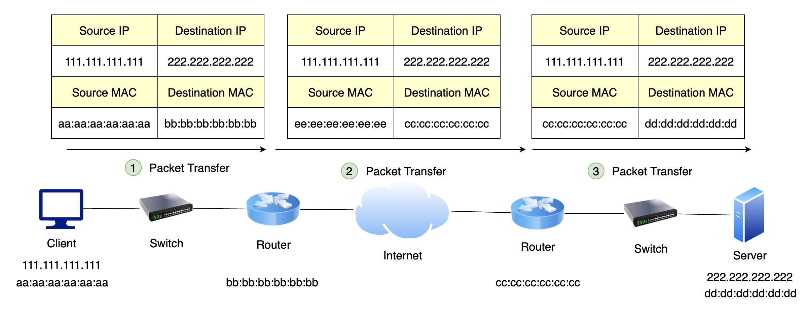

## TCP/IP 모델 패킷 전송 과정

 네트워크 통신을 위한 과정을 분류하는 모델로 OSI 7 계층이라는 표준이 존재합니다. 그리고 우리가 HTTP 통신을 하기 위해 주로 사용하는 TCP/IP 프로토콜을 OSI 7 계층에 맞추어 추상화한 것이 위 그림의 TCP/IP 모델입니다.

### Application Layer

 HTTP, FTP, SMTP 등 응용프로그램들이 네트워크를 사용하기 위한 인터페이스를 제공합니다.

#### Transport Layer

 통신 노드 간의 연결을 제어하고, 유실된 패킷을 재전송 하는 등 신뢰성 있는 통신을 보장합니다. 프로토콜로는 TCP와 UDP가 있습니다.

#### Internet Layer

 패킷을 발신지로부터 목적지로 전달하는 역할을 담당합니다.

#### Network Interface Layer

 물리적인 주소로 MAC을 사용하여 프레임 데이터를 전달합니다.

## 패킷의 구조

#### 송신

 송신자가 수신자에게 전송하는 데이터는 상위 계층부터 하위 계층까지 거쳐가며 각 계층의 프로토콜 정보와 관련된 헤더가 씌워집니다.

**Application Layer**

 실제 데이터를 응용 계층에 넘기며, 데이터를 인코딩하고 수신자와의 통신할 준비를 합니다.

**Transport Layer**

 상위 계층의 데이터에 TCP 헤더를 붙입니다. 데이터의 크기가 크면 MTU 단위로 데이터를 쪼개고, 이를 세그먼트라고 합니다. 세그먼트를 송신할 때마다 쪼개진 데이터의 순서를 알 수 있도록 Sequence 번호가 TCP 헤더에 기록됩니다. 이는 네트워킹의 상황에 따라 수신지에 도착하는 데이터의 순서가 바뀔 수 있기 때문입니다. 수신지에서 패킷이 누락되었는지 여부를 확인할 수도 있습니다.

forming

**Internet Layer**

 세그먼트에 IP 헤더를 붙입니다. 이 계층에서의 데이터 단위를 패킷이라고 합니다.

**Network Interface Layer**

 패킷에 Ethermet 헤더와 Tail(FCS)이 붙습니다. 헤더 정보에는 송신자와 수신자의 MAC 주소가 담겨있고, Tail에는 FCS(Frame Check Sequence)가 있습니다. FCS는 데이터 전송 도중에 에러가 있는지 판별하는데 사용됩니다. 이 계층에서의 데이터 단위를 프레임이라고 합니다.

#### 수신

 송신자 측으로부터 받은 프레임은 송신때와는 반대로, 하위 계층에서부터 상위 계층까지 올라가며 헤더를 없애가며 데이터를 받습니다.

**Network Interface Layer**

 Ethernet 헤더를 검사하여 Destination MAC 주소가 자신의 주소와 일치하는지 비교하고, 일치하면 상위 계층으로 보냅니다.

**Internet Layer**

 IP 헤더를 검사하여 Destination IP 주소 값이 자신의 IP 주소와 일치하는지 비교하고, 일치하면 상위 계층으로 보냅니다.

**Transpart Layer**

 TCP 헤더의 Sequence 번호를 검사하여 데이터들이 누락되지는 않았는지 확인하고, 데이터들이 모두 수신될 때까지 대기한 후에 재조립합니다.

**Application Layer**

 데이터를 디코딩하여 사용자에게 데이터를 넘깁니다.

## 3-Way Handshake 와 4-Way Handshake

 TCP 연결은 3-Way Handshake를 통해 서로 3번의 통신으로 이루어 집니다.

1.  클라이언트는 SYN(a) 패킷을 보내고, 응답을 기다리는 SYN\_SENT 상태가 됩니다.
2.  서버는 요청을 수락했다는 의미로 SYN(b)와 ACK(a + 1)이 담긴 패킷을 보내고, SYN\_RECEIVED 상태가 됩니다.
3.  클라이언트는 서버로부터 SYN(b)와 ACK(a + 1) 패킷을 받고, ACK(b + 1)를 서버로 보내면 연결이 성립되어 두 호스트는 ESTABLISHED 상태가 됩니다.

 이후에는 서로 필요한 데이터를 주고 받습니다.

TCP 연결 해제는 4-Way Handshake를 통해 연결이 해제됩니다.

1.  클라이언트는 연결을 종료하겠다는 FIN 플래그를 보냅니다.
2.  서버는 확인 메시지로 ACK를 보내고 자신의 데이터를 모두 보낼 때까지 CLOSE\_WAIT 상태가 됩니다.
3.  서버가 데이터를 모두 보내고 통신이 끝났으면 연결이 종료되었다고 클라이언트에게 FIN 플래그를 전송합니다.
4.  클라이언트는 FIN 메시지를 확인했다는 메시지(ACK)를 보내고, 연결이 종료됩니다.

---

## 클라이언트와 서버의 통신

### DNS Server에서 해당 도메인의 IP 주소 검색

1\. 클라이언트는 DNS Server에 aaa.com 이라는 도메인의 IP 주소를 요청합니다.

2\. DNS 서버는 해당 도메인의 IP 주소를 응답합니다.

 DNS Server를 검색하는 과정은 아래에 정리되어 있습니다.

[icarus8050.tistory.com/31?category=358436](https://icarus8050.tistory.com/31?category=358436)

[aws.amazon.com/ko/route53/what-is-dns/](https://aws.amazon.com/ko/route53/what-is-dns/)

### ARP 과정을 통해 MAC Address 요청

 네트워크 계층에서 IP를 이용하여 상대방에게 패킷을 전달하는데, 해당 패킷을 전달하기 위해서는 수신자의 물리적 주소인 **MAC 주소**를 알고 있어야 합니다. MAC 주소는 컴퓨터에 장착되어 있는 랜카드의 고유한 주소값으로, 6옥텟(48bit)으로 구성되어 있습니다. 클라이언트는 서버의 MAC 주소를 알아내기 위해 **ARP(Address Resolution Protocol)**라는 과정을 거칩니다.

1\. 클라이언트는 앞의 과정에서 찾은 222.222.222.222 IP 주소로 요청을 보내기 위해는 라우터를 거쳐야 합니다. 이를 위해 클라이언트는 ARP를 통해 라우터의 MAC 주소를 요청합니다.

2\. 라우터는 자신의 MAC 주소(bb:bb:bb:bb:bb:bb)를 응답합니다.

**ARP 패킷 구조 (참고)**

-   Hardware type : ARP가 수행되고 있는 네트워크 유형을 정의합니다. 이더넷인 경우 값은 1로 설정됩니다. (2 bytes)
-   Protocol type : 상위 프로토콜을 정의합니다. 상위 프로토콜이 IP일 경우 0x0800으로 설정됩니다. (2 bytes)
-   Hardware address Length : 물리 주소(MAC)의 길이를 byte 단위로 나타냅니다. 이더넷 상에서 6으로 설정됩니다. (1 byte)
-   Protocol address Length : 프로토콜 주소의 길이를 byte 단위로 나타냅니다. IPv4의 경우 4로 설정됩니다. (1 byte)
-   Operation Code : ARP의 구체적인 동작을 나타냅니다. (2 bytes)  
    -   Operation Code 값
    -   1 : ARP Request
    -   2 : ARP Reply
    -   3 : RARP Request
    -   4 : RARP Request
-   Sender hardware address : 송신자의 MAC 주소
-   Sender protocol address : 송신자의 IP 주소
-   Target hardware address : 수신자의 MAC 주소, APR Request 동작 시 0으로 설정된다. (이더넷 헤더의 Dst 주소가 ff:ff:ff:ff:ff:ff로 설정되어 브로드 캐스팅된다.)
-   Target Protocol Address : 수신자의 IP 주소

### 패킷 전송

1\. 클라이언트는 전송하고자 하는 패킷(111.111.111.111 -> 222.222.222.222)에 이전 단계에서 알아낸 MAC 주소(bb:bb:bb:bb:bb:bb)를 이더넷 헤더로 붙여서 전송합니다.

2\. 패킷을 받은 라우터에서는 MAC 주소를 확인하고, 자신의 MAC 주소가 맞는지 확인한 후에 맞다면 라우팅 프로토콜을 통해 목적지 IP를 가진 곳까지 패킷을 라우팅합니다. **이번 단계의 Source MAC이 bb:bb:bb:bb:bb:bb가 아닌 ee:ee:ee:ee:ee:ee인 이유는 클라이언트의 라우터부터 여러 라우터를 거치며 서버의 라우터에 도달했기 때문입니다. (중간 과정을 생략하였습니다.)**

3\. 서버측의 라우터에서 받은 패킷이 자신이 속한 네트워크 대역대인 것을 확인하면 서버측으로 패킷을 송신합니다. 서버에서는 받은 패킷의 Destination MAC 주소가 자신의 것과 동일하므로 바로 위 레이어인 L3 레이어에서 Destination IP가 자신의 IP와 같은지 비교합니다. 자신의 IP와 같다면 데이터를 무사히 받게 됩니다. (중간에 ARP 과정은 생략되었습니다.)

### 패킷 응답

 패킷의 응답 과정은 패킷의 송신 과정의 반대로 일어나게 됩니다. 2번 과정에서 Destination MAC이 ee:ee:ee:ee:ee:ee인 이유는 패킷 송신 과정에서의 2번과 이유가 같습니다(여러 라우터를 거쳐왔기 때문).

 패킷이 통신하는 과정에 대해서 서브넷이라던가 L2 스위치의 MAC Address Table, L3 라우터의 ARP Table, Routing Table 등이 생략이 되어 있습니다. 조금 더 자세한 통신 과정은 아래의 링크 영상에서 자세히 설명되어 있습니다.

[www.youtube.com/watch?v=rYodcvhh7b8](https://www.youtube.com/watch?v=rYodcvhh7b8)

---

## 참고자료

[blog.naver.com/sung\_mk1919/221177021021](https://blog.naver.com/sung_mk1919/221177021021)

[www.slideshare.net/ssuser0bcc46/ss-46924249](https://www.slideshare.net/ssuser0bcc46/ss-46924249)

[owlgwang.tistory.com/1](https://owlgwang.tistory.com/1)
