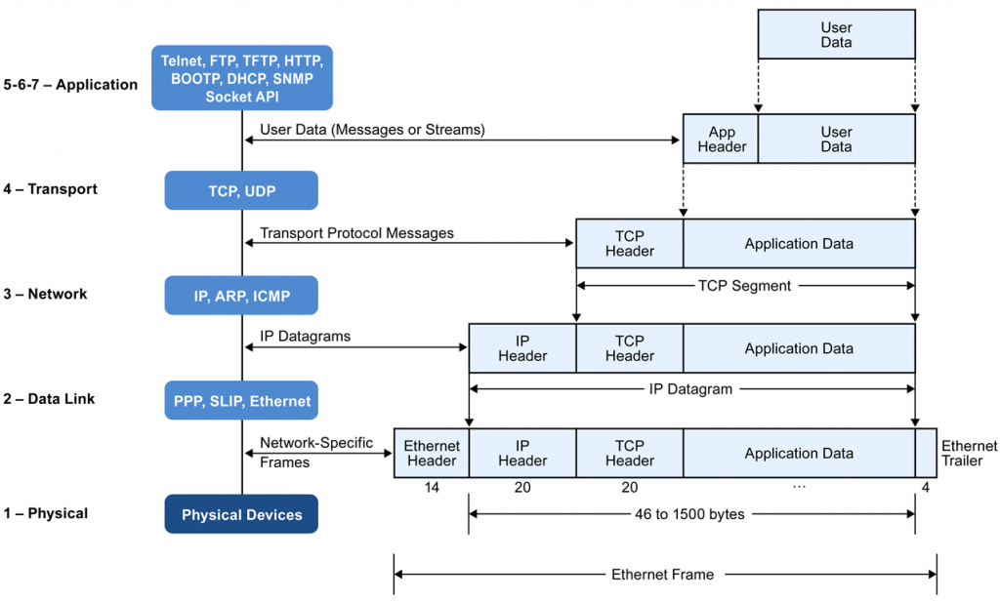

# TCP/IP 모델

## TCP/IP 모델

 네트워크 통신을 위한 과정을 분류하는 모델로 OSI 7 계층이라는 표준이 존재합니다. 그리고 우리가 HTTP 통신을 하기 위해 주로 사용하는 TCP/IP 프로토콜을 OSI 7 계층에 맞추어 추상화한 것이 위 그림의 TCP/IP 모델입니다.

### Application Layer

 HTTP, FTP, SMTP 등 응용프로그램들이 네트워크를 사용하기 위한 인터페이스를 제공합니다.

#### Transport Layer

 통신 노드 간의 연결을 제어하고, 유실된 패킷을 재전송 하는 등 신뢰성 있는 통신을 보장합니다. 프로토콜로는 TCP와 UDP가 있습니다.

#### Internet Layer

 패킷을 발신지로부터 목적지로 전달하는 역할을 담당합니다.

#### Network Interface Layer

 물리적인 주소로 MAC을 사용하여 프레임 데이터를 전달합니다.

## 패킷의 송수신 전송 과정

#### 송신

 송신자가 수신자에게 전송하는 데이터는 상위 계층부터 하위 계층까지 거쳐가며 각 계층의 프로토콜 정보와 관련된 헤더가 씌워집니다.

**Application Layer**

 실제 데이터를 응용 계층에 넘기며, 데이터를 인코딩하고 수신자와의 통신할 준비를 합니다.

**Transport Layer**

 상위 계층의 데이터에 TCP 헤더를 붙입니다. 데이터의 크기가 크면 MTU 단위로 데이터를 쪼개고, 이를 세그먼트라고 합니다. 세그먼트를 송신할 때마다 쪼개진 데이터의 순서를 알 수 있도록 Sequence 번호가 TCP 헤더에 기록됩니다. 이는 네트워킹의 상황에 따라 수신지에 도착하는 데이터의 순서가 바뀔 수 있기 때문입니다. 수신지에서 패킷이 누락되었는지 여부를 확인할 수도 있습니다.

**Internet Layer**

 세그먼트에 IP 헤더를 붙입니다. 이 계층에서의 데이터 단위를 패킷이라고 합니다.

**Network Interface Layer**

 패킷에 Ethermet 헤더와 Tail(FCS)이 붙습니다. 헤더 정보에는 송신자와 수신자의 MAC 주소가 담겨있고, Tail에는 FCS(Frame Check Sequence)가 있습니다. FCS는 데이터 전송 도중에 에러가 있는지 판별하는데 사용됩니다. 이 계층에서의 데이터 단위를 프레임이라고 합니다.

#### 수신

 송신자 측으로부터 받은 프레임은 송신때와는 반대로, 하위 계층에서부터 상위 계층까지 올라가며 헤더를 없애가며 데이터를 받습니다.

**Network Interface Layer**

 Ethernet 헤더를 검사하여 Destination MAC 주소가 자신의 주소와 일치하는지 비교하고, 일치하면 상위 계층으로 보냅니다.

**Internet Layer**

 IP 헤더를 검사하여 Destination IP 주소 값이 자신의 IP 주소와 일치하는지 비교하고, 일치하면 상위 계층으로 보냅니다.

**Transpart Layer**

 TCP 헤더의 Sequence 번호를 검사하여 데이터들이 누락되지는 않았는지 확인하고, 데이터들이 모두 수신될 때까지 대기한 후에 재조립합니다.

**Application Layer**

 데이터를 디코딩하여 사용자에게 데이터를 넘깁니다.

---

## 참고자료

[blog.naver.com/sung\_mk1919/221177021021](https://blog.naver.com/sung_mk1919/221177021021)

[www.slideshare.net/ssuser0bcc46/ss-46924249](https://www.slideshare.net/ssuser0bcc46/ss-46924249)
