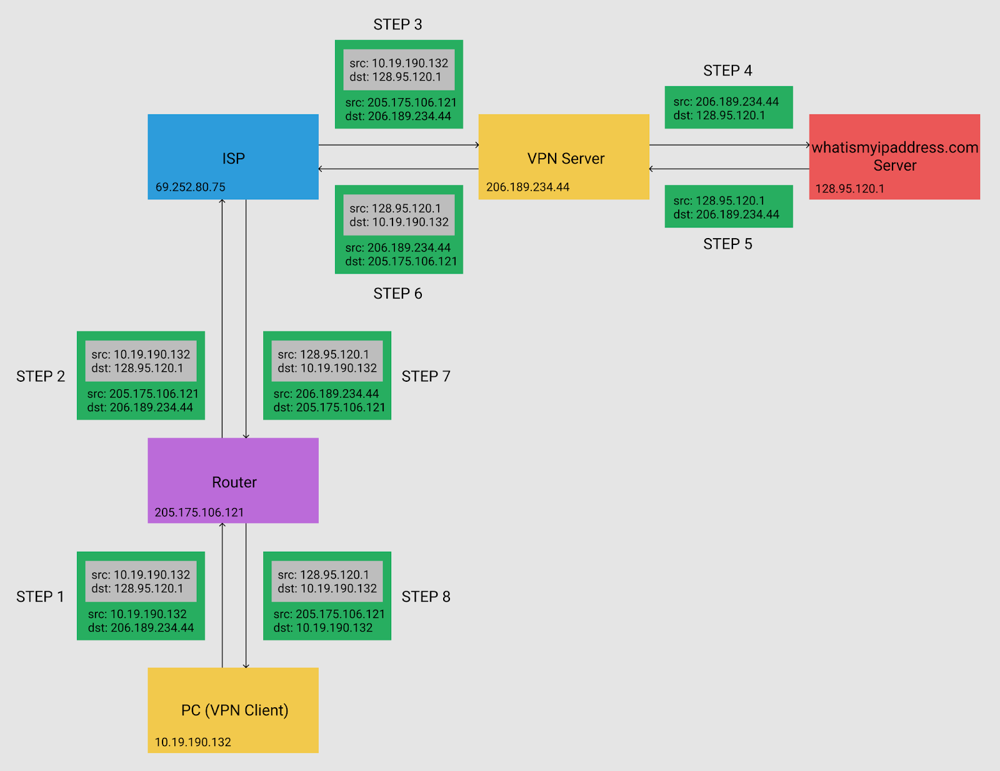

# VPN의 동작

 본 포스트는 VPN에 대한 내용이 정리된 아래의 링크를 간단하게 요약 정리한 포스트입니다. 부족한 영어 실력 탓에 잘못 해석된 내용이 있다면 양해 부탁드리고, 피드백 주시면 감사드리겠습니다. :)

[medium.com/@zicodeng/how-vpn-works-b7549dcc6ce4](https://medium.com/@zicodeng/how-vpn-works-b7549dcc6ce4)

## 들어가기

 인터넷을 사용하는 많은 사람들은 VPN에 대해서 들어봤거나 이전에 어떤 식으로든 사용해봤을 것입니다. VPN을 사용한다면 사용자의 IP 주소를 숨긴 채 인터넷을 익명으로 사용할 수 있습니다(ISP에서는 사용자를 알 수 없지만, VPN 제공자는 사용자에 대해 알고 있습니다). 덕분에 VPN을 사용하면 공중망에서도 회사의 중요한 보안 데이터들을 원격 지역에 데이터로 공유할 수 있습니다.

 보안성이라는 혜택과는 반대로 VPN의 단점도 있습니다. 사용자가 VPN 서버와 연결되면 사용자의 인터넷 속도와 대역폭이 서버의 물리적 위치와 수용력에 영향을 받습니다.

## VPN이란?

 VPN은 Virtual Private Network의 약자입니다. VPN을 이해하기 위해서 VPN의 약자 중, Virtual과 Private에 대한 기술 용어들을 살펴보겠습니다.

 Virtual이란 물리적으로 존재하지 않고, 소프트웨어에 의해 만들어진다는 것입니다.

 Private network는 Public network와 반대의 의미입니다. private network는 private IP 주소를 사용하기 때문에 인터넷을 통해 라우팅 될 수 없는 네트워크 망입니다.

 VPN은 일반적으로 사내 직원들과 같이 확인된 그룹에만 연결을 제한하여 인터넷을 사용하는 것보다 보안상 더 안전합니다. private network 상에서 전송된 데이터들은 퍼블릭 망에 있는 해커들이 쉽게 접근할 수 없기 때문입니다. VPN은 public network의 기기가 private network의 기기로 안전하게 연결될 수 있도록 하는 기술입니다. 즉, 데이터들은 여전히 public network를 통해 전송되지만, 마치 private network에서 전송된 데이터인 것처럼 보안적으로 연결하는 기술입니다.

## VPN의 종류

#### Remote Access VPN

 Remote access VPN은 단일 기기가 원격 네트워크에 연결되었을 때 설정됩니다. 대부분 가정에서 사용하는 유저들이 이 경우일 것입니다. 사용자는 스마트폰이나 컴퓨터에 VPN 소프트웨어를 설치하고 로그인 한 후에, VPN 서버를 선택하면 VPN에 연결되어 이용할 수 있게 됩니다. Remote access VPN은 집에서 회사의 자원에 접근을 해야 하는 회사 직원들과 같은 경우에도 유용하게 사용될 수 있습니다.

#### Site-To-Site VPN

 Site-To-Site VPN은 보통 지역이 다른 오피스와의 연결을 위한 회사를 위한 VPN으로 사용됩니다. 다른 두 오피스가 VPN으로 연결이 되면, 인터넷을 통해 보안이 필요한 자원들을 안전하게 공유할 수 있습니다. Site-To-Site VPN은 단일 기기와 네트워크를 연결하는 대신에 서로 다른 두 네트워크 간에 사설 망을 연결하는 점에서 Remote Access VPN과 차이점이 있습니다.

#### VPN에서의 IP Packet 송수신 과정

#### Step 1

 유저의 컴퓨터에 VPN 소프트웨어가 설치되어 있다면, 가장 먼저 패킷이 캡슐화될 것입니다. 캡슐화는 유저의 VPN 소프트웨어에 의해 만들어진 또 다른 패킷 내부에 원래의 패킷을 감싸는 과정입니다. 원래의 패킷은 모두 VPN 소프트웨어에 의해 암호화되고, VPN 서버에서만 이를 읽을 수 있습니다. public 망에서 이 패킷은 여전히 유효한 패킷이며, 평범하게 라우트 됩니다. 유저에서 나가는 패킷의 Destination IP는 VPN 서버의 IP 주소인 206.189.234.44가 됩니다.

#### Step 2

 이 과정에서 Source IP 주소가 라우터의 public IP로 NAT되고, 관련 정보를 추적하기 위해 NAT 테이블에 기록합니다.

#### Step 3

 ISP는 이 패킷을 VPN 서버까지 보냅니다. 패킷을 보내는 가장 빠른 경로는 라우팅 프로토콜과 라우팅 테이블에 의해 동적으로 선택됩니다.

#### Step 4

 VPN 서버가 패킷을 받고나면, 바깥에 감싸져 있던 패킷을 벗겨내고 대칭키를 이용하여 내부에 있던 패킷을 복호화합니다. 그다음, VPN 서버는 패킷을 목적지인 "whatismyipaddress.com" 서버까지 전송하게 됩니다.

#### Step 5

 목적지 서버에서 들어온 요청을 처리하고  VPN 서버로 다시 응답합니다.

#### Step 6

 VPN 서버는 패킷을 암호화하고, 해당 패킷을 보내기전에 캡슐화하여 ISP로 전송합니다.

#### Step 7

 ISP는 응답 패킷을 다시 라우터로 라우팅합니다.

#### Step 8

 유저에서 패킷을 받으면 VPN 소프트웨어는 가장먼저 바깥의 패킷을 벗겨내고, 내부에 암호화된 패킷을 대칭키로 복호화하게 됩니다.

---

## 참고자료

[medium.com/@zicodeng/how-vpn-works-b7549dcc6ce4](https://medium.com/@zicodeng/how-vpn-works-b7549dcc6ce4)
