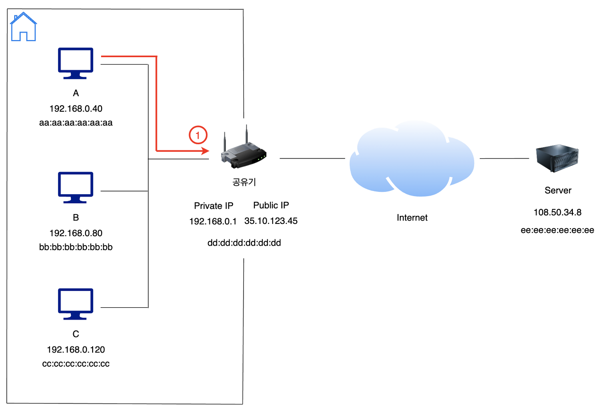
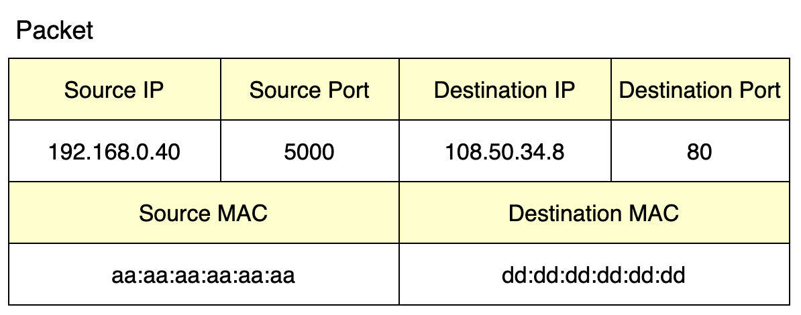

# 공유기가 인터넷과 통신하는 방법 (feat. NAT)

## 공유기 (Broadband Router)

 보통 가정집에서는 인터넷 연결을 위해 공유기를 많이 사용합니다. 공유기는 자신과 연결된 컴퓨터들이 ISP로부터 할당받은 Public IP로 인터넷 연결을 할 수 있도록 중개하는 역할을 합니다.

 공유기는 자신과 연결된 컴퓨터들에게 내부적으로 통신을 위한 Private IP를 발급합니다. 이는 공유기의 DHCP에 의해 자동적으로 일어납니다. 이 Private IP는 공유기와 연결된 내부에서만 서로 통신이 가능하고 외부 망인 WAN과는 통신이 불가능합니다.

 Private IP를 가진 로컬 컴퓨터들이 외부망과 통신하기 위해서는 Public IP로 변환이 필요합니다. 이는 서버로부터 응답받을 패킷을 퍼블릭 망을 통해 자신의 네트워크까지 다시 받아와야 하기 때문입니다. 공유기는 로컬 컴퓨터들과 외부망 사이에서 이러한 IP 변환 과정을 수행해 주는데, 이를 NAT라고 합니다.

## NAT (Network Address Translation)

 NAT는 영어 단어 그대로 네트워크 주소를 변환하는 것입니다. L3 레이어 패킷의 IP 주소를 변환하면 Private IP 주소를 가진 사설망 컴퓨터가 Public IP를 이용하여 외부망과 통신이 가능해지게 됩니다. NAT 기능이 포함된 라우터를 NAT 라우터라고 부르는데, 주변에서 흔하게 볼 수 있는 장치로 공유기가 있습니다.

 NAT을 활용하면 여러 가지 장점이 있습니다.

-   Public IP 주소의 부족 문제가 어느 정도 해소됩니다.
-   로컬 네트워크에 새로운 장비를 추가하기 쉽습니다.
-   사설 네트워크이기 때문에 관리자가 통제하기 좋습니다.
-   외부에 악의를 가진 공격자가 장비에 직접 접근하는 것이 어려워집니다.

## 로컬 망에서 공유기를 통한 네트워크 통신 과정

#### 통신 절차

 위와 같이 로컬 네트워크 상의 A 컴퓨터(192.168.0.40)가 인터넷 망을 통해 Server(108.50.34.8)와 통신을 한다고 가정해보겠습니다. 이 과정을 차근차근 정리해보겠습니다.

#### 1\. A 컴퓨터 -> 공유기

 A 컴퓨터는 요청을 보내고자하는 서버 컴퓨터를 찾아가기 위한 L3 레이어 패킷을 생성합니다. Source IP는 자신의 Private IP, Destination IP는 외부망에 존재하는 Server IP입니다.

 L2 레이어에서는 패킷을 외부와 통신이 가능한 공유기로 보내기 위해 Source MAC으로 A 컴퓨터의 MAC 주소를 넣고, Destination MAC에는 공유기의 MAC 주소를 넣어 생성합니다.

#### 2\. 공유기 -> 서버

1\. 아웃바운드 패킷을 받은 공유기는 SNAT을 수행합니다. SNAT은 새로운 개념은 아니고, 아까 살펴보았던 NAT의 개념에서 Source 부분만  변환한다는 개념입니다. NAT 과정에서 공유기는 위와 같이 NAT 테이블에 변환된 정보를 저장해둡니다.

 이러한 NAT 과정은 정확하게는 NAT이 아닌, **NAPT(Network Address Port Translation)**이라고 부릅니다. NAT는 IP 주소만을 변환시키지만, NAPT는 Port까지 함께 변환시키는 것입니다. 현재는 NAT과 NAPT를 크게 구분 짓지 않고 있기 때문에 NAT이라는 어휘를 선택했습니다.

2\. 변환된 네트워크 주소를 바탕으로 Packet을 인터넷망을 통해 Server로 전달합니다.

#### 3\. 서버 -> 공유기

1\. 서버는 요청에 대해 공유기로 다시 응답합니다. 패킷의 형태는 위와 같습니다.

#### 4\. 공유기 -> A 컴퓨터

1\. 공유기는 서버로부터 받은 패킷을 로컬 네트워크 영역에 있는 A 컴퓨터에 전달해 주어야 합니다. 이를 위해서 DNAT을 하게 됩니다. (DNAT은 위에서 보았던 SNAT과 반대입니다. 즉, Destination 부분을 변환하는 것입니다.)

 공유기는 NAT Table을 살펴보고DNAT을 수행하여 패킷의 주소를 변경하게 됩니다.

 NAT Table에는 위와 같이 아까 SNAT을 하면서 기록된 정보가 있습니다. 이를 바탕으로 어떤 로컬 컴퓨터를 목적지로 DNAT을 수행해야 할지 알 수 있습니다.

2\. 마침내 NAT이 끝나고, 공유기에서 컴퓨터 A로 패킷이 응답됩니다!

## 서버는 누구와 통신했는가..

 위의 과정을 살펴보면 우리는 서버 컴퓨터가 로컬 네트워크 상의 A 컴퓨터와 직접 통신하지 않았음을 알 수 있습니다. 서버는 A 컴퓨터의 존재를 의식하지 못하는 것입니다. 즉, 서버는 A 컴퓨터가 아닌, 공유기(Public IP, 35.10.123.45)와 통신했다고 생각하게 되는 것입니다.

 공유기의 이러한 기능 덕분에 로컬 네트워크상의 여러 컴퓨터들이 하나의 Public IP를 이용하여 인터넷 통신이 가능해지는 것입니다.