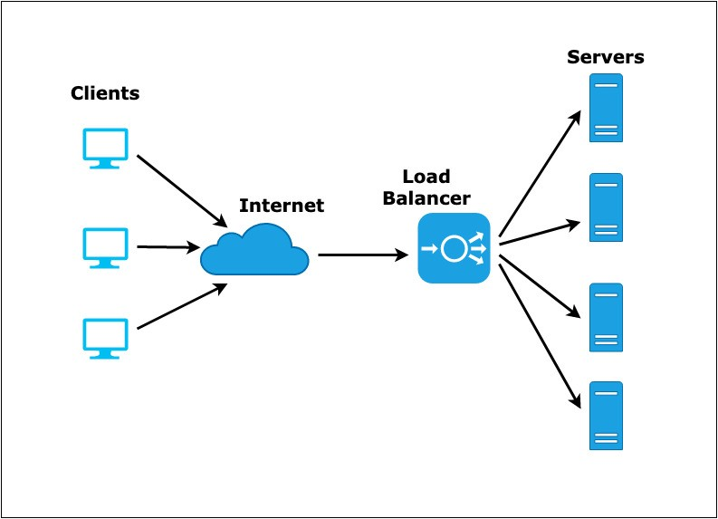

# 로드밸런싱 (Load Balancing)

## 로드밸런싱 (Load Balancing)

 로드밸런싱은 클라이언트의 요청을 받는 서버의 부하를 줄이기 위해 트래픽을 분산시키는 기법입니다. 그리고 그 역할을 로드밸런서(LB, Load Balancer)가 수행합니다. 로드밸런서는 VIP(Virtual IP)와 함께 구성됩니다.

#### VIP(Virtual IP) 란?

 VIP란 로드밸런싱의 대상이 되는 여러 서버들을 대표하는 가상의 아이피입니다. 클라이언트들은 Server의 IP로 직접 요청을 하는 것이 아니라 LB가 가지고 있는 VIP를 대상으로 요청을 합니다. 그리고 LB는 설정된 부하 분산 방법에 따라 각 Server로 요청을 분산시킵니다.

#### 로드밸런싱 알고리즘

**라운드 로빈 방식 (Round Robin Method)**

 라운드 로빈 방식은 각 서버를 순차적으로 선택하여 요청을 분산시킵니다.

**가중치 라운드 로빈 방식 (Weighted Round Robin Method)**

 각각의 서버에 가중치를 매기고, 가중치 비율에 따라 요청을 분산시킵니다. 주로 서버의 트래픽 처리 능력이 상이한 경우에 사용됩니다. 예를 들어 A 서버의 가중치가 7, B 서버의 가중치가 3이라면 A와 B로의 트래픽 분산 비율은 7:3이 됩니다.

**IP 해싱 방식 (IP Hash Method)**

 클라이언트의 IP 주소를 해시 처리하고, 특정 서버로 요청을 매핑하여 트래픽을 분배하는 방식입니다. 사용자의 IP 주소를 해시 처리하기 때문에 사용자가 항상 동일한 서버로 연결되는 것을 보장합니다.

**최소 연결 방식 (Least Connections Method)**

 연결된 커넥션 수가 가장 적은 서버를 선택하여 요청을 분산시킵니다. 트래픽으로 인해 세션이 길어지는 경우에 권장하는 방식입니다.

**최소 응답 시간 방식 (Least Response Time Method)**

 서버의 응답 시간이 가장 짧은 곳으로 트래픽을 분산시킵니다.

## 로드밸런서의 종류

 로드밸런서는 OSI 7 계층을 기준으로 어떻게 부하를 분산시키는지에 따라 종류가 나뉩니다.

#### L2 (데이터 링크 계층)

 Mac 주소를 바탕으로 로드밸런싱을 수행합니다.

#### L3 (네트워크 계층)

 IP 주소를 바탕으로 로드밸런싱을 수행합니다.

#### L4 (전송 계층)

 Port 기반의 로드밸런싱을 수행합니다. 주요 프로토콜로는 TCP, UDP가 있습니다.

#### L7 (어플리케이션 계층)

 URL, HTTP 헤더, 쿠키 등과 같은 사용자 요청을 기반으로 로드밸런싱을 수행합니다. 즉, 패킷의 내용을 확인하고 그 내용에 따라 트래픽을 특정 서버에 분배하는 것이 가능합니다. 이를 통해 마이크로서비스간에 통신을 유연하고 효율적으로 구성할 수 있습니다. 하지만 패킷 내용을 복호화하여 처리를 해야하므로 부하가 많이 걸릴 수 있다는 단점이 있습니다.

 주요 프로토콜로는 HTTP, HTTPS, FTP가 있습니다.

## 로드밸런싱의 구성

### Router Mode

#### Service Request

-   사용자가 서비스 요청 시, Destination IP는 L4의 VIP 입니다.
-   L4에서 Real Server로 전송 시, Destination IP를 VIP에서 Real Server로 NAT 합니다. (Destination NAT)
-   Network 대역이 변경되었으므로 MAC주소도 Source와 Destination MAC 모두 Rewriting 됩니다.

#### Service Response

-   Real Server에서 서비스 응답 시, 목적지 IP가 다른 대역이므로 Gateway(L4)로 전송합니다.
-   L4에서 Source IP를 L4의 서비스 VIP로 NAT해서 클라이언트에게 응답합니다. (Source NAT)

 L4를 중심으로 상/하단의 IP대역이 서로 다르게 구성됩니다. L4는 Server 대역 Network의 Gateway 역할을 합니다.

### Transparent Mode

#### Service Request

-   사용자가 서비스 요청 시, Destination IP는 L4의 VIP 입니다.
-   L4에서 Real Server로 전송 시, Destination IP를 VIP에서 Real Server로 NAT 합니다. (Destination NAT)
-   동일 Network 대역이므로, Destination MAC 주소만 Rewriting 됩니다.

#### Service Response

-   Real Server에서 서비스 응답 시, Destination IP가 다른 대역의 IP이므로 Gateway(Router)로 전송합니다.
-   Server에서 Gateway 구간에 L4를 거치면서 Source IP를 L4의 서비스 IP로 NAT을 수행합니다. (Source NAT)
-   동일한 Network 대역이므로 MAC 주소는 따로 Rewriting 되지 않습니다.

### One-Arm Mode

#### Service Request

-   사용자가 서비스 요청 시, Destination IP는 L4의 VIP 입니다.
-   L4에서 Real Server로 전송 시, Destination IP를 VIP에서 Real Server로 NAT을 수행합니다. (Destination NAT)
-   Destination으로 전송을 위해서 Destination MAC 주소도 Rewriting 합니다.
-   Real Server에서 L4로의 전송을 위해서 Source IP도 L4의 IP Pool의 IP로 NAT을 수행합니다. (Source NAT)

#### Service Response

-   Real Server에 서비스 응답 시, 목적지는 L4에서 NAT된 IP Pool의 IP로 보냅니다.
-   L4에서 클라이언트로 응답 시, Source IP를 Real Server의 IP에서 L4의 서비스 VIP로 NAT을 수행합니다. (Source NAT)
-   Destination IP를 IP Pool의 IP에서 클라이언트 IP로 NAT을 수행합니다. (Destination NAT)

 One-Arm Mode는 클라이언트의 IP가 Server에 전달되지 않기 때문에 Server가 실제 클라이언트의 IP를 이용해야 할 경우 부적합한 기법입니다. 일반적으로 권고되지 않는 구성 방법입니다.

---

## 참고자료

[theplmingspace.tistory.com/434](https://theplmingspace.tistory.com/434)

[nesoy.github.io/articles/2018-06/Load-Balancer](https://nesoy.github.io/articles/2018-06/Load-Balancer)

[ssup2.github.io/theory\_analysis/SLB/](https://ssup2.github.io/theory_analysis/SLB/)
