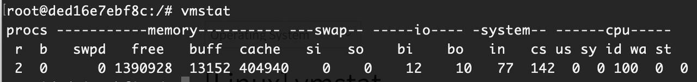
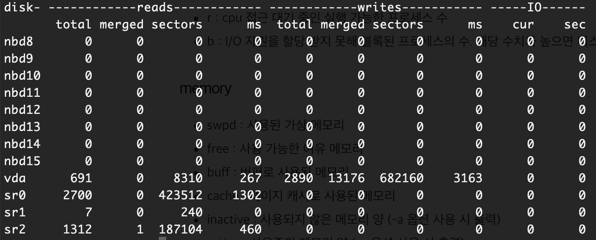

# vmstat 명령어

## vmstat \[option\] \[delay \[count\]\]

 프로세스, 메모리, 페이징, I/O 블럭, CPU 활동 사항들의 정보를 출력하는 기능을 합니다.

## 옵션

-   \-t : 날짜 + 시간을 출력
-   \-w : 출력 결과의 너비를 맞춤
-   \-f : 부팅 후 포크된 수
-   \-d : 디스크 상태 조회
-   \-a : buffer와 cache 대신 active와 inactive 메모리 사용량에 대한 결과를 출력
-   \-s : 부팅되었을 때부터 OS상에서 수행된 이벤트와 메모리 사용량에 대한 통계 테이블 출력
-   \-S : 출력되는 데이터 단위 지정 (k, K, m, M = 1000, 1024, 1,000,000, 1,048,576으로 나눈 값으로 출력)

#### procs

-   r : cpu 접근 대기 중인 실행 가능한 프로세스 수
-   b : I/O 자원을 할당 받지 못해 블록된 프로세스의 수. 해당 수치가 높으면 디스크 IO가 지연되는 것으로 판단할 수 있습니다.

#### memory

-   swpd : 사용된 가상 메모리
-   free : 사용 가능한 여유 메모리
-   buff : 버퍼로 사용된 메모리
-   cache : 페이지 캐시로 사용된 메모리
-   inactive : 사용되지 않은 메모리 양 (-a 옵션 사용 시 출력)
-   active : 사용중인 메모리 양 (-a 옵션 사용 시 출력)

#### swap

-   si (swap-in) : swap-in 된 메모리의 양 (kb)
-   so (swap-out) : swap-out 된 메모리의 양 (kb). 스왑 아웃이 지속적으로 발생하였다면 메모리 부족을 의심해 볼 수 있습니다.

#### io

-   bi (block in) : 블록 디바이스에서 읽은 블록 수
-   bo (block out) : 블록 디바이스에 쓴 블록 수

#### system

-   in (interrupt) : 초당 인터럽수 수
-   cs (context switch) : 초당 컨텍스트 스위치 수

#### cpu

-   us : 유저 코드가 소요한 CPU 사용 시간
-   sy : 커널 코드가 소요한 CPU 사용 시간
-   id : idle 시간 (idle : 컴퓨터가 작업을 하지 않는 유휴 상태)
-   wa : IO 대기 시간
-   st (stolen) : 가상 머신 실행 시간 (가상 머신으로부터 뺏긴 시간)

#### \-d 옵션 출력 예시

#### reads

-   total : 성공한 모든 읽기 작업 수
-   merged : grouped reads (I/O 결과)
-   sectors : 성공적으로 읽은 섹터 수
-   ms : 쓰기 작업을 하는데 소요된 시간 (millisecond)

#### writes

-   total : 성공한 모든 쓰기 작업 수
-   merged : grouped writes (I/O 결과)
-   sectors : 성공적으로 쓴 섹터 수
-   ms : 쓰기 작업을 하는데 소요된 시간 (millisecond)

#### I/O (입출력)

-   cur : 현재 수행중인 I/O 수
-   sec : I/O를 수행하는데 소요된 시간 (second)