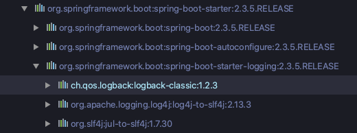

# logback 설정

## logback

 Spring Boot를 이용하면 로그 데이터를 남길 수 있도록 아래와 같이 logback과 logback의 퍼사드인 slf4j가 자동으로 추가됩니다.



## Log Level

#### trace < debug < info < warn < error

 오른쪽으로 갈 수록 높은 레벨을 가집니다. 설정된 로그 레벨에 따라 설정 레벨 이상의 로그를 출력합니다. 만약 설정된 로그 레벨이 info라면, trace와 debug 수준의 로그는 출력하지 않습니다.

## Appender

#### ch.qos.logback.core.ConsoleAppender

 로그를 OutputStream에 write하여 console 창에 로깅 메시지를 출력합니다.

#### ch.qos.logback.core.FileAppender

 로그를 File에 write합니다.

#### ch.qos.logback.core.rolling.RollingAppender

 FileAppender를 상속받은 Appender로, 지정 용량이 넘어간 로그 파일을 넘버링을 통해 나누어 저장할 수 있습니다. 넘버링하는 파일의 최소, 최대 개수를 지정할 수 있고, 최대 개수를 넘어갔을 경우 오래된 순으로 덮어쓰기 됩니다.

## logback 설정

 Spring Boot는 classpath 내에 logback-spring.xml 설정 파일을 통해 logback을 설정할 수 있습니다. 또는 application.properties에 설정할 수도 있습니다.

**application.properties에서 com.example.demo.controller 패키지 범위의 로그 레벨 설정 예시**

```
logging.level.com.example.demo.controller=info
```

**logback-spring.xml 설정 예시**

```
<?xml version="1.0" encoding="UTF-8" ?>
<configuration>
    <!-- 프로퍼티 설정 -->
    <property name="LOG_PATH" value="./logs"/>

    <!-- Console Logger -->
    <appender name="SAMPLE" class="ch.qos.logback.core.ConsoleAppender">
        <layout class="ch.qos.logback.classic.PatternLayout">
            <Pattern>%d{HH:mm} %-5level %logger{36} - %msg%n</Pattern>
        </layout>
    </appender>

    <!-- Rolling File Logger -->
    <appender name="FILE_LOGGER" class="ch.qos.logback.core.rolling.RollingFileAppender">

        <!-- 출력 패턴 설정 -->
        <encoder>
            <Pattern>%d{yyyy-MM-dd HH:mm:ss.SSS} %-5level %logger{36} - ${method} - %msg%n</Pattern>
        </encoder>

        <!-- 로그 필터 (warn 레벨만 출력하도록 필터링) -->
        <filter class="ch.qos.logback.classic.filter.LevelFilter">
            <level>warn</level>
            <onMatch>ACCEPT</onMatch>
            <onMismatch>DENY</onMismatch>
        </filter>
        <!-- Rolling 정책 -->
        <rollingPolicy class="ch.qos.logback.core.rolling.TimeBasedRollingPolicy">

            <!-- .gz 또는 .zip 을 넣으면 자동 일자별 로그 압축 -->
            <fileNamePattern>${LOG_PATH}/logback.%d{yyyy-MM-dd}.%i.log</fileNamePattern>
            <timeBasedFileNamingAndTriggeringPolicy class="ch.qos.logback.core.rolling.SizeAndTimeBasedFNATP">
                <!-- 로그 파일의 최대 용량 (KB, MB, GB) -->
                <maxFileSize>10MB</maxFileSize>
            </timeBasedFileNamingAndTriggeringPolicy>
            <!-- 일자별 로그 파일의 최대 생명 주기(일), 해당일 이상된 파일은 자동으로 제거 -->
            <maxHistory>60</maxHistory>
        </rollingPolicy>
    </appender>

    <!-- 스프링 부트의 프로파일에 따른 로깅 전략 -->
    <springProfile name="local">

        <!-- 루트 경로의 로그 설정 -->
        <root level="INFO">
            <appender-ref ref="SAMPLE"/>
        </root>

        <!-- 특정 클래스의 로그 설정 (패키지로 설정하면 해당 패키지 범위의 클래스들로 로그 설정) -->
        <logger name="com.example.logbackedu.controller.FooController" level="WARN">
            <appender-ref ref="FILE_LOGGER"/>
        </logger>
    </springProfile>
</configuration>
```

## Logger Pattern 요소

%logger{length} : logger name을 축약. {length}은 최대 자리 수.

%-5level : 로그 레벨, -5는 출력의 고정폭 (5글자)

%msg : 로그 메시지

%d{pattern} : 로그 기록 시간. ex) %d{yyyy-MM-dd HH:mm:ss.SSS}

%n : 줄바꿈

%thread : 현재 스레드 명

 조금 더 자세한 패턴 요소는 아래의 링크를 참조합니다.

[logback.qos.ch/manual/layouts.html](http://logback.qos.ch/manual/layouts.html)

---

## 참고자료

[logback.qos.ch/manual/index.html](http://logback.qos.ch/manual/index.html)
