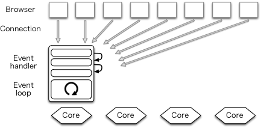

# Nginx 이해하기

## Nginx?

 Nginx는 간단하게 말씀드리자면 경량 웹 서버입니다. 클라이언트로부터 요청을 받았을 때 요청에 맞는 정적 파일을 응답해주는 HTTP Web Server로 활용되기도 하고, Reverse Proxy Server로 활용하여 WAS 서버의 부하를 줄일 수 있는 로드 밸런서로 활용되기도 합니다.

## Apache 서버와 다른점

 Apache와 같은 웹서버는 클라이언트로부터 받은 요청을 처리할 때 새로운 프로세스 또는 쓰레드를 생성하여 처리합니다. 요청마다 쓰레드가 생성되므로 접속하는 사용자가 많으면 그만큼 쓰레드가 생성되어 CPU와 메모리 자원의 소모가 커집니다.

 Nginx는 **Event-Driven** 구조로 동작하기 때문에 한 개 또는 고정된 프로세스만 생성하여 사용하고, 비동기 방식으로 요청들을 Concurrency하게 처리할 수 있습니다. 위의 그림에서 보이듯이 Nginx는 새로운 요청이 들어오더라도 새로운 프로세스와 쓰레드를 생성하지 않기 때문에 프로세스와 쓰레드 생성 비용이 존재하지 않고, 적은 자원으로도 효율적인 운용이 가능합니다. 이러한 Nginx의 장점 덕분에 단일 서버에서도 동시에 많은 연결을 처리할 수 있습니다.

## Nginx의 구조

 Nginx는 하나의 Master Process와 다수의 Worker Process로 구성되어 실행됩니다. Master Process는 설정 파일을 읽고, 유효성을 검사합니다. 그리고 Worker Process를 관리합니다. 모든 요청은 Worker Process에서 처리합니다.  Worker Process의 개수는 설정 파일에서 정의되며, 정의된 프로세스 개수와 사용 가능한 CPU 코어 숫자에 맞게 자동으로 조정됩니다.

## Reverse Proxy

 Nginx는 리버스 프록시로도 활용할 수 있습니다. 리버스 프록시란 외부 클라이언트에서 서버로 접근 시, 중간에서 중개자 역할을 하여 내부 서버로 접근할 수 있도록 도와주는 서버입니다. 리버스 프록시를 활용했을 때 얻을 수 있는 장점은 아래와 같습니다.

-   **보안** : 외부 사용자로부터 내부망에 있는 서버의 존재를 숨길 수 있습니다. 모든 요청은 리버스 프록시 서버에서 받으며, 매핑되는 내부 서버로 요청을 전달합니다. 또한 Nginx는 SSL 설정도 가능합니다.
-   **로드밸런싱** : 리버스 프록시 서버가 내부 서버에 대한 정보를 알고 있으므로, 각 서버의 상태에 따라 부하를 분산시키며 요청을 전달할 수 있습니다.

---

## 참고자료

[https://nginx.org/en/docs/beginners\_guide.html](https://nginx.org/en/docs/beginners_guide.html)

[https://subscription.packtpub.com/book/networking\_and\_servers/9781785281839/1/ch01lvl1sec08/the-nginx-architecture](https://subscription.packtpub.com/book/networking_and_servers/9781785281839/1/ch01lvl1sec08/the-nginx-architecture)

[https://medium.com/sjk5766/%EB%84%8C-%EB%AD%90%EB%8B%88-nginx-9a8cae25e964](https://medium.com/sjk5766/%EB%84%8C-%EB%AD%90%EB%8B%88-nginx-9a8cae25e964)

[https://www.aosabook.org/en/posa/warp.html](https://www.aosabook.org/en/posa/warp.html)
