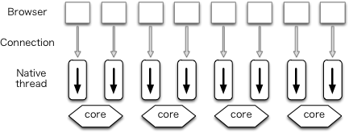
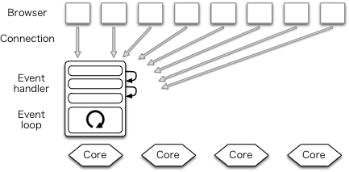

# Nginx 이해하

## Nginx?

 Nginx는 간단하게 말씀드리자면 경량 웹 서버입니다. 클라이언트로부터 요청을 받았을 때 요청에 맞는 정적 파일을 응답해주는 HTTP Web Server로 활용되기도 하고, Reverse Proxy Server로 활용하여 WAS 서버의 부하를 줄일 수 있는 로드 밸런서로 활용되기도 합니다.

## Apache 서버와 다른점

 Apache와 같은 웹서버는 클라이언트로부터 받은 요청을 처리할 때 새로운 쓰레드를 생성하여 처리합니다. 요청마다 쓰레드가 생성되므로 접속하는 사용자가 많으면 그만큼 쓰레드가 생성되여 CPU와 메모리 자원의 낭비가 심해지게 됩니다.

 Nginx는 Event-Driven 구조로 동작하기 때문에 한 개 또는 고정된 프로세스만 생성하여 사용하고, 비동기 방식으로 요청들을 Concurrency하게 처리할 수 있습니다. 위의 그림에서 보이듯이 Nginx는 새로운 요청이 들어오더라도 새로운 프로세스와 쓰레드를 생성하지 않기 때문에 프로세스와 쓰레드 생성 비용이 존재하지 않고, 적은 자원으로도 효율적인 운용이 가능합니다. 이러한 Nginx의 장점 덕분에 단일 서버에서도 동시에 많은 연결을 처리할 수 있습니다.